# AZ-700 Demo Environment Architecture

> **💰 Cost-Optimized Demo Environment** - See toggles to reduce from $109/day to $20-30/day!

## Network Topology Diagram

> 💡 **Tip**: The diagram below can be hard to navigate on GitHub. **[👉 Click here to open it in Mermaid Live](https://mermaid.live/view#pako:eNqtWltv28gV_itTbrZwUFEWKVGyhEUAOZa9QSxFsBwb2LooKHIksaE4Ai9ylAvQAkVRFG13Nxts292HRQqkfW2BPhQo0B-TP9D9CT1zI4cSKTnOOg_xHJ755syZc0-eaw5xsdbRJj65dmZ2GKPzw6sAwU-UjKehvZihB0GMwwDHP73S3v35V__79-cp5Ur7GeelP48jHEbA8_13X77li9znR8EwxHP2_fO_wkqnSy_C0SfjcP_e3sibJ74dY_duugsH7lWwJkv3WRJiAGF_o_s-SdzcKdlv6ZYTn4xtf4TDpedgLuDvvxBUJMk5EPrTPT5KjzkOSRCjI0JCJisTPJmj0cPHbP39d9--oVq57B6jU3uFQ2TwO90xmvuuvbq7AX7eB-zz0J5MPAf17cCeYgGNwwkJ53bgYHRGktgLphzq0SL2SAAC6-hOrWrUinGHydj3nKPBCOD57wgW6DMSYAbjwD1IRPSn8FN1yDwHoKg7p79Pk_EZnsLpTHVf_YESEKegvccP0QjknG3Kou6_GDDrmSVjfQlmw2Qx4BrVWrW2bzQ39q7vHyVj2Ebfjp4tVoW76M-hHVFlcTb5iDliJgCIsG82xTO-eiOwEQn8VSn-CZjptb1K8XPrDNqk0K1SlP50HqcQVDNzIGS763R3o3T38WX-esdeCDL4_roQDXa_UpizUQpDzQ1Td8DhOohVfhNmNOvE7Y95hiOShNwVuSmJNdj2fRK4Hrf0Xc_LrPH1FzwiSCKTeRTbgWuHruKgr_6B7hiNqsX8htHeffOGBil0fNbroSO8pMw_Kj3zYjg4ueYn_okupA0wqItFcHJtoJ-goTmiH5Uz2-LIUuDeGcOl0vSeLkIcRewdcvhl96lXzew-e0d4TiCs-gVhIY1pz44v-SXeCrVJsymJa_SYg5aqNtj7L9QnUUzFxUHkLXG51gZ2LLQGAXfQPb_RrURwKzfZzE75XX7NSYjTGFR3NEBNyzIsFdiqNrYjH04Xg6XNQL9-SwP64ckQDS66DOT4TMRjiHnjJIiTu8pJtZqhnFSrHlilB204zAahJIyOIDljN5fGXv9dUMvTGMsKobcExYu0wBdb8oJPHJsbBNykZpTe5CFeXdiJH3NRvqRrxAi555VAW151FJMQMiBPL3-TS9R1HAKKZgCnZyPwr2OoUdApmfKSAUxli3OdjS4Y4Kv_QoBxCFjGKtWSIiZItgUEzupCKFrFnsM1_tXvKA2lRIYhE3meap0cIsdeFGLn3rws744W5Ak28qmX0ZBxo7zL94vUG7FFPvsebEu_fPcRnogndvlvymajVp6itmSASzw-93BoyLgAa0QJaA9Mc26HW-IXsJ4esmj5NXXPU2K7EPh9Wi1xv7_GY90foz1pfHflGze3ez4AGxd9bi__QYACmpqzvYfmXFibWW1Yu0DMHIj5niDbQ8NWMzGLzMREewMSxjPUS0KywLtMxVRNxcyZSn2npZilllLnNVaxnXQXi5PrrJLJVtlu80OszNy0shFEA2ocu-xs0NttaXqAb2Vs9Zyd1IvspH6wC6SRA2m8J8j7Fm7wNlR_3ML-SZdMn-W1Bn1Lxs2bI1hDO2LTIi1XBkDT9POlCcH90WV3NETw3iU9lalk2Hpzq3LgLBHqVXEFiVdLYOrXJHxCi8849Bzad_K0ZaAhPHPqrbVdB2WPsJwb4gHS_GS2P1T_wx5Pr69kFke9wF0QT-RFegcfjFNfYGl9ZuP2KedSwOWjiaTeKOtIZhFMUgHVcNLYFk4kQGlAaWwLKNtCggAWZvzum78wA5OX22rNkmtH-pGXvVUOkorLvFpQbpOMhqcj2a5Iwzn1gic5J8iMx49-wITUvRjwK_zxW-b4rNG48MI4sX0k_U4MPTaOFd_FZ4BZ28AEv4-DOLR97xlUvn3ZNbP-h1rd5l2GIXFPQpIsWP1L3MThYYiSNpihF5S88Cv2yWIOx5Uw8_Jb8q8V4wV7ynQGfW-AQaqlF6_4u_0yR9s4WG0Wi_rH-17oJB7XDA51hy91-1mrVtNdUFW-B7NqqD9eREonqaMBiUFZSy8CXaljuW336JPAg_Id2iQePH6rUNCPswq57N0v7diZ5d5dUD58A20eaO8ArNRK1poJo6bPvQB5dLC5LBg-iBpf7QaKy_7-qT62I7ACD5rj6WzNGlMHUhT48cfpPDV9cxJE_COboyJdv0cHkuuk8z6n8NEq0qv6vRdghV6M9Zjo9O90HJEOEOEdX_BxRtHeIc0s5ZvphGM7gGqEmTWxPeon5e5iEBsTMVME5QdiAMvvTQsJTjrvy2No9yr6cQrNCrab8Ax6nCs9XcyNaLMJsqHcnDUdGN3l7JJX4BdMj16ITqKQn4Q0MniADa8cER8LfrOE_06jbu3PoTOfochewi0isaFetEFUhAUfWJFStCFNOAUf-SxEeSbmM0OMmSfvfZqMdVb3C9WIGS_6RGeis6mMuoOZgij7qC-Bb_DY1AvssY9derOsX_2BMc2bYzINKxWMogA5KuPTpjVTSYdkQh900ibf8UEQLcCnZQjhXuFNkIsXPlmxyLp5-dsBmGsyC-2IWMKcFnxKz0-w-Uc6iCz9pmYWZh6Ue82T0g6LBlZOZS7HnFh1ixzVzFEHPUmvl9CZiadnyi5EOZOFCxk4JEiOKNLzuvhqHajeIa38uAhrTgN1FtNaxqaIp1Zegr2XRlrlGy9q0tBPnxNwFSB1wMmmkqkj5uKVnHAKI1QmpfJUZW9-UIre_eY1H2TS06X3l6BwcR4Ev-Dy8gTaNqtGk06F-FgoRzRrclb0QrrgTcGLnOM9dq17BC1ORS1JyzpOzxedElKpMnlmz3bRB5I1ZSlEWkmWcyjloyIjTVzULITbZuNbKRn9yONbTpnbGNdVuJN3XXFZHcdJspxiXiFGtgVf1AmqSNBrlVQBW3roKF756YmOb0cRdIVolozRxPP9zkfYmFgTXIEWHiTufFQzrFZ7LJb6tefGs465eLq2nc23BMCkjq2JlQI0bKNx4OwCkH2TxJgASi3FwE0LfGAXxpRXPeIaBxMLt1MEY2xhcydChJ0khNYglQKPcaaKcctwjJ03iXjDIhBs-idFaBr0zy4EIuNPqou200gxJlZrYrQ2MCTBtakAob3qIAtZ8t0ZtrTsSvavv_Td1ziyfzqUcqgMmc1X5NCZP_4Gk6kymRUx69pkVkuDijpPSG1C5c7_xwPx5CoDTfIVlpsqsviSr5oTMfcvPxUWwvjLcS6tok1Dz9U6cZjgijbH4dymS-05_X6lxTOIWldaB6WjlCvtKngJ2xZ28Bkhc7kT4tB0pnUmth_BKlm4NEJ4NrR2GQs0Lji8T_9hRus0DhiE1nmuPdU6ertlVg8OrIZVM5ttq95qVbSV1qmbUBsZ9bpVNxjReFnRnrFDzWq93m7Xm41248Bsma2aVdGwS6NMn_-fFPZfU17-H5WZqH0)** — full interactive view with zoom and pan.

```mermaid
flowchart TB
    subgraph Internet["☁️ Internet"]
        Users["👥 Users"]
        OnPrem["🏢 On-Premises<br/>(Simulated)"]
    end

    subgraph Azure["Azure Cloud"]
        
        subgraph GlobalServices["🌐 Global Services"]
            AFD["Azure Front Door<br/>Premium SKU<br/>🛡️ WAF Layer 1<br/>($16/day)"]
            TM["Traffic Manager<br/>Performance Routing<br/>(Optional - $0.10/day)"]
            PublicDNS["Public DNS Zone<br/>contoso-xxxx.com"]
        end

        subgraph HubRegion["📍 Hub Region (UK South)"]
            subgraph HubVNet["hub-vnet<br/>10.1.0.0/16"]
                subgraph HubSubnets["Hub Subnets"]
                    BastionSubnet["AzureBastionSubnet<br/>10.1.1.0/26<br/>💡 Subnet only"]
                    GatewaySubnet["GatewaySubnet<br/>10.1.2.0/27"]
                    MgmtSubnet["hub-mgmt<br/>10.1.3.0/24"]
                    FWSubnet["AzureFirewallSubnet<br/>10.1.4.0/26"]
                    RSSubnet["RouteServerSubnet<br/>10.1.5.0/27"]
                end
                
                subgraph HubResources["Hub Resources - Conditional"]
                    Bastion["🔐 Azure Bastion<br/>Standard SKU<br/>💰 $14.50/day<br/>⚡ Use FREE Dev SKU!"]
                    VPNGw["🔗 VPN Gateway<br/>VpnGw1 + P2S VPN<br/>💰 $9.50/day"]
                    ERGw["⚡ ExpressRoute Gateway<br/>Standard SKU<br/>💰 $13.20/day<br/>(Demo Only)"]
                    AzFW["🔥 Azure Firewall<br/>Premium SKU<br/>💰 $87.50/day<br/>🔴 Most Expensive!"]
                    NatGw["🌐 NAT Gateway<br/>Standard SKU<br/>💰 $1.10/day"]
                    RouteServer["🔄 Route Server<br/>ASN 65515<br/>💰 $15.40/day"]
                    BgpNva["🖥️ BGP NVA<br/>FRRouting (Ubuntu)<br/>ASN 65001<br/>💰 $0.85/day"]
                end
            end
            
            subgraph SharedServices["🔧 Shared Services"]
                PrivateDNS["Private DNS Zone<br/>contoso-xxxx.local<br/>$0.01/day"]
                KeyVault["🔑 Key Vault<br/>Standard<br/>$0.10/day"]
                Storage["📦 Storage Account<br/>LRS + Flow Logs<br/>$1.50/day"]
                RSV["💾 Recovery Services Vault<br/>$0.50/day"]
                LogAnalytics["📊 Log Analytics<br/>Traffic Analytics<br/>5GB cap/day"]
            end
        end

        subgraph Spoke1Region["📍 Spoke 1 (UK South)"]
            subgraph Spoke1VNet["spoke1-vnet<br/>10.18.0.0/16"]
                Spoke1Default["default<br/>10.18.10.0/24"]
                
                subgraph WebTier1["🌐 Web Tier (Primary)"]
                    WebLB["⚖️ Load Balancer<br/>web-lb (Standard)<br/>$0.60/day"]
                    Web1VM["💻 web1-vm<br/>B2ms<br/>$2.45/day"]
                    Web2VM["💻 web2-vm<br/>B2ms<br/>$2.45/day"]
                end
            end
        end

        subgraph Spoke2Region["📍 Spoke 2 (North Europe)"]
            subgraph Spoke2VNet["spoke2-vnet<br/>10.3.0.0/16"]
                Spoke2Default["default<br/>10.3.1.0/24"]
                AppGwSubnet["AppGwSubnet<br/>10.3.2.0/24"]
                
                subgraph WebTier2["🌐 Web Tier (Secondary)"]
                    WebLBNE["⚖️ Load Balancer<br/>web-lb-ne (Standard)<br/>$0.60/day"]
                    Web3VM["💻 web3-vm<br/>B2ms<br/>$2.38/day"]
                    Web4VM["💻 web4-vm<br/>B2ms<br/>$2.38/day"]
                end
                
                subgraph AppTier["📱 App Tier"]
                    AppGw["🛡️ Application Gateway<br/>WAF_v2 + OWASP 3.2<br/>🛡️ WAF Layer 2<br/>💰 $36/day"]
                    AppService["📱 App Service<br/>(Network Restricted)<br/>S1 Plan<br/>$2.40/day"]
                    AppVM["💻 vm1<br/>B2s<br/>$1.29/day"]
                end
                
                PE["🔒 Private Endpoint<br/>workload-pe<br/>$0.24/day"]
            end
        end

        subgraph WorkloadRegion["📍 Workload (UK South)"]
            subgraph WorkloadVNet["workload-vnet<br/>10.4.0.0/16"]
                WorkloadDefault["default<br/>10.4.1.0/24"]
                
                subgraph WorkloadTier["⚙️ Workload Tier"]
                    WorkloadLB["⚖️ Load Balancer<br/>workload-lb (Standard)<br/>$0.60/day"]
                    WorkloadVM["💻 workload1-vm<br/>B2ms<br/>$2.45/day"]
                    PLS["🔗 Private Link Service<br/>workload-pls"]
                end
            end
        end

        subgraph AVNM["🎛️ Azure Virtual Network Manager"]
            NetworkManager["Network Manager<br/>Centralized Mgmt<br/>Demo VNets"]
            ProdGroup["Production Group"]
            DevGroup["Development Group"]
            SharedGroup["Shared Services Group"]
        end

        subgraph Connectivity["🔀 Connectivity"]
            ExpressRoute["⚡ ExpressRoute Circuit<br/>er-circuit-az700-demo<br/>Standard 50 Mbps<br/>(Demo - NotProvisioned)"]
        end

        subgraph Monitoring["📈 Monitoring & Analytics"]
            NetworkWatcher["Network Watcher"]
            NetworkWatcher["Network Watcher"]
            FlowLogs["VNet Flow Logs<br/>10-min interval"]
            TrafficAnalytics["Traffic Analytics<br/>ML-based insights"]
        end
    end

    %% Internet Connections
    Users --> AFD
    Users --> TM
    OnPrem -.->|"Site-to-Site VPN<br/>(Optional)"| VPNGw
    OnPrem -.->|"Point-to-Site VPN<br/>(Optional P2S)"| VPNGw
    OnPrem -.->|"ExpressRoute<br/>(Demo)"| ExpressRoute

    %% Global to Regional
    AFD --> AppGw
    TM -.->|"DNS Routing"| WebLB
    TM -.->|"DNS Routing"| WebLBNE
    
    %% Bastion Access (Optional - $14.50/day)
    Bastion -.->|"Use FREE Dev SKU!"| Web1VM
    Bastion -.->|"or Serial Console"| Web2VM
    Bastion -.->|"$435/month savings"| Web3VM
    Bastion -.-> Web4VM
    Bastion -.-> AppVM
    Bastion -.-> WorkloadVM
    Bastion -.-> BgpNva

    %% VNet Peering (Hub-Spoke)
    HubVNet <-->|"🔄 VNet Peering<br/>Gateway Transit<br/>Enabled"| Spoke1VNet
    HubVNet <-->|"🔄 VNet Peering<br/>Gateway Transit<br/>Enabled"| Spoke2VNet
    HubVNet <-->|"🔄 VNet Peering"| WorkloadVNet

    %% Firewall Routes (Optional - $87.50/day)
    AzFW -.->|"Inspect Traffic<br/>(if deployed)"| Spoke1VNet
    AzFW -.->|"Inspect Traffic<br/>(if deployed)"| Spoke2VNet

    %% Gateways
    VPNGw --- GatewaySubnet
    ERGw --- GatewaySubnet
    ExpressRoute -.-> ERGw
    
    %% Web Tier Flow
    WebLB --> Web1VM
    WebLB --> Web2VM
    WebLBNE --> Web3VM
    WebLBNE --> Web4VM

    %% App Tier Flow
    AppGw --> AppVM
    AppGw --> AppService
    
    %% Workload Tier Flow
    WorkloadLB --> WorkloadVM
    PLS --- WorkloadLB

    %% Private Link
    PE -.->|"Private Link<br/>Connection"| PLS

    %% Route Server BGP Peering (Optional - $15.40/day)
    RouteServer -.->|"BGP Peering<br/>ASN 65515 ↔ 65001"| BgpNva
    RouteServer -.->|"Route Injection<br/>192.168.100.0/24<br/>192.168.200.0/24"| HubVNet
    RouteServer -.->|"Route Injection"| Spoke1VNet
    RouteServer -.->|"Route Injection"| Spoke2VNet

    %% AVNM Management
    NetworkManager -.->|"Centralized<br/>Management"| ProdGroup
    NetworkManager -.-> DevGroup
    NetworkManager -.-> SharedGroup

    %% DNS Links
    PrivateDNS -.->|"Linked"| HubVNet
    PrivateDNS -.->|"Linked"| Spoke1VNet
    PrivateDNS -.->|"Linked"| Spoke2VNet

    %% Monitoring
    FlowLogs --> Storage
    FlowLogs --> LogAnalytics
    TrafficAnalytics --> LogAnalytics

    %% Styling
    classDef hub fill:#e1f5fe,stroke:#01579b,stroke-width:2px
    classDef spoke fill:#f3e5f5,stroke:#4a148c,stroke-width:2px
    classDef workload fill:#fff3e0,stroke:#e65100,stroke-width:2px
    classDef global fill:#e8f5e9,stroke:#1b5e20,stroke-width:2px
    classDef security fill:#ffebee,stroke:#b71c1c,stroke-width:2px
    classDef shared fill:#fafafa,stroke:#616161,stroke-width:2px
    classDef optional fill:#fff9c4,stroke:#f57f17,stroke-width:2px,stroke-dasharray: 5 5

    class HubVNet,HubSubnets hub
    class HubResources optional
    class Spoke1VNet,WebTier1 spoke
    class Spoke2VNet,WebTier2,AppTier spoke
    class WorkloadVNet,WorkloadTier workload
    class GlobalServices global
    class AzFW,AppGw,Bastion security
    class SharedServices,AVNM shared
```



## 💰 Cost Optimization Toggles

The architecture supports flexible deployment through `azure.yaml` parameters to control costs:

| Toggle | Default | Daily Cost | Impact | When to Use |
|--------|---------|-----------|--------|-------------|
| `deployBastion` | true | $14.50 | High | Set to **false**, use FREE Bastion Developer SKU! |
| `deployFirewall` | true | $87.50 | 🔴 Critical | Essential for firewall demos only |
| `deployRouteServer` | false | $15.40 | High | BGP/dynamic routing demos only |
| `deployExpressRoute` | true | $13.20 | High | ExpressRoute architecture demos |
| `deployVpnGateway` | true | $9.50 | Medium | Hybrid connectivity demos |
| `deployNatGateway` | true | $1.10 | Low | Predictable outbound IP demos |
| `deployTrafficManager` | true | $0.10 | Low | Global traffic routing demos |
| `deployAVNM` | true | Minimal | Low | Centralized management demos |
| `enableP2S` | false | Included | None | Point-to-Site VPN testing |
| `deployKeyVault` | true | $0.10 | Low | Secrets management demos |

**Cost Modes:**
- **Minimal** (~$20-30/day): All expensive features = false
- **Essential** (~$50-60/day): VPN only, no Firewall/RouteServer/Bastion
- **Full Demo** (~$109/day): All features enabled

## Resource Summary

| Category | Resource | SKU/Tier | Location | Conditional | Daily Cost |
|----------|----------|----------|----------|-------------|------------|
| **Networking** | hub-vnet | - | UK South | No | Included |
| | spoke1-vnet | - | UK South | No | Included |
| | spoke2-vnet | - | North Europe | No | Included |
| | workload-vnet | - | UK South | No | Included |
| **Gateways** | VPN Gateway | VpnGw1 | UK South | Yes | $9.50 |
| | ExpressRoute Gateway | Standard | UK South | Yes | ~$4.50 |
| | ExpressRoute Circuit | Standard/50Mbps | UK South | Yes | ~$8.70 |
| | NAT Gateway | Standard | UK South | Yes | $1.10 |
| **Routing** | Route Server | Standard | UK South | Yes | $15.40 |
| | BGP NVA | FRRouting/Ubuntu | UK South | Yes | $0.85 |
| **Security** | Azure Firewall | Premium | UK South | Yes | $87.50 🔴 |
| | Application Gateway | WAF_v2 | North Europe | No | $36.00 |
| | Azure Bastion | Standard | UK South | Yes | $14.50 ⚡ |
| **Load Balancing** | web-lb | Standard | UK South | No | $0.60 |
| | web-lb-ne | Standard | North Europe | No | $0.60 |
| | workload-lb | Standard | UK South | No | $0.60 |
| | Azure Front Door | Premium | Global | No | ~$16.00 |
| | Traffic Manager | - | Global | Yes | $0.10 |
| **Compute** | web1-vm, web2-vm | B2ms | UK South | No | $2.45 each |
| | web3-vm, web4-vm | B2ms | North Europe | No | $2.38 each |
| | vm1 (app) | B2s | North Europe | No | $1.29 |
| | workload1-vm | B2ms | UK South | No | $2.45 |
| | hub-bgp-nva | B2s | UK South | Yes | $0.85 |
| **App Services** | App Service Plan | S1 | Multi-region | No | $2.40 |
| | App Services (2x) | S1 | UK South, West EU | No | Included |
| **Private Link** | workload-pls | - | UK South | No | Included |
| | workload-pe | - | North Europe | No | $0.24 |
| **DNS** | Public DNS Zone | - | Global | No | $0.01 |
| | Private DNS Zone | - | Global | No | $0.01 |
| **Management** | Azure VNet Manager | - | UK South | Yes | Minimal |
| **Monitoring** | Log Analytics | 5GB cap | UK South | Yes | Variable |
| | VNet Flow Logs | 10-min interval | Multi-region | Yes | $1.50 |
| | Traffic Analytics | 10-min interval | UK South | Yes | Included |
| | Network Watcher | - | Multi-region | Auto | Minimal |
| **Storage** | Storage Account | Standard_LRS | UK South | No | $1.00 |
| | Key Vault | Standard | UK South | Yes | $0.10 |
| | Recovery Services Vault | Standard | UK South | No | $0.50 |

**💡 Cost-Saving Tip:** Most expensive items (Firewall $87.50, Application Gateway $36, Route Server $15.40, Bastion $14.50) are conditionally deployed!

## Data Flow Patterns

### 1️⃣ External User → Multi-Layer Security (Dual-WAF Architecture)
```
Internet Users → Azure Front Door (Global Edge)
                  ↓ (WAF Layer 1: Rate limiting @100 req/min, DDoS, SSL termination)
               Application Gateway (Regional WAF_v2)
                  ↓ (WAF Layer 2: OWASP 3.2 rules, backend routing)
               App Service (S1 Plan)
                  ↓ (Backend - network-restricted, App Gw access only)
               Frontend Application (HTML/CSS/JS)
```
**Security Benefits:** Defense in depth, dual-WAF protection, global edge acceleration

### 2️⃣ External User → Load Balanced Web Tier
```
Internet → Traffic Manager (Performance-based DNS)
           ↓
    ┌──────┴──────┐
    ↓             ↓
UK South      North Europe
web-lb        web-lb-ne
    ↓             ↓
web1-vm       web3-vm
web2-vm       web4-vm
(B2ms)        (B2ms)
```
**Traffic Flow:** DNS-based global load balancing to nearest healthy endpoint

### 3️⃣ On-Premises → Azure (VPN) - Optional
```
On-Premises Network
    ↓
Site-to-Site VPN Connection (Optional)
    ↓
VPN Gateway (VpnGw1 SKU)
    ↓
Hub VNet (10.1.0.0/16)
    ↓ (if deployFirewall=true)
Azure Firewall (Premium)
    ↓ (VNet Peering with Gateway Transit)
Spoke VNets → Resources
```
**Conditional:** Only deployed when `deployVpnGateway=true`

### 4️⃣ Remote User → Point-to-Site VPN - Optional
```
Remote User (Windows/Mac/Linux)
    ↓
P2S VPN Client (Certificate Auth)
    ↓
Client Address Pool (172.16.201.0/24)
    ↓
VPN Gateway (VpnGw1 SKU)
    ↓
Hub VNet → Full Azure Network Access
```
**Conditional:** Only when `enableP2S=true` and certificate configured

### 5️⃣ On-Premises → Azure (ExpressRoute Demo)
```
On-Premises Network (Simulated)
    ↓
ExpressRoute Circuit (50 Mbps)
    ↓ (NotProvisioned - Demo Only)
ExpressRoute Gateway (Standard SKU)
    ↓
Hub VNet (10.1.0.0/16)
    ↓ (VNet Peering)
All Spoke VNets
```
**Demo Only:** Circuit remains NotProvisioned - shows architecture concepts

### 6️⃣ Spoke-to-Spoke Communication (with Firewall)
```
spoke1-vnet (10.18.0.0/16)
    ↓ (UDR: Next Hop = Azure Firewall)
Hub VNet → Azure Firewall Premium (10.1.4.4)
    ↓ (Firewall Rules: Inspect & Allow)
Hub VNet (Transit)
    ↓ (UDR: Next Hop = Azure Firewall)
spoke2-vnet (10.3.0.0/16)
```
**Conditional:** Only when `deployFirewall=true`

### 7️⃣ Spoke-to-Spoke Communication (without Firewall)
```
spoke1-vnet (10.18.0.0/16)
    ↓ (VNet Peering)
Hub VNet (10.1.0.0/16)
    ↓ (VNet Peering)
spoke2-vnet (10.3.0.0/16)
```
**Default:** Direct peering when firewall not deployed

### 8️⃣ Private Link Service Connection
```
spoke2-vnet (Consumer)
    ↓
Private Endpoint (workload-pe)
    ↓ (Private Link Connection)
Private Link Service (workload-pls)
    ↓
Internal Load Balancer (workload-lb)
    ↓
Workload VMs (workload1-vm)
```
**Use Case:** Private, secure access to services without public IPs

### 9️⃣ Secure Admin Access - Bastion (Optional)
```
Administrator → Azure Portal
                ↓
            Azure Bastion (Standard SKU - Optional)
                ↓ (HTTPS over 443)
            Any VM (RDP/SSH)
```
**💡 Cost Tip:** Set `deployBastion=false`, use FREE Bastion Developer SKU instead!

### 🔟 Dynamic BGP Routing with Route Server (Optional)
```
BGP NVA (FRRouting, ASN 65001)
    ↓ (Static null routes: 192.168.100.0/24, 192.168.200.0/24)
BGP Peering (10.1.3.10 ↔ 10.1.5.4/5)
    ↓
Route Server (ASN 65515)
    ↓ (Automatic route injection)
All VNets (hub-vnet, spoke1-vnet, spoke2-vnet)
    ↓
VMs see routes via VirtualNetworkGateway
```
**Conditional:** Only when `deployRouteServer=true`

### 1️⃣1️⃣ Network Monitoring & Traffic Analytics
```
All VNets → VNet Flow Logs (10-min intervals)
              ↓
          Storage Account (7-day retention)
              ↓
          Log Analytics Workspace (5GB daily cap)
              ↓
          Traffic Analytics (ML-based insights)
              ↓
     Dashboard: Geo-maps, threat detection, bandwidth analysis
```
**Conditional:** Only when `deployNetworkMonitoring=true`

### 1️⃣2️⃣ NAT Gateway Outbound Flow
```
Hub VNet Subnets
    ↓ (Associated with NAT Gateway)
NAT Gateway (hub-nat-gateway)
    ↓ (Static Public IP)
Internet (Predictable Source IP)
```
**Use Cases:** Consistent outbound IP for whitelisting, partner integrations

## AZ-700 Module Coverage

| Module | Topics Covered | Resources Demonstrated |
|--------|---------------|----------------------|
| **Module 1** | Core Networking | VNets, Subnets, Peering, DNS, Bastion |
| **Module 2** | VPN & Hybrid | VPN Gateway (VpnGw1), P2S VPN, S2S VPN, NAT Gateway |
| **Module 3** | ExpressRoute | ER Circuit, ER Gateway, Circuit Peerings (Demo) |
| **Module 4** | Load Balancing | Standard LB, App Gateway WAF_v2, Front Door Premium, Traffic Manager |
| **Module 5** | Network Security | Azure Firewall Premium, NSGs, WAF Policies, Private Endpoints |
| **Module 6** | Private Access | Private Link, Private Endpoints, Private Link Service |
| **Module 7** | Monitoring | Network Watcher, Traffic Analytics (10-min), VNet Flow Logs |
| **Advanced** | BGP & Routing | Route Server, BGP NVA (FRRouting), Dynamic Routing |
| **Management** | AVNM | Azure Virtual Network Manager, Network Groups, Connectivity Configs |

## 🎛️ Deployment Configuration (azure.yaml)

### Default Configuration (Full Demo - $109/day)
```yaml
parameters:
  deployBastion: true          # $14.50/day - ⚡ Set to FALSE, use FREE Dev SKU!
  deployVpnGateway: true       # $9.50/day - Hybrid connectivity
  deployExpressRoute: true     # $13.20/day - Demo architecture only
  deployFirewall: true         # $87.50/day - 🔴 Most expensive component
  deployNatGateway: true       # $1.10/day - Predictable outbound IPs
  deployTrafficManager: true   # $0.10/day - Global DNS routing
  deployRouteServer: false     # $15.40/day - BGP dynamic routing
  deployKeyVault: true         # $0.10/day - Secrets management
  deployAVNM: true             # Minimal - Network Manager
  enableP2S: false             # Included - Point-to-Site VPN
  deployNetworkMonitoring: true # Variable - VNet Flow Logs + Traffic Analytics
```

### Cost-Optimized Configuration (Minimal - ~$25/day)
```yaml
parameters:
  deployBastion: false         # ⚡ Use FREE Bastion Developer SKU
  deployVpnGateway: false      # Skip hybrid connectivity
  deployExpressRoute: false    # Skip ExpressRoute demo
  deployFirewall: false        # Use NSGs only
  deployNatGateway: false      # Standard outbound only
  deployTrafficManager: true   # Keep for demos ($0.10/day)
  deployRouteServer: false     # Skip BGP routing
  deployKeyVault: true         # Keep for demos ($0.10/day)
  deployAVNM: true             # Minimal cost
  enableP2S: false             # Not needed
  deployNetworkMonitoring: false # Skip monitoring
```

### Essential Demo Configuration (Balanced - ~$50/day)
```yaml
parameters:
  deployBastion: false         # ⚡ Use FREE Bastion Developer SKU
  deployVpnGateway: true       # Keep for VPN demos
  deployExpressRoute: false    # Skip expensive ER demo
  deployFirewall: false        # Skip expensive firewall
  deployNatGateway: true       # Keep for outbound demos
  deployTrafficManager: true   # Keep for global routing
  deployRouteServer: false     # Skip unless doing BGP demos
  deployKeyVault: true         # Keep for security demos
  deployAVNM: true             # Keep for management demos
  enableP2S: true              # Enable P2S VPN testing
  deployNetworkMonitoring: true # Keep for monitoring demos
```

### Route Server / BGP Demo Configuration
```yaml
parameters:
  deployBastion: false         # ⚡ Use FREE Dev SKU
  deployVpnGateway: true       # Gateway transit demo
  deployExpressRoute: false    # Not needed for BGP
  deployFirewall: false        # Not needed for BGP
  deployNatGateway: true       # Standard setup
  deployTrafficManager: false  # Not needed for BGP
  deployRouteServer: true      # 🔥 Enable Route Server
  nvaSshPublicKey: "ssh-rsa ..." # Required for BGP NVA
  deployKeyVault: true         # Standard setup
  deployAVNM: true             # Standard setup
  deployNetworkMonitoring: true # Monitor BGP routes
```

## 🚀 Quick Deployment Commands

```bash
# Full demo environment (all features)
azd up

# Cost-optimized (minimal features)
azd up \
  --set deployBastion=false \
  --set deployFirewall=false \
  --set deployExpressRoute=false \
  --set deployVpnGateway=false \
  --set deployRouteServer=false \
  --set deployNetworkMonitoring=false

# Essential demo (balanced features)
azd up \
  --set deployBastion=false \
  --set deployFirewall=false \
  --set deployExpressRoute=false \
  --set deployRouteServer=false

# Route Server BGP demo
azd up \
  --set deployBastion=false \
  --set deployFirewall=false \
  --set deployExpressRoute=false \
  --set deployRouteServer=true \
  --set nvaSshPublicKey="ssh-rsa AAAA...your-key"

# Enable Point-to-Site VPN
azd up \
  --set enableP2S=true \
  --set p2sRootCertData="MIIC5zCCAc+...base64-cert" \
  --set p2sRootCertName="P2SRootCert"
```

## 📋 Pre-Deployment Checklist

### Required
- ✅ Azure subscription with appropriate permissions
- ✅ Azure CLI installed (`az --version`)
- ✅ Azure Developer CLI installed (`azd version`)
- ✅ Logged in to Azure (`az login` and `azd auth login`)
- ✅ Sufficient Azure quotas (VMs, public IPs, gateways)

### Optional (based on features)
- ⚠️ SSH public key (if `deployRouteServer=true`)
- ⚠️ P2S root certificate base64 data (if `enableP2S=true`)
- ⚠️ Admin Object ID for Key Vault (if `deployKeyVault=true` with CMK)

### Recommended Actions
1. **Start with cost-optimized config** for initial testing
2. **Enable features incrementally** as needed for demos
3. **Set VM auto-shutdown schedules** to save costs overnight
4. **Monitor costs daily** via Azure Cost Management
5. **Clean up environments** immediately after demos

---

*Last Updated: February 2026*
*Architecture aligns with AZ-700 certification requirements*
*Optimized for training, demos, and hands-on learning*
