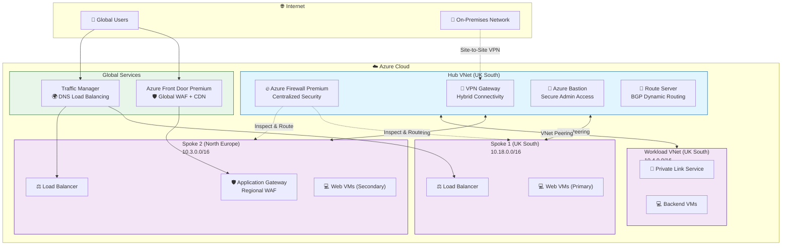
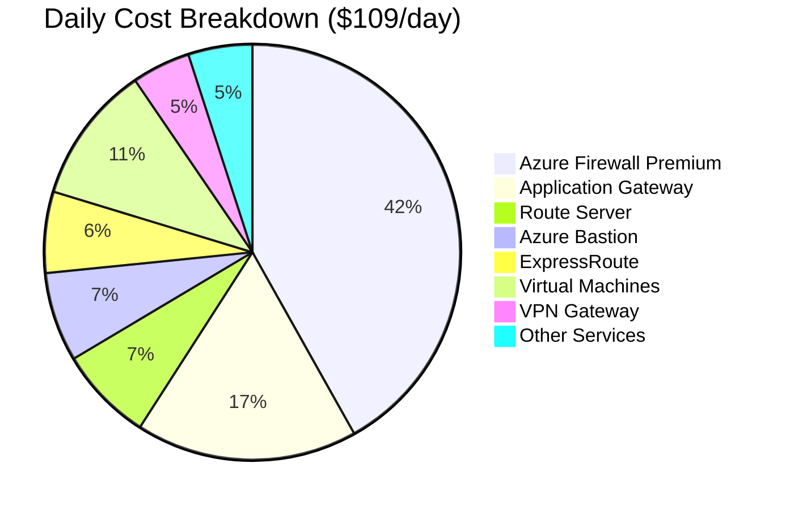
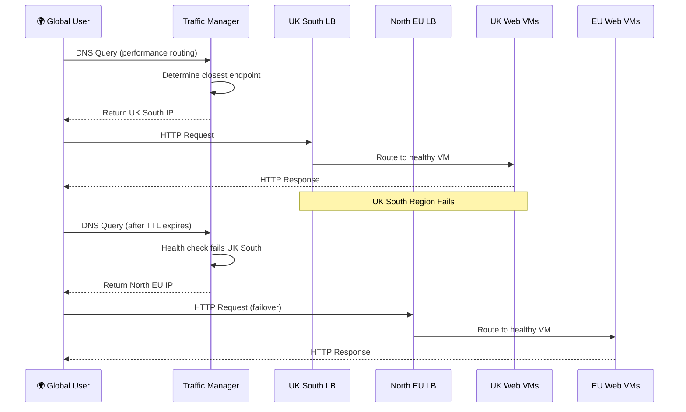
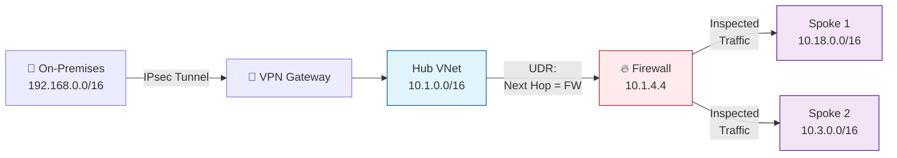
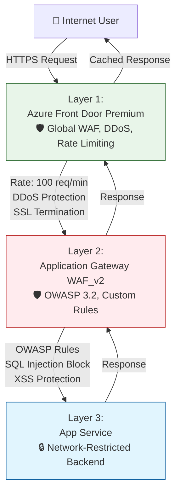

# Building the Ultimate AZ-700 Demo Environment: From Zero to Hero

> **Part 1 of 4** - Introduction and Architecture Overview

> ⚠️ **Note**: This is a blog article describing the design. For current working deployment commands, use the [⚡ Quick Start Guide](../quick_guide.md).

---

## 🎯 The Challenge

Picture this: You're preparing to deliver Azure networking training for the AZ-700 certification. You need an environment that demonstrates:
- Hub-and-spoke network topology
- VPN and ExpressRoute connectivity
- Azure Firewall with advanced threat protection
- Application Gateway with WAF
- Azure Front Door for global load balancing
- Traffic Manager for DNS-based routing
- Private Link and Private Endpoints
- Azure Route Server with BGP
- Network monitoring with Traffic Analytics

**The problem?** Spinning up all these services costs **$100+ per day**. Leave it running for a month and you're looking at **$3,000+ in Azure charges**. Not ideal for a demo environment! 💸

## 💡 The Solution

What if you could have a **production-grade Azure networking demonstration platform** that:
- ✅ Deploys in **one command** using Azure Developer CLI (`azd`)
- ✅ Includes **conditional deployment** for enterprise-grade resources
- ✅ Reduces costs from **$109/day to $25/day** with smart toggles
- ✅ Supports **multiple deployment scenarios** (minimal, essential, full)
- ✅ Includes **comprehensive demo guides** and scripts
- ✅ Follows **AZ-700 exam objectives** exactly
- ✅ Uses **Infrastructure as Code** (Bicep) for repeatability

That's exactly what we built! Let me show you how.

## 🏗️ Architecture Overview

Our environment implements a **modern hub-and-spoke network topology** with advanced Azure networking services:



## 🎓 Target Audience

This environment is perfect for:

### **Azure Trainers & Instructors**
- Need realistic, working demos for AZ-700 training
- Want to show multiple networking scenarios
- Require cost-effective environments that can be deployed on-demand

### **AZ-700 Certification Students**
- Hands-on learning with real Azure services
- Practice complex networking scenarios
- Understand architecture patterns before the exam

### **Solution Architects**
- Proof of concept for enterprise networking
- Test Azure networking features before production
- Demonstrate patterns to customers

### **DevOps Engineers**
- Learn Infrastructure as Code with Bicep
- Understand Azure networking automation
- Implement CI/CD for infrastructure

## 💰 The Cost Challenge (And How We Solved It)

When you deploy networking infrastructure in Azure, costs can escalate quickly. Here's what a typical **full-featured demo environment** costs per day:



**The breakdown:**
- 🔴 **Azure Firewall Premium**: $87.50/day ($2,625/month) - 40% of costs!
- **Application Gateway WAF_v2**: $36/day ($1,080/month)
- **Route Server**: $15.37/day ($461/month)
- **Azure Bastion Standard**: $14.52/day ($435/month)
- **ExpressRoute Circuit**: $13.20/day ($396/month)
- **Virtual Machines (6x)**: $22.49/day ($674/month)
- **VPN Gateway**: $9.50/day ($285/month)

### 💡 Our Cost Optimization Strategy

We implemented **conditional deployment** with feature toggles in `azure.yaml`:

```yaml
parameters:
  # 🔴 Enterprise-grade - for advanced security demos
  deployFirewall: false         # Saves $87.50/day!
  
  # ⚡ Use FREE Bastion Developer SKU instead
  deployBastion: false          # Saves $14.52/day!
  
  # Only for BGP/dynamic routing demos
  deployRouteServer: false      # Saves $15.37/day!
  
  # Demo only - circuit never provisioned
  deployExpressRoute: false     # Saves $13.20/day!
  
  # Always deployed - needed for demos
  deployVpnGateway: true        # $9.50/day
  deployNatGateway: true        # $1.10/day
  deployTrafficManager: true    # $0.10/day
```

### 📊 Three Deployment Modes

#### **🟢 Minimal Mode** (~$25/day, ~$750/month)
Perfect for basic networking demos and learning:
```bash
azd up \
  --set deployBastion=false \
  --set deployFirewall=false \
  --set deployExpressRoute=false \
  --set deployVpnGateway=false \
  --set deployRouteServer=false
```

**Savings: 75% ($82/day saved!)**

#### **🟡 Essential Mode** (~$50/day, ~$1,500/month)
Balanced features for most training scenarios:
```bash
azd up \
  --set deployBastion=false \
  --set deployFirewall=false \
  --set deployExpressRoute=false \
  --set deployRouteServer=false
```

**Savings: 55% ($59/day saved!)**

#### **🔴 Full Demo Mode** (~$109/day, ~$3,284/month)
Everything enabled for comprehensive demos:
```bash
azd up
# All features enabled by default
```

## 🚀 Quick Start

### Prerequisites
```bash
# Check Azure CLI
az --version

# Check Azure Developer CLI
azd version

# Login to Azure
az login
azd auth login
```

### Deploy in One Command
```bash
# Clone the repository
git clone https://github.com/SQLtattoo/az700env.git
cd az700env

# Deploy with minimal configuration
azd up
```

### Verify Deployment
```bash
# Check resource group
az group list --query "[?contains(name, 'rg-')].name" -o table

# List all VNets
az network vnet list --query "[].{Name:name, Location:location, AddressSpace:addressSpace.addressPrefixes[0]}" -o table

# Check VNet peering status
az network vnet peering list -g <resource-group> --vnet-name hub-vnet -o table
```

## 🎯 What's Included

### **Network Foundation**
- ✅ **4 Virtual Networks** (Hub + 3 Spokes) with proper address planning
- ✅ **VNet Peering** with gateway transit enabled
- ✅ **NSG Rules** configured per tier (web, app, workload)
- ✅ **DNS Zones** (public and private) with automatic linking
- ✅ **Subnet Design** following Azure best practices

### **Security Services**
- ✅ **Azure Firewall Premium** (optional) - TLS inspection, IDPS, threat intelligence
- ✅ **Application Gateway WAF_v2** - OWASP 3.2, custom rules
- ✅ **Azure Bastion** (optional) - Secure RDP/SSH without public IPs
- ✅ **Network Security Groups** - Subnet-level traffic filtering
- ✅ **Private Endpoints** - Secure PaaS service access

### **Connectivity**
- ✅ **VPN Gateway** (optional) - Site-to-Site and Point-to-Site
- ✅ **ExpressRoute** (optional, demo) - Private connectivity architecture
- ✅ **NAT Gateway** - Predictable outbound IPs
- ✅ **Gateway Transit** - Centralized hybrid connectivity

### **Load Balancing**
- ✅ **Azure Front Door Premium** - Global HTTP(S) load balancing
- ✅ **Traffic Manager** - DNS-based routing with health probes
- ✅ **Standard Load Balancers** - Regional TCP/UDP load balancing
- ✅ **Application Gateway** - Layer 7 routing with WAF

### **Advanced Routing**
- ✅ **Azure Route Server** (optional) - BGP dynamic routing
- ✅ **BGP NVA** (FRRouting) - Simulated on-premises BGP router
- ✅ **User-Defined Routes** - Custom routing tables
- ✅ **Route Propagation** - Automatic route distribution

### **Monitoring**
- ✅ **VNet Flow Logs** - 10-minute intervals
- ✅ **Traffic Analytics** - ML-based insights and geo-maps
- ✅ **Log Analytics Workspace** - Centralized logging
- ✅ **Network Watcher** - Connectivity troubleshooting

### **Management**
- ✅ **Azure Virtual Network Manager** - Centralized network management
- ✅ **Key Vault** - Secrets and certificate management
- ✅ **Recovery Services Vault** - Backup configuration
- ✅ **Storage Accounts** - Flow logs and diagnostics

## 📊 Real-World Scenarios Covered

### **Scenario 1: Global Application with Regional Failover**


### **Scenario 2: Hybrid Connectivity with Hub-and-Spoke**


### **Scenario 3: Multi-Layer Security (Defense in Depth)**


## 🎓 AZ-700 Exam Coverage

This environment covers **all major AZ-700 exam objectives**:

| Exam Objective | Services Demonstrated |
|----------------|----------------------|
| **Design, implement, and manage hybrid networking** | VPN Gateway, ExpressRoute (demo), NAT Gateway |
| **Design and implement core networking infrastructure** | VNets, Subnets, Peering, DNS, NSGs |
| **Design and implement routing** | Route Tables, UDRs, Route Server, BGP |
| **Secure and monitor networks** | Azure Firewall, NSGs, Network Watcher, Traffic Analytics |
| **Design and implement Private access to Azure Services** | Private Link, Private Endpoints, Service Endpoints |
| **Design and implement Azure load balancing solutions** | Load Balancer, App Gateway, Front Door, Traffic Manager |

## 🛠️ Technology Stack

### **Infrastructure as Code**
- **Bicep** - Azure's native IaC language
- **Azure Developer CLI** - Simplified deployment workflow
- **Modular Design** - Reusable, maintainable templates

### **Networking Services**
- **Azure Virtual Network** - Network isolation and segmentation
- **Azure Firewall Premium** - Advanced threat protection
- **Application Gateway v2** - Application-layer routing and WAF
- **Azure Front Door Premium** - Global HTTP(S) load balancing

### **Compute**
- **Virtual Machines** - B2s and B2ms SKUs for cost efficiency
- **App Services** - PaaS for web applications
- **Network Virtual Appliance** - FRRouting for BGP

### **Monitoring & Management**
- **Azure Monitor** - Comprehensive monitoring solution
- **Log Analytics** - Centralized log collection
- **Network Watcher** - Network diagnostics and troubleshooting
- **Traffic Analytics** - ML-based network insights

## 🎬 What's Next?

In **Part 2**, we'll dive deep into the technical implementation:
- Hub-and-Spoke topology in detail
- VNet peering and gateway transit
- Azure Firewall configuration and rules
- Route Server and BGP dynamic routing
- Bicep code walkthrough

In **Part 3**, we'll explore security architecture:
- Multi-layer WAF strategy
- Private Link and Private Endpoints
- Network security best practices
- Traffic Analytics and monitoring

In **Part 4**, we'll master cost optimization:
- Feature toggle implementation
- Deployment strategies for different scenarios
- The Bastion Developer SKU trick
- Best practices for training environments

## 📚 Resources

- **GitHub Repository**: [SQLtattoo/az700env](https://github.com/SQLtattoo/az700env)
- **Architecture Diagram**: See [ARCHITECTURE.md](../ARCHITECTURE.md)
- **Demo Guide**: See [demoguide/demoguide.md](../demoguide/demoguide.md)
- **Azure Documentation**: [Azure Networking](https://docs.microsoft.com/azure/networking/)
- **AZ-700 Exam**: [Study Guide](https://docs.microsoft.com/certifications/exams/az-700)

## 💬 Feedback

Have questions or suggestions? Open an issue on GitHub or reach out on LinkedIn!

---

**Next**: [Part 2 - Hub-and-Spoke to Route Server: Technical Deep Dive →](part2-technical-deep-dive.md)

---

*Published: February 2026*  
*Author: Vasilis Ioannidis*  
*Tags: #Azure #AZ700 #Networking #IaC #Bicep #DevOps*
