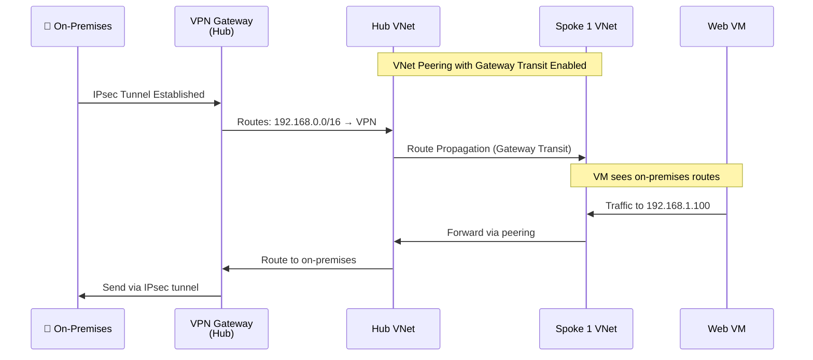
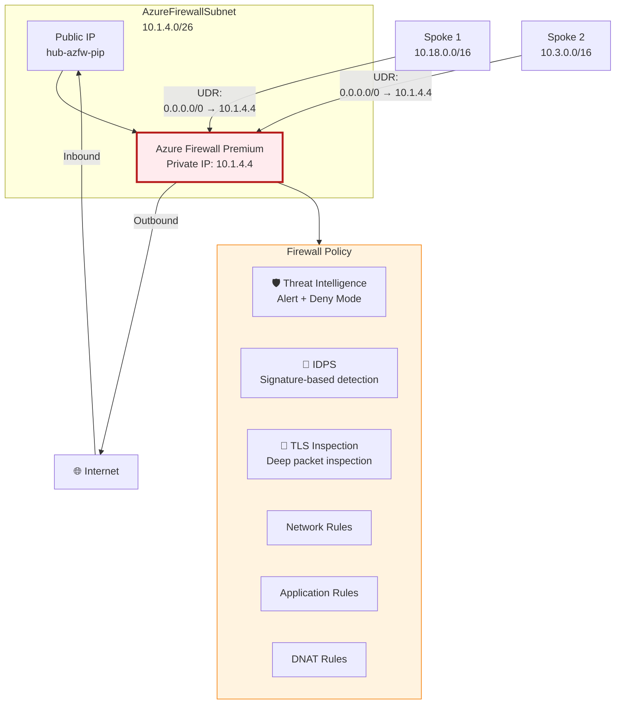
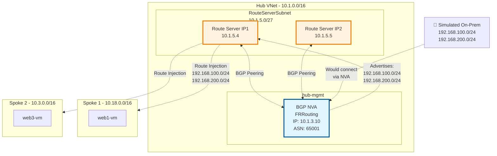
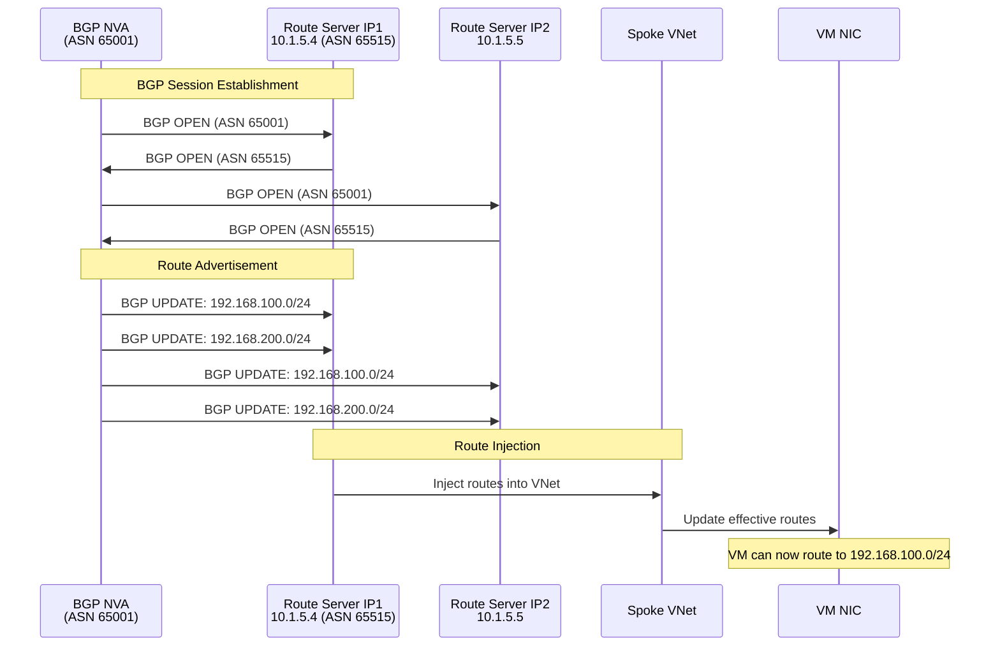

# Hub-and-Spoke to Route Server: Technical Deep Dive

> **Part 2 of 4** - Core Networking Components and Implementation

---

## 🎯 Overview

In Part 1, we introduced the AZ-700 demo environment and its cost-optimization strategies. Now, let's dive deep into the **technical implementation** of the core networking components:

- Hub-and-Spoke network topology
- VNet peering and gateway transit
- Azure Firewall configuration
- Route Server with BGP dynamic routing
- Bicep Infrastructure as Code

## 🏗️ Hub-and-Spoke Architecture

The hub-and-spoke model is the cornerstone of enterprise Azure networking. Here's why we chose this pattern:

### **Benefits**
- ✅ **Centralized security** - Firewall in hub inspects all traffic
- ✅ **Shared services** - DNS, monitoring, management in one place
- ✅ **Cost optimization** - Single VPN Gateway shared across spokes
- ✅ **Network isolation** - Spokes can't directly communicate (without hub)
- ✅ **Scalability** - Add/remove spokes without affecting others

### **Architecture Diagram**

```mermaid
graph TB
    subgraph Hub["🏠 Hub VNet - 10.1.0.0/16<br/>(UK South)"]
        direction TB
        BastionSub["AzureBastionSubnet<br/>10.1.1.0/26"]
        GatewaySub["GatewaySubnet<br/>10.1.2.0/27"]
        MgmtSub["hub-mgmt<br/>10.1.3.0/24"]
        FWSub["AzureFirewallSubnet<br/>10.1.4.0/26"]
        RSSub["RouteServerSubnet<br/>10.1.5.0/27"]
        
        Bastion["Azure Bastion"]
        VPNGw["VPN Gateway<br/>VpnGw1"]
        ERGw["ExpressRoute Gw<br/>Standard"]
        BGPNVA["BGP NVA<br/>FRRouting"]
        Firewall["Azure Firewall<br/>10.1.4.4"]
        RS["Route Server<br/>ASN 65515"]
        
        BastionSub -.-> Bastion
        GatewaySub -.-> VPNGw
        GatewaySub -.-> ERGw
        MgmtSub -.-> BGPNVA
        FWSub -.-> Firewall
        RSSub -.-> RS
    end
    
    subgraph Spoke1["📘 Spoke 1 VNet - 10.18.0.0/16<br/>(UK South)"]
        Spoke1Sub["default<br/>10.18.10.0/24"]
        WebLB1["Standard LB"]
        Web1["web1-vm<br/>B2ms"]
        Web2["web2-vm<br/>B2ms"]
        
        Spoke1Sub --> WebLB1
        WebLB1 --> Web1
        WebLB1 --> Web2
    end
    
    subgraph Spoke2["📗 Spoke 2 VNet - 10.3.0.0/16<br/>(North Europe)"]
        Spoke2Default["default<br/>10.3.1.0/24"]
        AppGwSub["AppGwSubnet<br/>10.3.2.0/24"]
        
        AppGw["App Gateway<br/>WAF_v2"]
        WebLB2["Standard LB"]
        Web3["web3-vm<br/>B2ms"]
        Web4["web4-vm<br/>B2ms"]
        VM1["vm1<br/>B2s"]
        
        Spoke2Default --> WebLB2
        AppGwSub --> AppGw
        WebLB2 --> Web3
        WebLB2 --> Web4
        Spoke2Default -.-> VM1
        AppGw --> VM1
    end
    
    subgraph Workload["📙 Workload VNet - 10.4.0.0/16<br/>(UK South)"]
        WorkloadSub["default<br/>10.4.1.0/24"]
        WorkloadLB["Standard LB"]
        PLS["Private Link<br/>Service"]
        Workload1["workload1-vm<br/>B2ms"]
        
        WorkloadSub --> WorkloadLB
        WorkloadLB --> Workload1
        WorkloadLB --- PLS
    end
    
    OnPrem["🏢 On-Premises<br/>Site-to-Site VPN"] -.->|"IPsec"| VPNGw
    ERCircuit["⚡ ExpressRoute<br/>Circuit (Demo)"] -.->|"Private"| ERGw
    
    Hub <-->|"VNet Peering<br/>✅ Gateway Transit"| Spoke1
    Hub <-->|"VNet Peering<br/>✅ Gateway Transit"| Spoke2
    Hub <-->|"VNet Peering"| Workload
    
    RS <-.->|"BGP Peering<br/>ASN 65001"| BGPNVA
    
    Firewall -.->|"Inspect<br/>Traffic"| Spoke1
    Firewall -.->|"Inspect<br/>Traffic"| Spoke2
    
    style Hub fill:#e1f5fe,stroke:#01579b,stroke-width:3px
    style Spoke1 fill:#e8f5e9,stroke:#2e7d32,stroke-width:2px
    style Spoke2 fill:#fff3e0,stroke:#f57c00,stroke-width:2px
    style Workload fill:#f3e5f5,stroke:#7b1fa2,stroke-width:2px
```



## 🔗 VNet Peering Deep Dive

### **Creating VNet Peerings**

VNet peering connects virtual networks seamlessly. Here's how we implement it in Bicep:

```bicep
// Peer Hub to Spoke1
resource hubToSpoke1Peering 'Microsoft.Network/virtualNetworks/virtualNetworkPeerings@2023-05-01' = {
  parent: hubVnet
  name: 'hub-to-spoke1'
  properties: {
    allowVirtualNetworkAccess: true      // Allow VM-to-VM communication
    allowForwardedTraffic: true          // Allow traffic from spoke through hub
    allowGatewayTransit: true            // Share VPN/ER Gateway with spoke
    useRemoteGateways: false             // Hub has its own gateway
    remoteVirtualNetwork: {
      id: spoke1Vnet.id
    }
  }
}

// Peer Spoke1 to Hub
resource spoke1ToHubPeering 'Microsoft.Network/virtualNetworks/virtualNetworkPeerings@2023-05-01' = {
  parent: spoke1Vnet
  name: 'spoke1-to-hub'
  properties: {
    allowVirtualNetworkAccess: true
    allowForwardedTraffic: true
    allowGatewayTransit: false           // Spoke doesn't have gateway
    useRemoteGateways: true              // Use hub's gateway (requires gateway transit)
    remoteVirtualNetwork: {
      id: hubVnet.id
    }
  }
}
```

### **Gateway Transit in Action**

Gateway transit allows spoke VNets to use the hub's VPN/ExpressRoute Gateway:



### **Verify Peering with Azure CLI**

```bash
# List all peerings in hub VNet
az network vnet peering list \
  --resource-group rg-az700demo \
  --vnet-name hub-vnet \
  --output table

# Check peering status
az network vnet peering show \
  --resource-group rg-az700demo \
  --vnet-name hub-vnet \
  --name hub-to-spoke1 \
  --query '{Name:name, Status:peeringState, AllowGatewayTransit:allowGatewayTransit, UseRemoteGateways:useRemoteGateways}'

# Verify effective routes on spoke VM
az network nic show-effective-route-table \
  --resource-group rg-az700demo \
  --name web1-vm-nic \
  --output table
```

## 🔥 Azure Firewall Premium Configuration

Azure Firewall Premium provides advanced threat protection. Let's configure it properly:

### **Firewall Architecture**



### **Bicep: Firewall Deployment**

```bicep
// Azure Firewall Public IP
resource firewallPip 'Microsoft.Network/publicIPAddresses@2023-05-01' = {
  name: 'hub-azfw-pip'
  location: location
  sku: {
    name: 'Standard'
  }
  properties: {
    publicIPAllocationMethod: 'Static'
    publicIPAddressVersion: 'IPv4'
  }
}

// Firewall Policy with Premium features
resource firewallPolicy 'Microsoft.Network/firewallPolicies@2023-05-01' = {
  name: 'hub-azfw-policy'
  location: location
  properties: {
    sku: {
      tier: 'Premium'
    }
    threatIntelMode: 'Alert'                    // Alert on known threats
    intrusionDetection: {                       // IDPS enabled
      mode: 'Alert'
      configuration: {
        signatureOverrides: []
        bypassTrafficSettings: []
      }
    }
    transportSecurity: {                        // TLS inspection
      certificateAuthority: {
        keyVaultSecretId: tlsCertSecretId       // Certificate from Key Vault
      }
    }
  }
}

// Azure Firewall
resource firewall 'Microsoft.Network/azureFirewalls@2023-05-01' = {
  name: 'hub-azfw'
  location: location
  properties: {
    sku: {
      name: 'AZFW_VNet'
      tier: 'Premium'
    }
    ipConfigurations: [
      {
        name: 'azfw-ipconfig'
        properties: {
          subnet: {
            id: firewallSubnetId
          }
          publicIPAddress: {
            id: firewallPip.id
          }
        }
      }
    ]
    firewallPolicy: {
      id: firewallPolicy.id
    }
  }
}
```

### **Firewall Rules Example**

```bicep
// Network Rule Collection - Allow basic services
resource networkRuleCollection 'Microsoft.Network/firewallPolicies/ruleCollectionGroups@2023-05-01' = {
  parent: firewallPolicy
  name: 'DefaultNetworkRuleCollectionGroup'
  properties: {
    priority: 200
    ruleCollections: [
      {
        ruleCollectionType: 'FirewallPolicyFilterRuleCollection'
        name: 'AllowBasicServices'
        priority: 1000
        action: {
          type: 'Allow'
        }
        rules: [
          {
            ruleType: 'NetworkRule'
            name: 'Allow-DNS'
            ipProtocols: ['UDP']
            sourceAddresses: ['10.0.0.0/8']         // All internal subnets
            destinationAddresses: ['*']
            destinationPorts: ['53']
          }
          {
            ruleType: 'NetworkRule'
            name: 'Allow-NTP'
            ipProtocols: ['UDP']
            sourceAddresses: ['10.0.0.0/8']
            destinationAddresses: ['*']
            destinationPorts: ['123']
          }
          {
            ruleType: 'NetworkRule'
            name: 'Allow-Spoke-to-Spoke'
            ipProtocols: ['Any']
            sourceAddresses: [
              '10.18.0.0/16'                        // Spoke 1
              '10.3.0.0/16'                         // Spoke 2
            ]
            destinationAddresses: [
              '10.18.0.0/16'
              '10.3.0.0/16'
            ]
            destinationPorts: ['*']
          }
        ]
      }
    ]
  }
}

// Application Rule Collection - Web access
resource applicationRuleCollection 'Microsoft.Network/firewallPolicies/ruleCollectionGroups@2023-05-01' = {
  parent: firewallPolicy
  name: 'DefaultApplicationRuleCollectionGroup'
  properties: {
    priority: 300
    ruleCollections: [
      {
        ruleCollectionType: 'FirewallPolicyFilterRuleCollection'
        name: 'AllowWebAccess'
        priority: 2000
        action: {
          type: 'Allow'
        }
        rules: [
          {
            ruleType: 'ApplicationRule'
            name: 'Allow-Windows-Update'
            protocols: [
              {
                protocolType: 'Https'
                port: 443
              }
            ]
            sourceAddresses: ['10.0.0.0/8']
            targetFqdns: [
              '*.windowsupdate.microsoft.com'
              '*.update.microsoft.com'
              '*.windowsupdate.com'
            ]
          }
          {
            ruleType: 'ApplicationRule'
            name: 'Allow-Azure-Services'
            protocols: [
              {
                protocolType: 'Https'
                port: 443
              }
            ]
            sourceAddresses: ['10.0.0.0/8']
            targetFqdns: [
              '*.azure.com'
              '*.microsoft.com'
            ]
          }
        ]
      }
    ]
  }
}
```

### **User-Defined Routes (UDR)**

Force traffic through the firewall using route tables:

```bicep
// Route table for Spoke 1
resource spoke1RouteTable 'Microsoft.Network/routeTables@2023-05-01' = {
  name: 'rt-spoke1'
  location: location
  properties: {
    disableBgpRoutePropagation: false            // Allow gateway routes
    routes: [
      {
        name: 'Internet-via-Firewall'
        properties: {
          addressPrefix: '0.0.0.0/0'             // Default route
          nextHopType: 'VirtualAppliance'
          nextHopIpAddress: '10.1.4.4'           // Firewall private IP
        }
      }
      {
        name: 'Spoke2-via-Firewall'
        properties: {
          addressPrefix: '10.3.0.0/16'           // Spoke 2 traffic
          nextHopType: 'VirtualAppliance'
          nextHopIpAddress: '10.1.4.4'
        }
      }
    ]
  }
}

// Associate route table with subnet
resource spoke1SubnetWithRouteTable 'Microsoft.Network/virtualNetworks/subnets@2023-05-01' = {
  parent: spoke1Vnet
  name: 'default'
  properties: {
    addressPrefix: '10.18.10.0/24'
    routeTable: {
      id: spoke1RouteTable.id
    }
    networkSecurityGroup: {
      id: spoke1Nsg.id
    }
  }
}
```

### **Test Firewall Configuration**

```bash
# Check firewall status
az network firewall show \
  --resource-group rg-az700demo \
  --name hub-azfw \
  --query '{Name:name, Tier:sku.tier, PrivateIP:ipConfigurations[0].properties.privateIPAddress}'

# View firewall policy
az network firewall policy show \
  --resource-group rg-az700demo \
  --name hub-azfw-policy \
  --query '{ThreatIntel:threatIntelMode, IDPS:intrusionDetection.mode, Tier:sku.tier}'

# Check firewall logs (requires diagnostic settings)
az monitor log-analytics query \
  --workspace <workspace-id> \
  --analytics-query "AzureDiagnostics | where Category == 'AzureFirewallApplicationRule' | take 20"
```

## 🔄 Azure Route Server & BGP Dynamic Routing

Route Server enables BGP routing in Azure - perfect for SD-WAN and NVA scenarios:

### **Route Server Architecture**



### **Bicep: Deploy Route Server**

```bicep
// Route Server requires a dedicated subnet
resource routeServerSubnet 'Microsoft.Network/virtualNetworks/subnets@2023-05-01' = {
  parent: hubVnet
  name: 'RouteServerSubnet'                     // Name must be exact
  properties: {
    addressPrefix: '10.1.5.0/27'               // Minimum /27
  }
}

// Public IP for Route Server
resource routeServerPip 'Microsoft.Network/publicIPAddresses@2023-05-01' = {
  name: 'hub-route-server-pip'
  location: location
  sku: {
    name: 'Standard'
  }
  properties: {
    publicIPAllocationMethod: 'Static'
  }
}

// Route Server
resource routeServer 'Microsoft.Network/virtualHubs@2023-05-01' = {
  name: 'hub-route-server'
  location: location
  properties: {
    sku: 'Standard'
    allowBranchToBranchTraffic: true            // Enable route exchange
  }
}

// Route Server IP Configuration
resource routeServerIPConfig 'Microsoft.Network/virtualHubs/ipConfigurations@2023-05-01' = {
  parent: routeServer
  name: 'rsipconfig'
  properties: {
    subnet: {
      id: routeServerSubnet.id
    }
    publicIPAddress: {
      id: routeServerPip.id
    }
  }
}

// BGP Connection to NVA
resource bgpConnection 'Microsoft.Network/virtualHubs/bgpConnections@2023-05-01' = {
  parent: routeServer
  name: 'bgp-nva-peer'
  properties: {
    peerIp: '10.1.3.10'                        // NVA IP
    peerAsn: 65001                             // NVA ASN
  }
  dependsOn: [
    routeServerIPConfig
  ]
}
```

### **BGP NVA with FRRouting**

Deploy Ubuntu VM with FRRouting for BGP:

```bicep
// Ubuntu VM for BGP NVA
resource bgpNvaVm 'Microsoft.Compute/virtualMachines@2023-03-01' = {
  name: 'hub-bgp-nva'
  location: location
  properties: {
    hardwareProfile: {
      vmSize: 'Standard_B2s'
    }
    osProfile: {
      computerName: 'bgpnva'
      adminUsername: adminUsername
      linuxConfiguration: {
        disablePasswordAuthentication: true
        ssh: {
          publicKeys: [
            {
              path: '/home/${adminUsername}/.ssh/authorized_keys'
              keyData: sshPublicKey
            }
          ]
        }
      }
    }
    storageProfile: {
      imageReference: {
        publisher: 'Canonical'
        offer: '0001-com-ubuntu-server-jammy'
        sku: '22_04-lts-gen2'
        version: 'latest'
      }
      osDisk: {
        createOption: 'FromImage'
        managedDisk: {
          storageAccountType: 'Premium_LRS'
        }
      }
    }
    networkProfile: {
      networkInterfaces: [
        {
          id: bgpNvaNic.id
          properties: {
            primary: true
          }
        }
      ]
    }
  }
}

// Custom Script Extension to configure FRRouting
resource bgpNvaConfig 'Microsoft.Compute/virtualMachines/extensions@2023-03-01' = {
  parent: bgpNvaVm
  name: 'ConfigureFRRouting'
  location: location
  properties: {
    publisher: 'Microsoft.Azure.Extensions'
    type: 'CustomScript'
    typeHandlerVersion: '2.1'
    autoUpgradeMinorVersion: true
    settings: {
      fileUris: []
    }
    protectedSettings: {
      commandToExecute: '''
        #!/bin/bash
        set -e
        
        # Install FRRouting
        curl -s https://deb.frrouting.org/frr/keys.asc | sudo apt-key add -
        echo "deb https://deb.frrouting.org/frr $(lsb_release -s -c) frr-stable" | sudo tee -a /etc/apt/sources.list.d/frr.list
        sudo apt-get update
        sudo apt-get install -y frr frr-pythontools
        
        # Enable BGP daemon
        sudo sed -i 's/bgpd=no/bgpd=yes/' /etc/frr/daemons
        
        # Configure FRRouting
        sudo tee /etc/frr/frr.conf > /dev/null <<EOF
frr version 8.4
frr defaults traditional
hostname bgpnva
log syslog informational
no ipv6 forwarding
service integrated-vtysh-config

router bgp 65001
 bgp router-id 10.1.3.10
 neighbor 10.1.5.4 remote-as 65515
 neighbor 10.1.5.4 ebgp-multihop 255
 neighbor 10.1.5.5 remote-as 65515
 neighbor 10.1.5.5 ebgp-multihop 255
 
 address-family ipv4 unicast
  network 192.168.100.0/24
  network 192.168.200.0/24
  neighbor 10.1.5.4 soft-reconfiguration inbound
  neighbor 10.1.5.5 soft-reconfiguration inbound
 exit-address-family
exit

! Create null routes for advertised networks
ip route 192.168.100.0/24 Null0
ip route 192.168.200.0/24 Null0

line vty
exit
EOF
        
        # Restart FRRouting
        sudo systemctl restart frr
        sudo systemctl enable frr
      '''
    }
  }
}
```

### **Verify BGP Configuration**

```bash
# SSH into NVA
ssh azadmin@<nva-public-ip>

# Check BGP summary
sudo vtysh -c "show ip bgp summary"
# Output shows:
# Neighbor        V    AS MsgRcvd MsgSent   TblVer  InQ OutQ Up/Down  State/PfxRcd
# 10.1.5.4        4 65515     123     125        0    0    0 01:02:34        0
# 10.1.5.5        4 65515     120     122        0    0    0 01:02:30        0

# Check advertised routes
sudo vtysh -c "show ip bgp neighbors 10.1.5.4 advertised-routes"
# Should show 192.168.100.0/24 and 192.168.200.0/24

# Check received routes (routes FROM Route Server)
sudo vtysh -c "show ip bgp neighbors 10.1.5.4 routes"
```

### **Verify Route Injection in Azure**

```bash
# Check routes on a VM in spoke VNet
az network nic show-effective-route-table \
  --resource-group rg-az700demo \
  --name web1-vm-nic \
  --output table

# Expected output includes:
# Source                 AddressPrefix       NextHopType             NextHopIP
# VirtualNetworkGateway  192.168.100.0/24   VirtualNetworkGateway   10.1.5.4
# VirtualNetworkGateway  192.168.200.0/24   VirtualNetworkGateway   10.1.5.5

# Get Route Server learned routes
az network routeserver peering list-learned-routes \
  --resource-group rg-az700demo \
  --routeserver hub-route-server \
  --name bgp-nva-peer
```

### **BGP Route Flow**



## 📊 Monitoring and Verification

### **Check VNet Peering Status**

```bash
# PowerShell script to verify all peerings
$rg = "rg-az700demo"
$vnets = @("hub-vnet", "spoke1-vnet", "spoke2-vnet", "workload-vnet")

foreach ($vnet in $vnets) {
    Write-Host "`n=== Peerings for $vnet ===" -ForegroundColor Cyan
    az network vnet peering list -g $rg --vnet-name $vnet --query "[].{Name:name, Status:peeringState, RemoteVNet:remoteVirtualNetwork.id, AllowGatewayTransit:allowGatewayTransit, UseRemoteGateways:useRemoteGateways}" -o table
}
```

### **Test Connectivity**

```bash
# From a spoke VM, test internet connectivity through firewall
curl -I https://www.microsoft.com

# Check if traffic goes through firewall (via UDR)
traceroute -n 8.8.8.8
# First hop should be 10.1.4.4 (firewall private IP)

# Test spoke-to-spoke communication
ping 10.3.1.4  # From spoke1 to spoke2
```

### **Firewall Logs**

```bash
# Query firewall application rule logs
az monitor log-analytics query \
  --workspace <workspace-id> \
  --analytics-query "
    AzureDiagnostics
    | where Category == 'AzureFirewallApplicationRule'
    | where TimeGenerated > ago(1h)
    | project TimeGenerated, msg_s
    | take 50
  " \
  --output table

# Query firewall network rule logs
az monitor log-analytics query \
  --workspace <workspace-id> \
  --analytics-query "
    AzureDiagnostics
    | where Category == 'AzureFirewallNetworkRule'
    | where TimeGenerated > ago(1h)
    | summarize Count=count() by Action
  " \
  --output table
```

## 🎓 Key Takeaways

### **Hub-and-Spoke Best Practices**
- ✅ Use /16 for hub, /16 for each spoke for scalability
- ✅ Reserve dedicated subnets for Azure services (GatewaySubnet, AzureBastionSubnet, etc.)
- ✅ Enable gateway transit for spoke VNets to share VPN/ER Gateway
- ✅ Implement UDRs to force traffic through Azure Firewall
- ✅ Use Network Security Groups for defense in depth

### **VNet Peering Configuration**
- ✅ Always peer bidirectionally (hub→spoke AND spoke→hub)
- ✅ Set `allowGatewayTransit=true` on hub
- ✅ Set `useRemoteGateways=true` on spokes
- ✅ Enable `allowForwardedTraffic` for spoke-to-spoke via hub

### **Azure Firewall**
- ✅ Use Premium tier for TLS inspection and IDPS
- ✅ Create modular rule collections (network, application, NAT)
- ✅ Enable threat intelligence in Alert or Deny mode
- ✅ Configure diagnostic settings to Log Analytics
- ✅ Use FQDN tags for common services (Windows Update, Azure, etc.)

### **Route Server & BGP**
- ✅ Use for dynamic routing scenarios (SD-WAN, multi-NVA)
- ✅ BGP routes override UDRs for more specific prefixes
- ✅ Enable branch-to-branch for multi-NVA scenarios
- ✅ Monitor BGP session state and advertised routes
- ✅ Use null routes on NVA for route advertisement without actual routing

## 🚀 What's Next?

In **Part 3**, we'll explore the security architecture:
- Multi-layer WAF strategy (Azure Front Door + App Gateway)
- Private Link and Private Endpoints implementation
- Network Security Groups and Application Security Groups
- Traffic Analytics and threat detection
- Best practices for network security

---

**Previous**: [← Part 1 - Building the Ultimate AZ-700 Demo Environment](part1-building-ultimate-az700-demo.md)  
**Next**: [Part 3 - Multi-Layer Security & Global Load Balancing →](part3-security-and-load-balancing.md)

---

*Published: February 2026*  
*Author: Vasilis Ioannidis*  
*Tags: #Azure #AZ700 #Networking #HubAndSpoke #BGP #Firewall #RouteServer*
