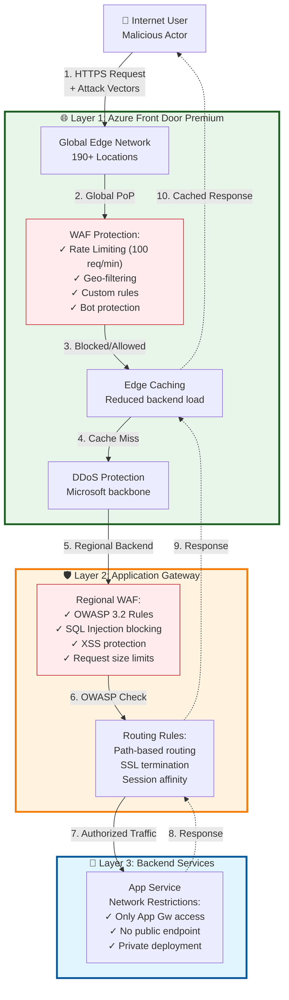
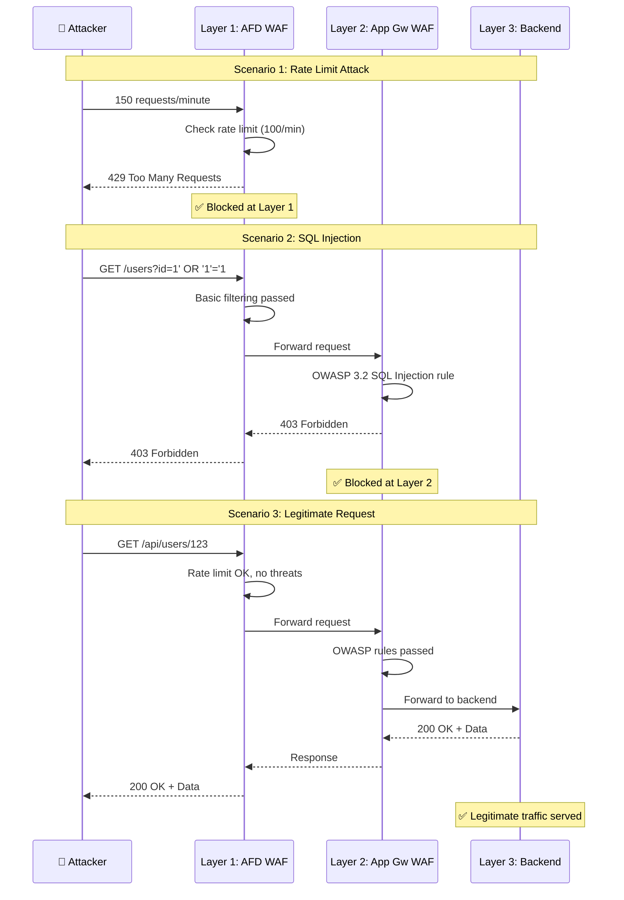
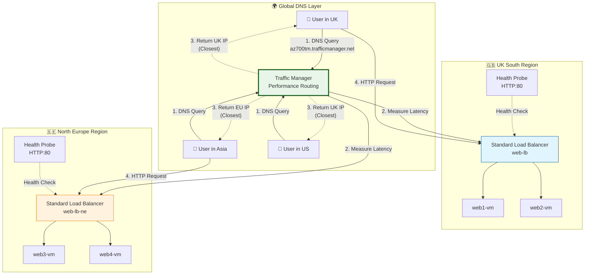
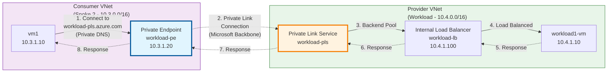
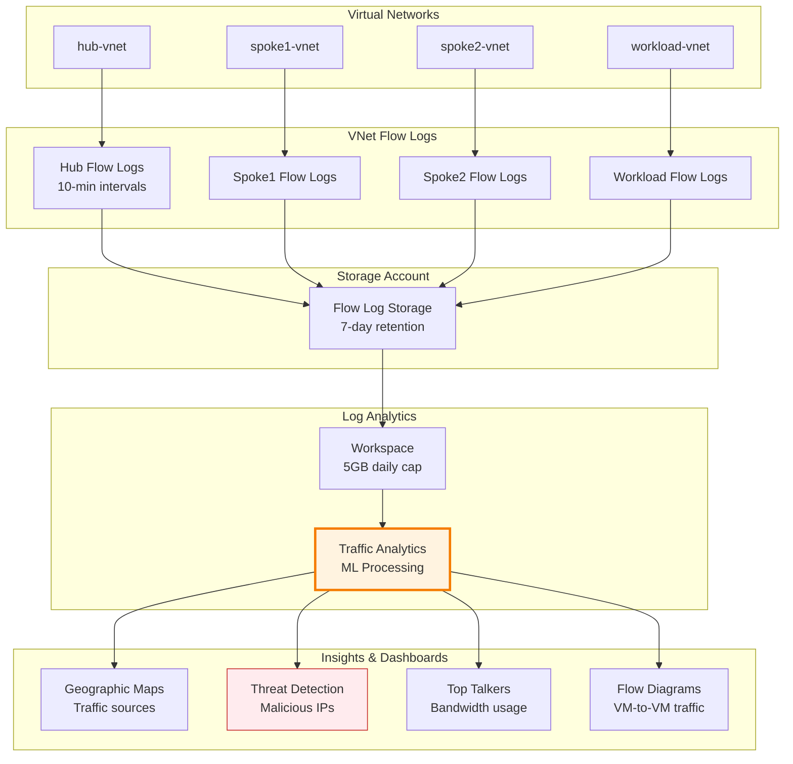
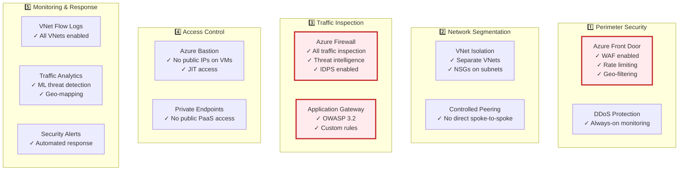

# Multi-Layer Security & Global Load Balancing

> **Part 3 of 4** - Defense in Depth and Traffic Management

---

## 🎯 Overview

In Parts 1 and 2, we built the foundation and core networking components. Now let's explore the **security architecture** that makes this environment production-ready:

- Multi-layer WAF strategy (Azure Front Door + Application Gateway)
- Private Link and Private Endpoints
- Global load balancing with Traffic Manager
- Network monitoring with Traffic Analytics
- Security best practices and threat detection

## 🛡️ Defense in Depth: Dual-WAF Architecture

The crown jewel of our security architecture is the **multi-layer WAF protection**. Think of it as a security fortress with multiple gates:

### **Security Layers**



### **Attack Scenarios and Protection**



## 🌐 Azure Front Door Premium Implementation

### **Bicep: Deploy Azure Front Door**

```bicep
// Azure Front Door Profile (Premium SKU)
resource frontDoorProfile 'Microsoft.Cdn/profiles@2023-05-01' = {
  name: 'afd-az700'
  location: 'global'
  sku: {
    name: 'Premium_AzureFrontDoor'
  }
  properties: {
    originResponseTimeoutSeconds: 60
  }
}

// WAF Policy for AFD
resource afdWafPolicy 'Microsoft.Network/FrontDoorWebApplicationFirewallPolicies@2022-05-01' = {
  name: 'afdwafpolicy'
  location: 'global'
  sku: {
    name: 'Premium_AzureFrontDoor'
  }
  properties: {
    policySettings: {
      enabledState: 'Enabled'
      mode: 'Prevention'                                    // Block mode
      requestBodyCheck: 'Enabled'
      customBlockResponseStatusCode: 403
      customBlockResponseBody: base64('Access Denied by WAF')
    }
    customRules: {
      rules: [
        {
          name: 'RateLimitRule'
          priority: 100
          ruleType: 'RateLimitRule'
          rateLimitThreshold: 100                           // 100 requests
          rateLimitDurationInMinutes: 1                     // per minute
          action: 'Block'
          matchConditions: [
            {
              matchVariable: 'RequestUri'
              operator: 'Contains'
              matchValue: ['/api/']
              transforms: []
            }
          ]
        }
        {
          name: 'GeoFilterRule'
          priority: 200
          ruleType: 'MatchRule'
          action: 'Block'
          matchConditions: [
            {
              matchVariable: 'RemoteAddr'
              operator: 'GeoMatch'
              negateCondition: true                         // NOT in these countries
              matchValue: ['GB', 'US', 'DE', 'FR', 'SE']   // Allowed countries
              transforms: []
            }
          ]
        }
      ]
    }
    managedRules: {
      managedRuleSets: [
        {
          ruleSetType: 'Microsoft_DefaultRuleSet'
          ruleSetVersion: '2.1'
          ruleSetAction: 'Block'
        }
        {
          ruleSetType: 'Microsoft_BotManagerRuleSet'
          ruleSetVersion: '1.0'
          ruleSetAction: 'Block'
        }
      ]
    }
  }
}

// AFD Endpoint
resource afdEndpoint 'Microsoft.Cdn/profiles/afdEndpoints@2023-05-01' = {
  parent: frontDoorProfile
  name: 'endpoint-${uniqueString(resourceGroup().id)}'
  location: 'global'
  properties: {
    enabledState: 'Enabled'
  }
}

// Origin Group (App Gateway as backend)
resource afdOriginGroup 'Microsoft.Cdn/profiles/originGroups@2023-05-01' = {
  parent: frontDoorProfile
  name: 'appgw-origin-group'
  properties: {
    loadBalancingSettings: {
      sampleSize: 4
      successfulSamplesRequired: 3
      additionalLatencyInMilliseconds: 50
    }
    healthProbeSettings: {
      probePath: '/health'
      probeRequestType: 'HEAD'
      probeProtocol: 'Https'
      probeIntervalInSeconds: 30
    }
  }
}

// Origin (Application Gateway)
resource afdOrigin 'Microsoft.Cdn/profiles/originGroups/origins@2023-05-01' = {
  parent: afdOriginGroup
  name: 'appgw-origin'
  properties: {
    hostName: applicationGateway.properties.frontendIPConfigurations[0].properties.publicIPAddress.properties.dnsSettings.fqdn
    httpPort: 80
    httpsPort: 443
    originHostHeader: applicationGateway.properties.frontendIPConfigurations[0].properties.publicIPAddress.properties.dnsSettings.fqdn
    priority: 1
    weight: 1000
    enabledState: 'Enabled'
  }
}

// AFD Route
resource afdRoute 'Microsoft.Cdn/profiles/afdEndpoints/routes@2023-05-01' = {
  parent: afdEndpoint
  name: 'default-route'
  properties: {
    customDomains: []
    originGroup: {
      id: afdOriginGroup.id
    }
    supportedProtocols: ['Http', 'Https']
    patternsToMatch: ['/*']
    forwardingProtocol: 'HttpsOnly'                         // Force HTTPS
    linkToDefaultDomain: 'Enabled'
    httpsRedirect: 'Enabled'                                // HTTP → HTTPS redirect
  }
  dependsOn: [
    afdOrigin
  ]
}

// Associate WAF policy with endpoint
resource afdSecurityPolicy 'Microsoft.Cdn/profiles/securityPolicies@2023-05-01' = {
  parent: frontDoorProfile
  name: 'waf-security-policy'
  properties: {
    parameters: {
      type: 'WebApplicationFirewall'
      wafPolicy: {
        id: afdWafPolicy.id
      }
      associations: [
        {
          domains: [
            {
              id: afdEndpoint.id
            }
          ]
          patternsToMatch: ['/*']
        }
      ]
    }
  }
}
```

### **Test Azure Front Door WAF**

```bash
# Get AFD endpoint URL
AFD_URL=$(az afd endpoint show \
  --resource-group rg-az700demo \
  --profile-name afd-az700 \
  --endpoint-name endpoint-xxxxx \
  --query hostName -o tsv)

echo "AFD Endpoint: https://$AFD_URL"

# Test 1: Normal request (should work)
curl -I "https://$AFD_URL/"

# Test 2: SQL Injection attempt (should be blocked)
curl -I "https://$AFD_URL/api/users?id=1' OR '1'='1"
# Expected: 403 Forbidden

# Test 3: XSS attempt (should be blocked)
curl -I "https://$AFD_URL/search?q=<script>alert('xss')</script>"
# Expected: 403 Forbidden

# Test 4: Rate limit (send 150 requests)
for i in {1..150}; do
  curl -s -o /dev/null -w "Request $i: %{http_code}\n" "https://$AFD_URL/api/test"
  sleep 0.1
done
# Expected: First 100 succeed, rest get 429

# Check WAF logs
az monitor log-analytics query \
  --workspace <workspace-id> \
  --analytics-query "
    AzureDiagnostics
    | where Category == 'FrontdoorWebApplicationFirewallLog'
    | where TimeGenerated > ago(1h)
    | project TimeGenerated, action_s, trackingReference_s, ruleName_s
    | take 50
  "
```

## 🛡️ Application Gateway WAF Configuration

The second layer provides regional OWASP protection:

### **Bicep: Application Gateway with WAF**

```bicep
// WAF Policy for Application Gateway
resource appGwWafPolicy 'Microsoft.Network/ApplicationGatewayWebApplicationFirewallPolicies@2023-05-01' = {
  name: 'appgw-waf-policy'
  location: location
  properties: {
    policySettings: {
      mode: 'Prevention'
      state: 'Enabled'
      maxRequestBodySizeInKb: 128
      fileUploadLimitInMb: 100
      requestBodyCheck: true
    }
    customRules: [
      {
        name: 'BlockSpecificUserAgent'
        priority: 100
        ruleType: 'MatchRule'
        action: 'Block'
        matchConditions: [
          {
            matchVariables: [
              {
                variableName: 'RequestHeaders'
                selector: 'User-Agent'
              }
            ]
            operator: 'Contains'
            matchValues: ['badbot', 'scraper']
            transforms: ['Lowercase']
          }
        ]
      }
    ]
    managedRules: {
      managedRuleSets: [
        {
          ruleSetType: 'OWASP'
          ruleSetVersion: '3.2'
          ruleGroupOverrides: []
        }
      ]
      exclusions: []
    }
  }
}

// Application Gateway
resource applicationGateway 'Microsoft.Network/applicationGateways@2023-05-01' = {
  name: 'app-gateway'
  location: location
  properties: {
    sku: {
      name: 'WAF_v2'
      tier: 'WAF_v2'
      capacity: 2
    }
    gatewayIPConfigurations: [
      {
        name: 'appGwIpConfig'
        properties: {
          subnet: {
            id: appGwSubnetId
          }
        }
      }
    ]
    frontendIPConfigurations: [
      {
        name: 'appGwPublicFrontendIp'
        properties: {
          publicIPAddress: {
            id: appGwPublicIp.id
          }
        }
      }
    ]
    frontendPorts: [
      {
        name: 'port_80'
        properties: {
          port: 80
        }
      }
      {
        name: 'port_443'
        properties: {
          port: 443
        }
      }
    ]
    backendAddressPools: [
      {
        name: 'appServicePool'
        properties: {
          backendAddresses: [
            {
              fqdn: appService.properties.defaultHostName
            }
          ]
        }
      }
      {
        name: 'vmPool'
        properties: {
          backendAddresses: [
            {
              ipAddress: vm1.properties.networkProfile.networkInterfaces[0].properties.ipConfigurations[0].properties.privateIPAddress
            }
          ]
        }
      }
    ]
    backendHttpSettingsCollection: [
      {
        name: 'appServiceHttpSettings'
        properties: {
          port: 443
          protocol: 'Https'
          cookieBasedAffinity: 'Disabled'
          pickHostNameFromBackendAddress: true
          requestTimeout: 30
          probe: {
            id: resourceId('Microsoft.Network/applicationGateways/probes', 'app-gateway', 'appServiceProbe')
          }
        }
      }
    ]
    httpListeners: [
      {
        name: 'httpListener'
        properties: {
          frontendIPConfiguration: {
            id: resourceId('Microsoft.Network/applicationGateways/frontendIPConfigurations', 'app-gateway', 'appGwPublicFrontendIp')
          }
          frontendPort: {
            id: resourceId('Microsoft.Network/applicationGateways/frontendPorts', 'app-gateway', 'port_80')
          }
          protocol: 'Http'
        }
      }
    ]
    requestRoutingRules: [
      {
        name: 'defaultRoutingRule'
        properties: {
          ruleType: 'Basic'
          priority: 100
          httpListener: {
            id: resourceId('Microsoft.Network/applicationGateways/httpListeners', 'app-gateway', 'httpListener')
          }
          backendAddressPool: {
            id: resourceId('Microsoft.Network/applicationGateways/backendAddressPools', 'app-gateway', 'appServicePool')
          }
          backendHttpSettings: {
            id: resourceId('Microsoft.Network/applicationGateways/backendHttpSettingsCollection', 'app-gateway', 'appServiceHttpSettings')
          }
        }
      }
    ]
    probes: [
      {
        name: 'appServiceProbe'
        properties: {
          protocol: 'Https'
          path: '/health'
          interval: 30
          timeout: 30
          unhealthyThreshold: 3
          pickHostNameFromBackendHttpSettings: true
        }
      }
    ]
    webApplicationFirewallConfiguration: {
      enabled: true
      firewallMode: 'Prevention'
      ruleSetType: 'OWASP'
      ruleSetVersion: '3.2'
    }
    firewallPolicy: {
      id: appGwWafPolicy.id
    }
  }
}
```

## 🌍 Global Load Balancing with Traffic Manager

Traffic Manager provides DNS-based global load balancing:

### **Traffic Manager Architecture**



### **Bicep: Traffic Manager Configuration**

```bicep
// Traffic Manager Profile
resource trafficManagerProfile 'Microsoft.Network/trafficManagerProfiles@2022-04-01' = {
  name: 'az700-tm'
  location: 'global'
  properties: {
    profileStatus: 'Enabled'
    trafficRoutingMethod: 'Performance'                     // Route to closest endpoint
    dnsConfig: {
      relativeName: 'az700tm-${uniqueString(resourceGroup().id)}'
      ttl: 60                                               // DNS TTL in seconds
    }
    monitorConfig: {
      protocol: 'HTTP'
      port: 80
      path: '/'
      intervalInSeconds: 30
      toleratedNumberOfFailures: 3
      timeoutInSeconds: 10
    }
    endpoints: [
      {
        name: 'uksouth-web-endpoint'
        type: 'Microsoft.Network/trafficManagerProfiles/azureEndpoints'
        properties: {
          targetResourceId: webLBUKSouth.properties.frontendIPConfigurations[0].properties.publicIPAddress.id
          endpointStatus: 'Enabled'
          weight: 100
          priority: 1
          endpointLocation: 'UK South'
        }
      }
      {
        name: 'northeurope-web-endpoint'
        type: 'Microsoft.Network/trafficManagerProfiles/azureEndpoints'
        properties: {
          targetResourceId: webLBNorthEU.properties.frontendIPConfigurations[0].properties.publicIPAddress.id
          endpointStatus: 'Enabled'
          weight: 100
          priority: 2                                       // Secondary priority
          endpointLocation: 'North Europe'
        }
      }
    ]
  }
}
```

### **Test Traffic Manager**

```bash
# Get Traffic Manager FQDN
TM_FQDN=$(az network traffic-manager profile show \
  --resource-group rg-az700demo \
  --name az700-tm \
  --query dnsConfig.fqdn -o tsv)

echo "Traffic Manager: $TM_FQDN"

# Test DNS resolution from different locations
# Run this from UK VM
nslookup $TM_FQDN
# Should return UK South IP

# Run this from Asia VM (if available)
nslookup $TM_FQDN
# Should return North Europe IP

# Check endpoint health
az network traffic-manager endpoint list \
  --resource-group rg-az700demo \
  --profile-name az700-tm \
  --query "[].{Name:name, Status:endpointStatus, MonitorStatus:endpointMonitorStatus}" \
  --output table

# Simulate endpoint failure (stop UK South LB)
az network lb stop \
  --resource-group rg-az700demo \
  --name web-lb

# Wait for health probe to detect failure (30-60 seconds)
# Traffic should failover to North Europe

# Check Traffic Manager metrics
az monitor metrics list \
  --resource $(az network traffic-manager profile show -g rg-az700demo -n az700-tm --query id -o tsv) \
  --metric "QpsByEndpoint" \
  --start-time $(date -u -d '1 hour ago' '+%Y-%m-%dT%H:%M:%SZ') \
  --interval PT1M
```

## 🔒 Private Link and Private Endpoints

Secure access to PaaS services without public IPs:

### **Private Link Architecture**



### **Bicep: Private Link Service**

```bicep
// Private Link Service
resource privateLinkService 'Microsoft.Network/privateLinkServices@2023-05-01' = {
  name: 'workload-pls'
  location: location
  properties: {
    enableProxyProtocol: false
    loadBalancerFrontendIpConfigurations: [
      {
        id: workloadLB.properties.frontendIPConfigurations[0].id
      }
    ]
    ipConfigurations: [
      {
        name: 'pls-ipconfig'
        properties: {
          privateIPAllocationMethod: 'Dynamic'
          subnet: {
            id: workloadSubnetId
          }
          primary: true
          privateIPAddressVersion: 'IPv4'
        }
      }
    ]
    autoApproval: {
      subscriptions: [subscription().subscriptionId]         // Auto-approve from same subscription
    }
    visibility: {
      subscriptions: [subscription().subscriptionId]         // Visible to same subscription
    }
  }
}

// Private Endpoint
resource privateEndpoint 'Microsoft.Network/privateEndpoints@2023-05-01' = {
  name: 'workload-pe'
  location: location
  properties: {
    subnet: {
      id: consumerSubnetId
    }
    privateLinkServiceConnections: [
      {
        name: 'pls-connection'
        properties: {
          privateLinkServiceId: privateLinkService.id
          requestMessage: 'Please approve connection from spoke2'
        }
      }
    ]
  }
}

// Private DNS Zone for Private Endpoint
resource privateDnsZone 'Microsoft.Network/privateDnsZones@2020-06-01' = {
  name: 'privatelink.workload.local'
  location: 'global'
}

// DNS Zone Group for Private Endpoint
resource privateDnsZoneGroup 'Microsoft.Network/privateEndpoints/privateDnsZoneGroups@2023-05-01' = {
  parent: privateEndpoint
  name: 'default'
  properties: {
    privateDnsZoneConfigs: [
      {
        name: 'config1'
        properties: {
          privateDnsZoneId: privateDnsZone.id
        }
      }
    ]
  }
}

// Link DNS Zone to Consumer VNet
resource dnsZoneLink 'Microsoft.Network/privateDnsZones/virtualNetworkLinks@2020-06-01' = {
  parent: privateDnsZone
  name: 'link-to-consumer-vnet'
  location: 'global'
  properties: {
    virtualNetwork: {
      id: consumerVnetId
    }
    registrationEnabled: false
  }
}
```

### **Test Private Endpoint**

```bash
# From consumer VM (vm1 in spoke2)
ssh azadmin@<vm1-ip>

# Check private endpoint IP
nslookup workload-pls.privatelink.workload.local
# Should return private IP (10.3.1.20)

# Test connectivity to workload through private endpoint
curl http://10.3.1.20
# Should connect to workload VMs

# Verify no public IP is used
ip route get <workload-vm-private-ip>
# Should show route via private endpoint, not internet

# Check private endpoint connections
az network private-endpoint-connection list \
  --resource-group rg-az700demo \
  --name workload-pls \
  --type Microsoft.Network/privateLinkServices \
  --query "[].{Name:name, Status:properties.privateLinkServiceConnectionState.status}" \
  --output table
```

## 📊 Network Monitoring with Traffic Analytics

VNet Flow Logs and Traffic Analytics provide deep insights:

### **Monitoring Architecture**



### **Bicep: Traffic Analytics Configuration**

```bicep
// Log Analytics Workspace
resource logAnalyticsWorkspace 'Microsoft.OperationalInsights/workspaces@2022-10-01' = {
  name: 'law-az700'
  location: location
  properties: {
    sku: {
      name: 'PerGB2018'
    }
    retentionInDays: 30
    workspaceCapping: {
      dailyQuotaGb: 5                                       // Cost control
    }
  }
}

// Storage Account for Flow Logs
resource flowLogStorage 'Microsoft.Storage/storageAccounts@2023-01-01' = {
  name: 'staz700flow${uniqueString(resourceGroup().id)}'
  location: location
  sku: {
    name: 'Standard_LRS'
  }
  kind: 'StorageV2'
  properties: {
    minimumTlsVersion: 'TLS1_2'
    allowBlobPublicAccess: false
    networkAcls: {
      defaultAction: 'Allow'
    }
  }
}

// VNet Flow Logs for Hub VNet
resource hubFlowLog 'Microsoft.Network/networkWatchers/flowLogs@2023-05-01' = {
  name: '${networkWatcher.name}/hub-vnet-flowlog'
  location: location
  properties: {
    targetResourceId: hubVnet.id
    storageId: flowLogStorage.id
    enabled: true
    retentionPolicy: {
      days: 7
      enabled: true
    }
    format: {
      type: 'JSON'
      version: 2
    }
    flowAnalyticsConfiguration: {
      networkWatcherFlowAnalyticsConfiguration: {
        enabled: true
        workspaceResourceId: logAnalyticsWorkspace.id
        trafficAnalyticsInterval: 10                        // 10-minute intervals
      }
    }
  }
}
```

### **Query Traffic Analytics**

```bash
# Top source IPs by traffic volume
az monitor log-analytics query \
  --workspace <workspace-id> \
  --analytics-query "
    AzureNetworkAnalytics_CL
    | where TimeGenerated > ago(24h)
    | summarize TotalBytes = sum(FlowCount_d * AvgPacketSize_d) by SrcIP_s
    | top 10 by TotalBytes desc
    | project SrcIP_s, TotalBytes_GB = TotalBytes / 1024 / 1024 / 1024
  " \
  --output table

# Detect malicious IPs
az monitor log-analytics query \
  --workspace <workspace-id> \
  --analytics-query "
    AzureNetworkAnalytics_CL
    | where TimeGenerated > ago(1h)
    | where MaliciousFlow_b == true
    | project TimeGenerated, SrcIP_s, DestIP_s, ThreatType_s, FlowCount_d
    | order by TimeGenerated desc
  " \
  --output table

# Geographic traffic distribution
az monitor log-analytics query \
  --workspace <workspace-id> \
  --analytics-query "
    AzureNetworkAnalytics_CL
    | where TimeGenerated > ago(24h)
    | summarize Connections = count() by Country_s
    | top 20 by Connections desc
  " \
  --output table

# Application protocol distribution
az monitor log-analytics query \
  --workspace <workspace-id> \
  --analytics-query "
    AzureNetworkAnalytics_CL
    | where TimeGenerated > ago(1h)
    | summarize count() by L7Protocol_s
    | order by count_ desc
  " \
  --output table
```

## 🛡️ Security Best Practices

### **Network Security Checklist**



## 🎓 Key Takeaways

### **Multi-Layer Security**
- ✅ **Defense in Depth** - Multiple security layers, not single point of failure
- ✅ **AFD + App Gateway** - Dual-WAF protection blocks threats at edge and regional layers
- ✅ **Network-Restricted Backends** - App Services only accessible via App Gateway
- ✅ **Rate Limiting** - Protect against DDoS and brute-force attacks

### **Global Load Balancing**
- ✅ **Traffic Manager** - DNS-based routing to closest healthy endpoint
- ✅ **Health Probes** - Automatic failover on endpoint failure
- ✅ **Performance Routing** - Users routed to lowest-latency endpoint
- ✅ **Geographic Distribution** - Serve users from nearest region

### **Private Connectivity**
- ✅ **Private Link** - Access PaaS services without public IPs
- ✅ **Private Endpoints** - Secure connections over Microsoft backbone
- ✅ **DNS Integration** - Automatic private DNS resolution
- ✅ **Network Security** - Traffic never leaves Azure network

### **Monitoring & Analytics**
- ✅ **VNet Flow Logs** - Comprehensive network traffic logging
- ✅ **Traffic Analytics** - ML-based insights and threat detection
- ✅ **Geographic Mapping** - Visualize traffic sources worldwide
- ✅ **Real-Time Alerts** - Automated threat response

## 🚀 What's Next?

In **Part 4** (final), we'll master cost optimization:
- The $109/day to $25/day transformation
- Feature toggles and conditional deployment
- The Azure Bastion Developer SKU trick
- Deployment configurations for different scenarios
- Best practices for training environments
- Resource cleanup and cost management

---

**Previous**: [← Part 2 - Hub-and-Spoke Technical Deep Dive](part2-technical-deep-dive.md)  
**Next**: [Part 4 - Cost Optimization & Deployment Strategies →](part4-cost-optimization.md)

---

*Published: February 2026*  
*Author: Vasilis Ioannidis*  
*Tags: #Azure #AZ700 #Security #WAF #PrivateLink #TrafficManager #Monitoring*
