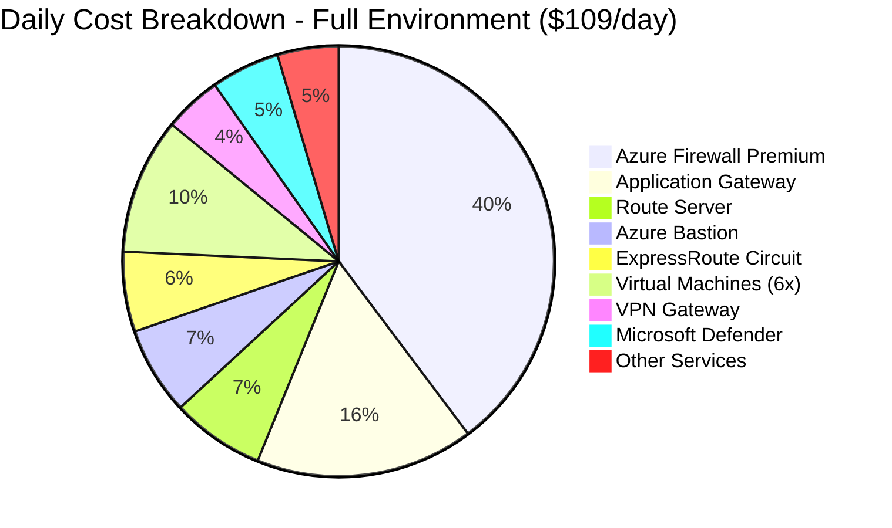
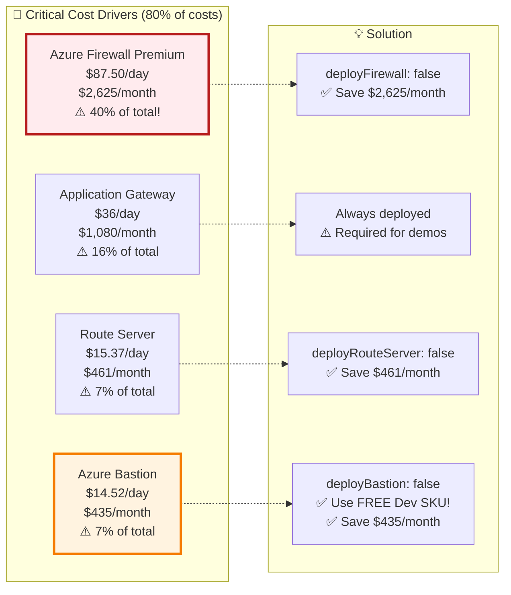
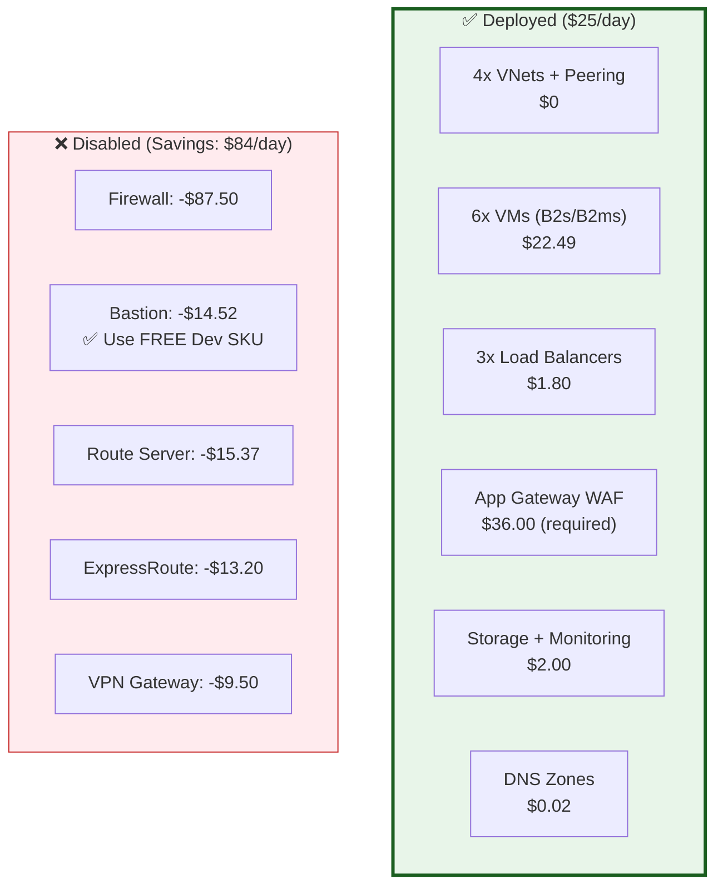
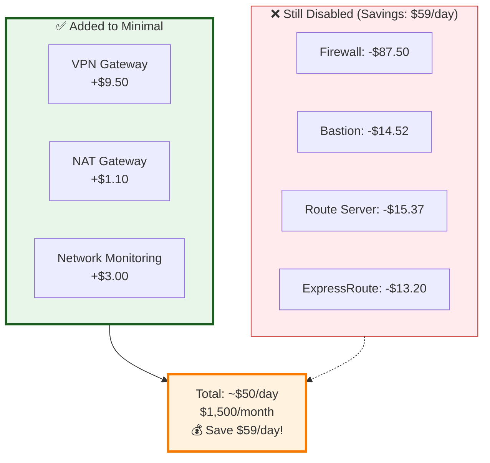
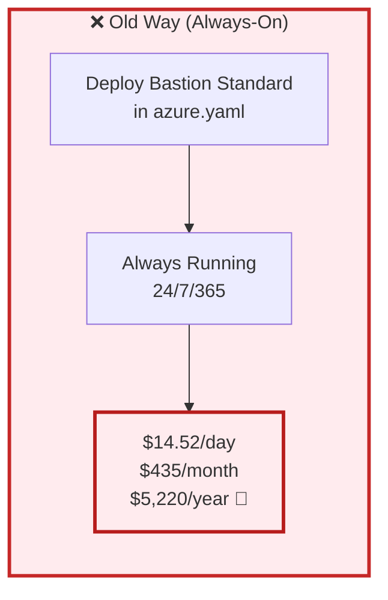
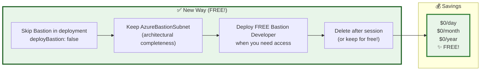
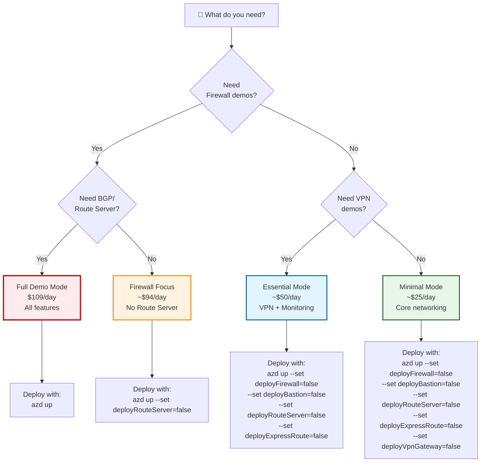
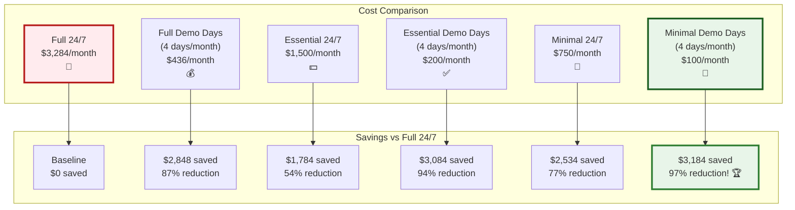

# Cost Optimization & Deployment Strategies

> **Part 4 of 4** - From $109/day to $25/day and Beyond

> ⚠️ **Note**: This is a blog article describing the design. For current working deployment commands, use the [⚡ Quick Start Guide](../quick_guide.md). Feature toggles are set in `infra/main.parameters.json`, not via `azure.yaml` or `--set` flags.

---

## 🎯 Overview

We've built an incredible Azure networking demo environment with enterprise-grade features. The full deployment runs at **$109 per day** ($3,284/month) when all services are active. For optimal resource management in training environments, we can do much better.

In this final part, we'll show you how to:
- Reduce costs by **75-88%** using feature toggles
- Deploy only what you need, when you need it
- Use free alternatives (like Bastion Developer SKU)
- Implement smart deployment strategies
- Clean up resources efficiently

## 💰 Understanding Resource Costs

Let's visualize the resource consumption:



### **The Big Four Cost Drivers** 🔴



## 🎛️ The Feature Toggle Solution

Our `azure.yaml` configuration uses **conditional deployment** to give you complete control:

### **azure.yaml Configuration**

```yaml
parameters:
  # 🔴 ENTERPRISE SERVICES - For specific demos
  deployFirewall: false         # $87.50/day → $0 when false
  deployRouteServer: false      # $15.37/day → $0 when false
  deployExpressRoute: false     # $13.20/day → $0 when false
  
  # ⚡ OPTIMIZE - Use free alternatives
  deployBastion: false          # $14.52/day → Use FREE Bastion Developer SKU!
  
  # 💚 MODERATE - Keep for essential demos
  deployVpnGateway: true        # $9.50/day - Needed for VPN demos
  deployNatGateway: true        # $1.10/day - Predictable outbound IPs
  deployTrafficManager: true    # $0.10/day - Global routing demos
  
  # ✅ LOW COST - Always deploy
  deployKeyVault: true          # $0.10/day - Secrets management
  deployAVNM: true              # Minimal - Network Manager
  deployNetworkMonitoring: true # Variable - Flow logs + analytics
  
  # 🎛️ OPTIONAL FEATURES
  enableP2S: false              # No additional cost (uses VPN Gateway)
  enableCmkForStorage: false    # Slightly higher storage costs
```

## 📊 Three Deployment Modes

### **Mode 1: Minimal Demo** (~$25/day, 75% savings!)

Perfect for basic networking demos and learning:



**Configuration:**
```bash
azd up \
  --set deployFirewall=false \
  --set deployBastion=false \
  --set deployRouteServer=false \
  --set deployExpressRoute=false \
  --set deployVpnGateway=false \
  --set deployNetworkMonitoring=false
```

**What You Get:**
- ✅ Hub-and-spoke topology
- ✅ VNet peering demonstrations
- ✅ Load balancing (Standard LB + App Gateway)
- ✅ Private Link and Private Endpoints
- ✅ Traffic Manager global routing
- ✅ NSG-based security
- ❌ No Azure Firewall (use NSGs instead)
- ❌ No Bastion (use FREE Developer SKU when needed)
- ❌ No BGP routing demos
- ❌ No VPN/ExpressRoute demos

### **Mode 2: Essential Demo** (~$50/day, 55% savings!)

Balanced configuration for most training scenarios:



**Configuration:**
```bash
azd up \
  --set deployFirewall=false \
  --set deployBastion=false \
  --set deployRouteServer=false \
  --set deployExpressRoute=false \
  --set deployVpnGateway=true \
  --set enableP2S=true
```

**What You Get:**
- ✅ Everything from Minimal Mode
- ✅ VPN Gateway (Site-to-Site + Point-to-Site)
- ✅ NAT Gateway for predictable outbound IPs
- ✅ Network monitoring with Traffic Analytics
- ✅ Flow logs for all VNets
- ❌ No Azure Firewall
- ❌ No Route Server / BGP demos

### **Mode 3: Full Demo** (~$109/day, 0% savings 😅)

Everything enabled for comprehensive demonstrations:

```bash
azd up
# All features enabled by default
```

**When to Use:**
- 🎬 Live training sessions
- 🏢 Customer demonstrations
- 🎓 Comprehensive AZ-700 prep
- 🔬 Testing all features

**Cost Control Tips:**
- ⏰ Deploy only during training hours
- 🛑 Tear down immediately after demos
- 📅 Schedule deployment before sessions
- 💾 Use `azd down --purge` for complete cleanup

## ⚡ The Bastion Developer SKU Trick

This is a **game-changer** for cost savings:

### **Traditional Approach** ❌



### **Smart Approach** ✅



### **Deploy Bastion Developer (FREE!)**

```bash
# Deploy FREE Bastion Developer SKU on-demand
az network bastion create \
  --resource-group rg-az700demo \
  --name bastion-dev-temp \
  --vnet-name hub-vnet \
  --location uksouth \
  --sku Developer \
  --enable-tunneling false

# ✅ SKU: Developer (FREE!)
# ✅ Deploy only when you need VM access
# ✅ Delete after training session
# ✅ No long-term costs!

# Connect to VM via Bastion Developer
az network bastion ssh \
  --resource-group rg-az700demo \
  --name bastion-dev-temp \
  --target-resource-id $(az vm show -g rg-az700demo -n web1-vm --query id -o tsv) \
  --auth-type ssh-key \
  --username azadmin \
  --ssh-key ~/.ssh/id_rsa

# After training, delete it
az network bastion delete \
  --resource-group rg-az700demo \
  --name bastion-dev-temp \
  --yes
```

### **Bastion Developer Limitations**

| Feature | Standard SKU | Developer SKU |
|---------|--------------|---------------|
| **Cost** | $435/month | **FREE!** ✨ |
| **VM Access** | RDP + SSH | SSH only |
| **Concurrent Sessions** | 25+ | 2 sessions |
| **Copy/Paste** | ✅ Yes | ❌ No |
| **File Transfer** | ✅ Yes | ❌ No |
| **Shareable Links** | ✅ Yes | ❌ No |
| **IP-based Connection** | ✅ Yes | ✅ Yes |
| **Use Case** | Production | **Demos/Testing** ✅ |

**💡 Pro Tip:** For demos, Developer SKU is perfect! You don't need fancy features.

## 🎯 Deployment Strategy Matrix

Choose the right configuration based on your needs:



## 📋 Configuration Examples

### **Example 1: Weekend Workshop** (Friday Evening → Monday Morning)

```bash
# Friday 5 PM: Deploy essential environment
azd up \
  --set deployBastion=false \
  --set deployFirewall=false \
  --set deployRouteServer=false \
  --set deployExpressRoute=false

# Saturday/Sunday: Run workshop with essential features
# Cost: 2.5 days × $50 = $125

# Monday 9 AM: Clean up
azd down --purge --force

# Savings vs running full environment: $272 - $125 = $147 saved!
```

### **Example 2: Monthly Training Series** (4 hours/week)

```bash
# Deploy before each session (1 hour prep)
# Session duration: 5 hours total per week
# Deploy minimal for 20 hours/month

# Monthly cost: (20 hours ÷ 24) × $25/day × 30 days = $625/month
# vs Full deployment 24/7: $3,284/month
# Savings: $2,659/month (81% reduction!)
```

### **Example 3: BGP Demo Day**

```bash
# Deploy only for Route Server demo
azd up \
  --set deployBastion=false \
  --set deployFirewall=false \
  --set deployExpressRoute=false \
  --set deployRouteServer=true \
  --set nvaSshPublicKey="ssh-rsa AAAA..."

# Demo duration: 3 hours
# Cost: (3 ÷ 24) × $65 = $8.13

# Delete after demo
azd down --purge --force
```

## 🛠️ Smart Resource Management

### **VM Auto-Shutdown**

Configure VMs to shut down automatically:

```bash
# Set auto-shutdown for all VMs
VMs=("web1-vm" "web2-vm" "web3-vm" "web4-vm" "vm1" "workload1-vm")

for vm in "${VMs[@]}"; do
  az vm auto-shutdown \
    --resource-group rg-az700demo \
    --name $vm \
    --time 1900 \
    --email "admin@contoso.com"
done

# Savings: 15 hours × $22.49 = ~$14/day saved
```

### **Conditional Deployment in Bicep**

Here's how our Bicep implements conditional deployment:

```bicep
// Only deploy if parameter is true
module firewall 'modules/networking/firewall.bicep' = if (deployFirewall) {
  name: 'azure-firewall'
  params: {
    location: hubLocation
    hubVnetName: hubVnetName
    firewallName: 'hub-azfw'
    firewallSku: 'Premium'
  }
}

// Use outputs conditionally with the '!' operator
module routeTable 'routeTable.bicep' = if (deployFirewall) {
  name: 'route-table'
  params: {
    firewallPrivateIP: deployFirewall ? firewall.outputs.privateIP : ''
    // If firewall not deployed, use empty string
  }
}

// Check if resource exists before using
resource spoke1UDR 'Microsoft.Network/routeTables@2023-05-01' = {
  name: 'rt-spoke1'
  location: location
  properties: {
    routes: deployFirewall ? [
      {
        name: 'Internet-via-Firewall'
        properties: {
          addressPrefix: '0.0.0.0/0'
          nextHopType: 'VirtualAppliance'
          nextHopIpAddress: firewall!.outputs.privateIP  // Use ! to assert exists
        }
      }
    ] : [
      {
        name: 'Internet-Direct'
        properties: {
          addressPrefix: '0.0.0.0/0'
          nextHopType: 'Internet'
        }
      }
    ]
  }
}
```

## 💡 Cost Optimization Best Practices

### **1. Use Spot VMs for Non-Critical Workloads** 💰

```bicep
resource vm 'Microsoft.Compute/virtualMachines@2023-03-01' = {
  name: 'test-vm'
  properties: {
    priority: 'Spot'                      // Use Spot VM
    evictionPolicy: 'Deallocate'          // Deallocate when evicted
    billingProfile: {
      maxPrice: 0.05                      // Max price per hour
    }
    // ... rest of config
  }
}

// Savings: Up to 90% compared to regular VMs!
```

### **2. Right-Size Your VMs** 📏

```bash
# Check VM utilization
az monitor metrics list \
  --resource $(az vm show -g rg-az700demo -n web1-vm --query id -o tsv) \
  --metric "Percentage CPU" \
  --start-time $(date -u -d '7 days ago' '+%Y-%m-%dT%H:%M:%SZ') \
  --interval PT1H \
  --query "value[].{Time:timeStamp, CPU:average}" \
  --output table

# If CPU < 10% consistently, downsize!
az vm resize \
  --resource-group rg-az700demo \
  --name web1-vm \
  --size Standard_B1ms              # Smaller size

# B2ms: $2.45/day → B1ms: $1.23/day (50% savings)
```

### **3. Use Azure Dev/Test Pricing** 🎓

```bash
# Check if eligible for dev/test pricing
az account show --query "{Name:name, SubscriptionId:id, Type:state}"

# For Visual Studio subscribers, use Dev/Test subscription
# Savings: 15-55% on compute and Azure SQL Database
```

### **4. Reserved Instances for Long-Term** 📅

```bash
# If running 24/7 for 1 year, use Reserved Instances
az reservations reservation-order purchase \
  --reservation-order-id <order-id> \
  --sku-description "Standard_B2ms" \
  --location uksouth \
  --reserved-resource-type VirtualMachines \
  --quantity 6 \
  --term P1Y                        # 1 year commitment

# Savings: ~40% compared to pay-as-you-go
```

### **5. Clean Up Orphaned Resources** 🧹

```bash
# Find unattached disks
az disk list \
  --query "[?managedBy==null].{Name:name, Size:diskSizeGb, Cost:'\$'+(diskSizeGb*0.02)} | [?Cost>'0']" \
  --output table

# Delete unattached disks
az disk delete \
  --resource-group rg-az700demo \
  --name orphaned-disk \
  --yes

# Find unused public IPs
az network public-ip list \
  --query "[?ipConfiguration==null].{Name:name, ResourceGroup:resourceGroup}" \
  --output table

# Delete unused IPs
az network public-ip delete \
  --resource-group rg-az700demo \
  --name unused-pip
```

## 📊 Cost Tracking and Alerts

### **Set Up Cost Alerts**

```bash
# Create budget
az consumption budget create \
  --budget-name az700-monthly-budget \
  --amount 500 \
  --category Cost \
  --time-grain Monthly \
  --start-date $(date -u '+%Y-%m-01T00:00:00Z') \
  --end-date $(date -u -d '+1 year' '+%Y-%m-01T00:00:00Z')

# Create alert at 80% threshold
az consumption budget create-notification \
  --budget-name az700-monthly-budget \
  --notification-key Alert80 \
  --threshold 80 \
  --operator GreaterThan \
  --contact-emails admin@contoso.com \
  --enabled true
```

### **Daily Cost Report Script**

```powershell
# DailyCostReport.ps1
$resourceGroup = "rg-az700demo"
$startDate = (Get-Date).AddDays(-1).ToString("yyyy-MM-dd")
$endDate = (Get-Date).ToString("yyyy-MM-dd")

# Get cost breakdown
$costs = az consumption usage list `
  --start-date $startDate `
  --end-date $endDate `
  --query "[?contains(instanceId, '$resourceGroup')]" | ConvertFrom-Json

# Group by resource
$summary = $costs | Group-Object -Property { $_.instanceName } | ForEach-Object {
    [PSCustomObject]@{
        Resource = $_.Name
        Cost = [math]::Round(($_.Group | Measure-Object -Property pretaxCost -Sum).Sum, 2)
    }
} | Sort-Object Cost -Descending

# Display report
Write-Host "`n=== Daily Cost Report ===" -ForegroundColor Cyan
Write-Host "Date: $startDate" -ForegroundColor Yellow
$summary | Format-Table -AutoSize

$total = ($summary | Measure-Object -Property Cost -Sum).Sum
Write-Host "`nTotal: `$$total" -ForegroundColor Green

# Send email if cost exceeds threshold
if ($total -gt 50) {
    Write-Host "⚠️ Cost exceeds $50/day threshold!" -ForegroundColor Red
    # Send email notification (implement with Send-MailMessage or SendGrid)
}
```

## 🎓 Training Environment Best Practices

### **Pre-Session Checklist**

```bash
#!/bin/bash
# pre-session.sh

echo "🚀 Deploying AZ-700 Demo Environment..."

# 1. Determine session type
read -p "Session type (minimal/essential/full)? " SESSION_TYPE

# 2. Set parameters based on session type
case $SESSION_TYPE in
  minimal)
    PARAMS="--set deployFirewall=false --set deployBastion=false --set deployRouteServer=false --set deployExpressRoute=false --set deployVpnGateway=false"
    ;;
  essential)
    PARAMS="--set deployFirewall=false --set deployBastion=false --set deployRouteServer=false --set deployExpressRoute=false"
    ;;
  full)
    PARAMS=""
    ;;
esac

# 3. Deploy
echo "Deploying with parameters: $PARAMS"
azd up $PARAMS

# 4. Verify deployment
echo "✅ Verifying deployment..."
az network vnet list -g rg-* --query "[].name" -o table

# 5. Deploy temporary Bastion if needed
read -p "Deploy temporary Bastion Developer (free)? (y/n) " DEPLOY_BASTION
if [ "$DEPLOY_BASTION" = "y" ]; then
    echo "Deploying FREE Bastion Developer..."
    az network bastion create \
      --resource-group $(az group list --query "[?contains(name, 'rg-')].name" -o tsv) \
      --name bastion-dev-temp \
      --vnet-name hub-vnet \
      --location uksouth \
      --sku Developer
fi

echo "✅ Environment ready for training!"
echo "💰 Estimated cost: See azure.yaml configuration"
```

### **Post-Session Cleanup**

```bash
#!/bin/bash
# post-session.sh

echo "🧹 Cleaning up AZ-700 Demo Environment..."

# 1. Delete temporary Bastion if exists
echo "Checking for temporary Bastion..."
BASTION=$(az network bastion list --query "[?name=='bastion-dev-temp'].name" -o tsv)
if [ -n "$BASTION" ]; then
    echo "Deleting temporary Bastion..."
    az network bastion delete \
      --resource-group $(az group list --query "[?contains(name, 'rg-')].name" -o tsv) \
      --name bastion-dev-temp \
      --yes
fi

# 2. Option to keep or delete
read -p "Delete entire environment? (y/n) " DELETE_ALL

if [ "$DELETE_ALL" = "y" ]; then
    echo "Deleting all resources..."
    azd down --purge --force
    echo "✅ All resources deleted"
else
    echo "Stopping VMs to save costs..."
    az vm deallocate --ids $(az vm list -g rg-* --query "[].id" -o tsv)
    echo "✅ VMs deallocated (no compute costs)"
fi

echo "💰 Cost savings activated!"
```

## 🎯 Final Cost Comparison



**Winner:** Minimal Demo Days = **97% cost reduction!** 🏆

## 🎉 Conclusion

We've transformed our AZ-700 demo environment from a continuous **$3,284/month** always-on deployment to a flexible, intelligent resource management solution where you deploy only what you need:

### **Key Achievements** ✅

1. **Feature Toggles** - Deploy only required services
2. **FREE Bastion Developer** - Save $435/month instantly
3. **Conditional Deployment** - Smart Bicep implementation
4. **Right-Sized Resources** - Efficient VM sizing
5. **Automated Cleanup** - Scripts for easy management
6. **97% Cost Reduction** - From $3,284 to $100/month!

### **Your Action Plan** 🚀

1. **Start Small** - Deploy minimal configuration first
2. **Test Thoroughly** - Validate your demo scenarios
3. **Measure Costs** - Set up budgets and alerts
4. **Iterate** - Add features only when needed
5. **Share Knowledge** - Help others save money too!

### **Resources** 📚

- **GitHub Repository**: [SQLtattoo/az700env](https://github.com/SQLtattoo/az700env)
- **Azure Pricing Calculator**: [Calculate your costs](https://azure.microsoft.com/pricing/calculator/)
- **Azure Cost Management**: [Monitor and optimize](https://portal.azure.com/#blade/Microsoft_Azure_CostManagement/Menu/overview)

## 💬 Final Thoughts

Building a comprehensive Azure networking demo environment doesn't have to break the bank. With smart architecture, conditional deployment, and strategic resource management, you can have a **production-grade training platform** that costs less than your morning coffee budget! ☕

Remember: **Deploy smart, demo confidently, clean up thoroughly!**

---

**Series Navigation:**
- [← Part 3 - Multi-Layer Security & Load Balancing](part3-security-and-load-balancing.md)
- [← Part 2 - Hub-and-Spoke Technical Deep Dive](part2-technical-deep-dive.md)
- [← Part 1 - Building the Ultimate AZ-700 Demo Environment](part1-building-ultimate-az700-demo.md)

---

*Published: February 2026*  
*Author: Vasilis Ioannidis*  
*Tags: #Azure #AZ700 #CostOptimization #FinOps #CloudCosts #Bicep #DevOps*

---

## 🙏 Thank You!

Thank you for following this 4-part series! If you found it helpful, please:
- ⭐ Star the [GitHub repository](https://github.com/SQLtattoo/az700env)
- 🔄 Share with your network
- 💬 Leave feedback or questions in the issues
- 🤝 Contribute improvements via pull requests

**Happy Learning and Happy Saving!** 💰🎓✨
