# 🎓 AZ-700 Trainer Demo Guide

> **Complete demonstration guide aligned with Microsoft Official Curriculum (MOC) AZ-700**  
> Deploy once, demonstrate throughout the entire course

---

## 🚀 Quick Start for Trainers

### **Pre-Deployment Setup**

1. **Install Prerequisites**
   ```powershell
   # Install Azure Developer CLI
   winget install microsoft.azd
   
   # Install Azure CLI
   winget install microsoft.azure-cli
   
   # Login to Azure
   az login
   azd auth login
   ```

2. **Clone and Configure**
   ```powershell
   git clone https://github.com/SQLtattoo/az700env.git
   cd az700env
   
   # Get your Azure AD Object ID for Key Vault access
   $objectId = az ad signed-in-user show --query id -o tsv
   
   # Edit azure.yaml and set adminObjectId
   ```

3. **Deploy the Environment**
   ```powershell
   # Initialize azd environment
   azd init
   
   # Provision and deploy all resources
   azd up
   
   # Note: This will take 45-60 minutes for full deployment
   ```

4. **Verify Deployment**
   ```powershell
   # Check resource group
   az group list --query "[?contains(name, 'az700')].name" -o table
   
   # List all resources
   az resource list --resource-group <your-rg-name> --output table
   ```

---
## Overview of architecture

```mermaid
flowchart TB
    subgraph Internet["☁️ Internet"]
        Users["👥 Users"]
        OnPrem["🏢 On-Premises<br/>(Simulated)"]
    end

    subgraph Azure["Azure Cloud"]
        
        subgraph GlobalServices["🌐 Global Services"]
            AFD["Azure Front Door<br/>Premium SKU"]
            TM["Traffic Manager<br/>(Optional)"]
            PublicDNS["Public DNS Zone<br/>contoso-xxxx.com"]
        end

        subgraph HubRegion["📍 Hub Region (North Europe)"]
            subgraph HubVNet["hub-vnet<br/>10.1.0.0/16"]
                subgraph HubSubnets["Hub Subnets"]
                    BastionSubnet["AzureBastionSubnet<br/>10.1.1.0/26"]
                    GatewaySubnet["GatewaySubnet<br/>10.1.2.0/27"]
                    MgmtSubnet["hub-mgmt<br/>10.1.3.0/24"]
                    FWSubnet["AzureFirewallSubnet<br/>10.1.4.0/26"]
                end
                
                subgraph HubResources["Hub Resources"]
                    Bastion["🔐 Azure Bastion<br/>Standard SKU"]
                    VPNGw["🔗 VPN Gateway<br/>VpnGw1"]
                    ERGw["⚡ ExpressRoute Gateway<br/>Standard SKU"]
                    AzFW["🔥 Azure Firewall<br/>Premium SKU"]
                end
            end
            
            subgraph SharedServices["🔧 Shared Services"]
                PrivateDNS["Private DNS Zone<br/>contoso-xxxx.local"]
                KeyVault["🔑 Key Vault"]
                Storage["📦 Storage Account"]
                RSV["💾 Recovery Services Vault"]
                LogAnalytics["📊 Log Analytics<br/>Traffic Analytics"]
            end
        end

        subgraph Spoke1Region["📍 Spoke 1 (North Europe)"]
            subgraph Spoke1VNet["spoke1-vnet<br/>10.18.0.0/16"]
                Spoke1Default["default<br/>10.18.10.0/24"]
                
                subgraph WebTier["🌐 Web Tier"]
                    WebLB["⚖️ Load Balancer<br/>web-lb"]
                    Web1VM["💻 web1-vm"]
                    Web2VM["💻 web2-vm"]
                end
            end
        end

        subgraph Spoke2Region["📍 Spoke 2 (North Europe)"]
            subgraph Spoke2VNet["spoke2-vnet<br/>10.3.0.0/16"]
                Spoke2Default["default<br/>10.3.1.0/24"]
                AppGwSubnet["AppGwSubnet<br/>10.3.2.0/24"]
                
                subgraph AppTier["📱 App Tier"]
                    AppGw["🛡️ Application Gateway<br/>WAF_v2 + OWASP 3.2"]
                    AppVM["💻 vm1"]
                end
                
                PE["🔒 Private Endpoint<br/>workload-pe"]
            end
        end

        subgraph WorkloadRegion["📍 Workload (UK South)"]
            subgraph WorkloadVNet["workload-vnet<br/>10.4.0.0/16"]
                WorkloadDefault["default<br/>10.4.1.0/24"]
                
                subgraph WorkloadTier["⚙️ Workload Tier"]
                    WorkloadLB["⚖️ Load Balancer<br/>workload-lb"]
                    WorkloadVM["💻 workload1-vm"]
                    PLS["🔗 Private Link Service<br/>workload-pls"]
                end
            end
        end

        subgraph Connectivity["🔀 Connectivity"]
            ExpressRoute["⚡ ExpressRoute Circuit<br/>er-circuit-az700-demo<br/>(Demo - Not Connected)"]
        end

        subgraph Monitoring["📈 Monitoring"]
            NetworkWatcher["Network Watcher"]
            FlowLogs["VNet Flow Logs"]
            TrafficAnalytics["Traffic Analytics"]
        end
    end

    %% Internet Connections
    Users --> AFD
    Users --> TM
    OnPrem -.->|"Site-to-Site VPN"| VPNGw
    OnPrem -.->|"ExpressRoute<br/>(Demo)"| ExpressRoute

    %% Global to Regional
    AFD --> AppGw
    TM -.->|"DNS Routing"| WebLB
    
    %% Bastion Access
    Bastion --> Web1VM
    Bastion --> Web2VM
    Bastion --> AppVM
    Bastion --> WorkloadVM

    %% VNet Peering (Hub-Spoke)
    HubVNet <-->|"🔄 VNet Peering<br/>Gateway Transit"| Spoke1VNet
    HubVNet <-->|"🔄 VNet Peering<br/>Gateway Transit"| Spoke2VNet
    HubVNet <-->|"🔄 VNet Peering"| WorkloadVNet

    %% Firewall Routes
    AzFW -->|"Inspect Traffic"| Spoke1VNet
    AzFW -->|"Inspect Traffic"| Spoke2VNet

    %% Gateways
    VPNGw --- GatewaySubnet
    ERGw --- GatewaySubnet
    ExpressRoute --- ERGw
    
    %% Web Tier Flow
    WebLB --> Web1VM
    WebLB --> Web2VM

    %% App Tier Flow
    AppGw --> AppVM
    
    %% Workload Tier Flow
    WorkloadLB --> WorkloadVM
    PLS --- WorkloadLB

    %% Private Link
    PE -.->|"Private Link"| PLS

    %% DNS Links
    PrivateDNS -.->|"Linked"| HubVNet
    PrivateDNS -.->|"Linked"| Spoke1VNet
    PrivateDNS -.->|"Linked"| Spoke2VNet

    %% Monitoring
    FlowLogs --> LogAnalytics
    TrafficAnalytics --> LogAnalytics

    %% Styling
    classDef hub fill:#e1f5fe,stroke:#01579b,stroke-width:2px
    classDef spoke fill:#f3e5f5,stroke:#4a148c,stroke-width:2px
    classDef workload fill:#fff3e0,stroke:#e65100,stroke-width:2px
    classDef global fill:#e8f5e9,stroke:#1b5e20,stroke-width:2px
    classDef security fill:#ffebee,stroke:#b71c1c,stroke-width:2px
    classDef shared fill:#fafafa,stroke:#616161,stroke-width:2px

    class HubVNet,HubSubnets,HubResources hub
    class Spoke1VNet,WebTier spoke
    class Spoke2VNet,AppTier spoke
    class WorkloadVNet,WorkloadTier workload
    class GlobalServices global
    class AzFW,AppGw,Bastion security
    class SharedServices shared
```


For the complete architecture diagram and detailed resource specifications, see [ARCHITECTURE.md](../ARCHITECTURE.md).

## 📚 Module-by-Module Demo Instructions

---

## **MODULE 1: Design and Implement Core Networking Infrastructure**

### **Demo 1.1: Design and Implement IP Addressing**

#### **What You'll Demonstrate**
- VNet address space planning
- Subnet design and delegation
- Public IP addresses and prefixes

#### **Resources to Show**
1. **Hub VNet** (`hub-vnet`)
   - Navigate to: Azure Portal → Virtual Networks → `hub-vnet`
   - **Address Space**: `10.1.0.0/16`
   - **Subnets**:
     - `default`: `10.1.0.0/24`
     - `GatewaySubnet`: `10.1.1.0/27` (VPN Gateway)
     - `AzureBastionSubnet`: `10.1.2.0/26` (Bastion)
     - `AzureFirewallSubnet`: `10.1.4.0/26` (Firewall)
     - `RouteServerSubnet`: `10.1.5.0/27` (Route Server)

2. **Spoke VNets**
   - `spoke1-vnet`: `10.10.0.0/16` (UK South)
   - `spoke2-vnet`: `10.20.0.0/16` (North Europe)
   - `workload-vnet`: `10.30.0.0/16` (UK South)

3. **Public IP Addresses**
   - Navigate to: Public IP addresses
   - Show: `hub-bastion-pip`, `hub-vpn-pip`, `hub-azfw-pip`
   - Discuss: Static vs Dynamic, Standard vs Basic SKU

#### **Key Points to Emphasize**
- ✅ Non-overlapping address spaces
- ✅ Proper subnet sizing for Azure services
- ✅ Reserved subnet names (GatewaySubnet, AzureBastionSubnet, etc.)
- ✅ Public IP SKU selection (Standard for production)

#### **Hands-On Exercise**
- **Exercise 01**: Design and Implement a Virtual Network in Azure
- Students create their own VNet with proper subnetting

---

### **Demo 1.2: Configure DNS Settings in Azure**

#### **What You'll Demonstrate**
- Azure DNS zones (public and private)
- Private DNS zone linking
- Name resolution in VNets

#### **Resources to Show**
1. **Public DNS Zone**
   - Navigate to: DNS zones → `contoso.com`
   - Show record sets (A, CNAME, etc.)
   - Demonstrate delegation from parent domain

2. **Private DNS Zone**
   - Navigate to: Private DNS zones → `contoso.local`
   - Show virtual network links
   - Explain auto-registration

3. **VNet DNS Settings**
   - Navigate to: Virtual Networks → `hub-vnet` → DNS servers
   - Show default (Azure-provided) vs custom DNS

#### **Demo Script**
```powershell
# Query DNS records
nslookup vm1.contoso.local

# Show private DNS zone records
az network private-dns record-set list \
  --resource-group <rg-name> \
  --zone-name contoso.local \
  --output table
```

#### **Key Points to Emphasize**
- ✅ Azure-provided DNS (168.63.129.16)
- ✅ Private DNS zones for internal name resolution
- ✅ Virtual network links enable name resolution
- ✅ Auto-registration vs manual records

#### **Hands-On Exercise**
- **Exercise 01**: Configure DNS Settings in Azure
- Students create private DNS zone and link to VNet

---

### **Demo 1.3: VNet Peering and Gateway Transit**

#### **What You'll Demonstrate**
- Hub-and-spoke topology
- VNet peering configuration
- Gateway transit and remote gateways

#### **Resources to Show**
1. **VNet Peering Connections**
   - Navigate to: Virtual Networks → `hub-vnet` → Peerings
   - Show bidirectional peerings:
     - `hub-to-spoke1`
     - `hub-to-spoke2`
   - Highlight:
     - ✅ Allow gateway transit (hub side)
     - ✅ Use remote gateway (spoke side)
     - ✅ Allow forwarded traffic

2. **Network Topology View**
   - Navigate to: Network Watcher → Topology
   - Select resource group
   - Visual representation of hub-and-spoke

#### **Demo Script**
```powershell
# List all peerings
az network vnet peering list \
  --resource-group <rg-name> \
  --vnet-name hub-vnet \
  --output table

# Show peering details
az network vnet peering show \
  --name hub-to-spoke1 \
  --resource-group <rg-name> \
  --vnet-name hub-vnet
```

#### **Key Points to Emphasize**
- ✅ Peering is not transitive by default
- ✅ Gateway transit enables spokes to use hub gateway
- ✅ Peering requires non-overlapping address spaces
- ✅ Global peering across regions (spoke1 ↔ spoke2 via hub)

#### **Hands-On Exercise**
- **Exercise 01**: Connect two Azure Virtual Networks using global virtual network peering
- Students create peering between two VNets

---

### **Demo 1.4: Azure Virtual Network Manager (AVNM)**

#### **What You'll Demonstrate**
- Network groups with dynamic membership
- Connectivity configurations (hub-spoke vs mesh)
- Security admin rules

#### **Resources to Show**
1. **Network Manager Instance**
   - Navigate to: Network Manager → `az700-avnm`
   - Show scope (subscription/management group)

2. **Network Groups**
   - Navigate to: Network groups
   - Show groups:
     - **Production Group**: spoke1-vnet, spoke2-vnet
     - **Development Group**: (dynamic membership)
     - **Shared Services Group**: hub-vnet

3. **Connectivity Configurations**
   - Navigate to: Configurations → Connectivity
   - **Hub-and-Spoke Configuration**:
     - Hub: hub-vnet
     - Spokes: Production group
     - Global mesh: Disabled
   - **Mesh Configuration** (Production group):
     - Direct connectivity between spokes
     - No hub required

4. **Security Admin Rules**
   - Navigate to: Configurations → Security admin
   - Show rule collection: `deny-rdp-from-internet`
   - Rules:
     - Priority: 100
     - Action: Deny
     - Source: Internet
     - Destination: Any
     - Protocol: TCP
     - Port: 3389

#### **Demo Script**
```powershell
# List network groups
az network manager group list \
  --network-manager-name az700-avnm \
  --resource-group <rg-name>

# Show connectivity configuration
az network manager connectivity-config show \
  --name hub-spoke-config \
  --network-manager-name az700-avnm \
  --resource-group <rg-name>

# Show security admin rules
az network manager security-admin-config rule-collection list \
  --configuration-name security-config \
  --network-manager-name az700-avnm \
  --resource-group <rg-name>
```

#### **Key Points to Emphasize**
- ✅ AVNM centralizes network management at scale
- ✅ Dynamic membership using Azure Policy
- ✅ Security admin rules override NSG rules
- ✅ Deployments are managed and versioned
- ✅ Mesh topology simplifies spoke-to-spoke connectivity

#### **Topology Comparison Demo**
1. **Show Hub-and-Spoke**: All traffic goes through hub
2. **Show Mesh**: Direct connectivity between spokes
3. **Discuss**: When to use each topology

---

### **Demo 1.5: NAT Gateway**

#### **What You'll Demonstrate**
- Outbound internet connectivity without public IPs
- SNAT port exhaustion prevention

#### **Resources to Show**
1. **NAT Gateway**
   - Navigate to: NAT gateways → `hub-nat-gateway`
   - Show associated public IP
   - Show associated subnets

2. **Test Outbound Connectivity**
   - Connect to VM via Bastion
   - Check outbound IP: `curl ifconfig.me`
   - All VMs share NAT Gateway IP

#### **Key Points to Emphasize**
- ✅ Provides 64,000+ SNAT ports
- ✅ Prevents SNAT exhaustion
- ✅ Static outbound IP for whitelisting
- ✅ Zone-resilient

---

### **Demo 1.6: Azure Route Server**

#### **What You'll Demonstrate**
- BGP route exchange
- Dynamic routing integration
- NVA route propagation

#### **Resources to Show**
1. **Route Server**
   - Navigate to: Route Servers → `hub-route-server`
   - Show BGP peerings
   - Show learned routes

2. **Effective Routes**
   - Navigate to: Network Interfaces → Select VM NIC
   - Effective routes
   - Show routes propagated by Route Server

#### **Demo Script**
```powershell
# Show Route Server details
az network routeserver show \
  --name hub-route-server \
  --resource-group <rg-name>

# List BGP peerings
az network routeserver peering list \
  --routeserver hub-route-server \
  --resource-group <rg-name>
```

#### **Key Points to Emphasize**
- ✅ Enables dynamic routing in Azure
- ✅ Exchange routes with NVAs
- ✅ Automatic failover and redundancy
- ✅ Required for certain SD-WAN scenarios

---

## **MODULE 2: Design and Implement VPN & Virtual WAN**

### **Demo 2.1: Site-to-Site VPN Gateway**

#### **What You'll Demonstrate**
- VPN Gateway deployment
- SKU selection
- Connection configuration

#### **Resources to Show**
1. **VPN Gateway**
   - Navigate to: Virtual network gateways → `hub-vpn-gateway`
   - Show:
     - SKU: VpnGw1 (or VpnGw2 for HA)
     - Gateway type: VPN
     - VPN type: Route-based
     - Active-active mode: No (can enable for HA)
     - Public IP: `hub-vpn-pip`

2. **Local Network Gateway** (simulated on-premises)
   - Navigate to: Local network gateways → `onprem-lng`
   - Show:
     - IP address: Simulated on-prem gateway IP
     - Address space: On-premises network (e.g., `192.168.0.0/16`)

3. **VPN Connection**
   - Navigate to: VPN Gateway → Connections
   - Show connection properties
   - Check connection status

#### **Demo Script**
```powershell
# Show VPN Gateway details
az network vnet-gateway show \
  --name hub-vpn-gateway \
  --resource-group <rg-name>

# Show connections
az network vpn-connection list \
  --resource-group <rg-name> \
  --output table

# Check connection status
az network vpn-connection show \
  --name hub-to-onprem \
  --resource-group <rg-name> \
  --query connectionStatus
```

#### **Key Points to Emphasize**
- ✅ Gateway subnet must be /27 or larger
- ✅ Route-based vs Policy-based VPN
- ✅ Active-active for high availability
- ✅ BGP for dynamic routing
- ✅ Generation 1 vs Generation 2

#### **Hands-On Exercise**
- **Exercise 02**: Create and configure a Virtual Network Gateway
- Students deploy VPN Gateway

---

### **Demo 2.2: Point-to-Site VPN**

#### **What You'll Demonstrate**
- P2S VPN configuration
- Client address pool
- Certificate-based authentication
- Client configuration download

#### **Resources to Show**
1. **Point-to-Site Configuration**
   - Navigate to: Virtual network gateways → `hub-vpn-gateway`
   - Point-to-site configuration
   - Show:
     - Address pool: `172.16.0.0/24`
     - Tunnel type: IKEv2 and OpenVPN
     - Authentication: Azure certificate

2. **Root Certificate**
   - Show uploaded root certificate (demo cert)
   - Explain certificate chain

3. **Download VPN Client**
   - Download VPN client configuration
   - Show configuration files for Windows, Mac, Linux

#### **Demo Script**
```powershell
# Generate self-signed root certificate (demo purposes)
$cert = New-SelfSignedCertificate `
  -Type Custom `
  -KeySpec Signature `
  -Subject "CN=AZ700-RootCert" `
  -KeyExportPolicy Exportable `
  -HashAlgorithm sha256 `
  -KeyLength 2048 `
  -CertStoreLocation "Cert:\CurrentUser\My" `
  -KeyUsageProperty Sign `
  -KeyUsage CertSign

# Export certificate
Export-Certificate `
  -Cert $cert `
  -FilePath "C:\Temp\AZ700-RootCert.cer"

# Show P2S configuration
az network vnet-gateway show \
  --name hub-vpn-gateway \
  --resource-group <rg-name> \
  --query vpnClientConfiguration
```

#### **Key Points to Emphasize**
- ✅ P2S for remote users
- ✅ Certificate auth vs Azure AD auth
- ✅ RADIUS integration for enterprise
- ✅ Always On VPN for Windows 10+
- ✅ Azure VPN Client for OpenVPN

---

### **Demo 2.3: Azure Route Server with BGP NVA**

#### **What You'll Demonstrate**
- Azure Route Server deployment and purpose
- BGP peering with Network Virtual Appliances (NVAs)
- Automatic route propagation to VNet NICs
- Dynamic routing between on-premises and Azure
- Route learning and advertisement

#### **Scenario Overview**
Azure Route Server enables network appliances (NVAs, SD-WAN devices, VPN appliances) to exchange routes dynamically with your Azure virtual network using BGP. This eliminates manual route table management and enables:
- Dynamic routing from NVAs to all VMs in hub and spoke VNets
- Integration of third-party network appliances with Azure networking
- Advanced routing scenarios (SD-WAN, multi-path routing, traffic engineering)

#### **Resources to Show**
1. **Route Server**
   - Navigate to: Route Servers → `hub-route-server`
   - Show:
     - Location: UK South (same as hub-vnet)
     - SKU: Standard
     - Hosted subnet: RouteServerSubnet (10.1.5.0/27)
     - Public IP: hub-routeserver-pip
     - ASN: 65515 (Azure Route Server ASN)
     - BGP Peering Status: Connected

2. **BGP NVA (Linux VM with FRRouting)**
   - Navigate to: Virtual machines → `hub-bgp-nva`
   - **What is FRRouting?** FRRouting (FRR) is an open-source routing software suite that implements BGP, OSPF, and other routing protocols on Linux, allowing the VM to function as a network router and peer with Azure Route Server using industry-standard BGP.
   - Show:
     - VM Size: Standard_B2s
     - OS: Ubuntu 22.04 LTS
     - Location: hub-mgmt subnet (10.1.3.0/24)
     - IP Forwarding: Enabled (critical for routing)
     - BGP Configuration:
       - ASN: 65001 (NVA's ASN)
       - Advertised Routes: 192.168.100.0/24, 192.168.200.0/24
       - Neighbors: Route Server IPs (10.1.5.4, 10.1.5.5)

3. **BGP Peering**
   - Navigate to: Route Server → Peers
   - Show peer: `bgp-nva-peer`
   - Peer IP: 10.1.3.4 (NVA's IP)
   - Peer ASN: 65001
   - Status: Connected

4. **Route Propagation**
   - Navigate to: Virtual machines → web1-vm → Networking → Network Interface
   - Click "Effective routes"
   - **Key observation**: Routes learned from Route Server appear automatically:
     - 192.168.100.0/24 via 10.1.3.4 (NVA)
     - 192.168.200.0/24 via 10.1.3.4 (NVA)
     - Next hop: VirtualNetworkGateway (Route Server injects as gateway)

#### **Demo Script**

```powershell
# 1. Show Route Server details
az network routeserver show \
  --name hub-route-server \
  --resource-group rg-az700t4 \
  --output table

# 2. List BGP peers
az network routeserver peering list \
  --routeserver hub-route-server \
  --resource-group rg-az700t4 \
  --output table

# 3. Show BGP peering status
az network routeserver peering show \
  --name bgp-nva-peer \
  --routeserver hub-route-server \
  --resource-group rg-az700t4

# 4. Show routes learned by Route Server from NVA
az network routeserver peering list-learned-routes \
  --name bgp-nva-peer \
  --routeserver hub-route-server \
  --resource-group rg-az700t4

# Expected output: 192.168.100.0/24, 192.168.200.0/24 with next hop 10.1.3.4

# 5. Show routes advertised by Route Server to NVA
az network routeserver peering list-advertised-routes \
  --name bgp-nva-peer \
  --routeserver hub-route-server \
  --resource-group rg-az700t4

# Expected output: All VNet address spaces (10.1.0.0/16, 10.18.0.0/16, etc.)
# If VPN Gateway present: On-premises routes as well

# 6. Check effective routes on a spoke VM
$nicId = az vm show --name web1-vm --resource-group rg-az700t4 --query "networkProfile.networkInterfaces[0].id" -o tsv
az network nic show-effective-route-table --ids $nicId --output table

# Look for routes with Source=VirtualNetworkGateway and AddressPrefix=192.168.x.0/24

# 7. SSH into BGP NVA to inspect FRRouting configuration (optional)
ssh azadmin@<nva-public-ip-or-bastion>

# Inside NVA:
sudo vtysh
show running-config
show ip bgp summary
show ip bgp neighbors
show ip route bgp
exit
```

#### **FRRouting Configuration on NVA** (Pre-configured via cloud-init)
```bash
# FRRouting BGP configuration
router bgp 65001
 bgp router-id 10.1.3.4
 neighbor 10.1.5.4 remote-as 65515  # Route Server instance 0
 neighbor 10.1.5.5 remote-as 65515  # Route Server instance 1
 !
 address-family ipv4 unicast
  network 192.168.100.0/24          # Advertise simulated network 1
  network 192.168.200.0/24          # Advertise simulated network 2
  neighbor 10.1.5.4 soft-reconfiguration inbound
  neighbor 10.1.5.5 soft-reconfiguration inbound
 exit-address-family
```

#### **Architecture Diagram**
```
┌─────────────────────────────────────────────────────────────┐
│                        Internet                             │
└─────────────────────────────────────────────────────────────┘
                              │
                              │ (Simulated connection)
                              │
┌─────────────────────────────▼─────────────────────────────┐
│               Hub VNet (10.1.0.0/16)                      │
│                                                            │
│  ┌──────────────────────────────────────────────┐         │
│  │  RouteServerSubnet (10.1.5.0/27)            │         │
│  │                                               │         │
│  │    ╔═══════════════════════════╗             │         │
│  │    ║   Azure Route Server      ║             │         │
│  │    ║   ASN: 65515              ║             │         │
│  │    ║   IPs: 10.1.5.4, 10.1.5.5 ║             │         │
│  │    ╚═══════════╤═══════════════╝             │         │
│  └────────────────┼───────────────────────────────         │
│                   │ BGP Peering                            │
│                   │                                        │
│  ┌────────────────▼───────────────────────────┐           │
│  │  hub-mgmt Subnet (10.1.3.0/24)            │           │
│  │                                             │           │
│  │    ┌─────────────────────────────┐         │           │
│  │    │  BGP NVA (Linux + FRR)      │         │           │
│  │    │  IP: 10.1.3.4               │         │           │
│  │    │  ASN: 65001                 │         │           │
│  │    │  Advertises:                │         │           │
│  │    │   - 192.168.100.0/24        │         │           │
│  │    │   - 192.168.200.0/24        │         │           │
│  │    └─────────────────────────────┘         │           │
│  └─────────────────────────────────────────────           │
│                                                            │
└────────────────────┬───────────────────────────────────────┘
                     │ VNet Peering (Route Server propagates routes)
                     │
        ┌────────────┴──────────────┐
        │                           │
┌───────▼──────────┐      ┌─────────▼────────┐
│ Spoke1 VNet      │      │ Spoke2 VNet      │
│ 10.18.0.0/16     │      │ 10.3.0.0/16      │
│                  │      │                  │
│  VMs automatically│      │ VMs automatically│
│  learn routes:   │      │  learn routes:   │
│  - 192.168.x/24  │      │  - 192.168.x/24  │
└──────────────────┘      └──────────────────┘
```

#### **Demonstration Flow**

1. **Show Route Server Deployment**
   - Portal: Navigate to Route Server resource
   - Explain: Route Server is a managed service (no VM management)
   - Point out: Requires dedicated RouteServerSubnet (/27 minimum)

2. **Show BGP NVA Configuration**
   - Portal: Show VM with IP forwarding enabled
   - Explain: FRRouting installed via cloud-init
   - SSH in (optional): Show `show ip bgp summary` output

3. **Show BGP Peering Establishment**
   - CLI: `az network routeserver peering list`
   - Verify: Peering state = Connected
   - Explain: Route Server has 2 instances (HA) - NVA peers with both

4. **Show Route Learning (Route Server ← NVA)**
   - CLI: `az network routeserver peering list-learned-routes`
   - Expected: 192.168.100.0/24, 192.168.200.0/24 from ASN 65001
   - Explain: Route Server learns these from BGP NVA

5. **Show Route Advertisement (Route Server → NVA)**
   - CLI: `az network routeserver peering list-advertised-routes`
   - Expected: All VNet prefixes (10.1.0.0/16, 10.18.0.0/16, 10.3.0.0/16, 10.4.0.0/16)
   - Explain: NVA now knows all Azure VNet routes

6. **Show Route Propagation to VMs**
   - CLI: Get effective routes for spoke1 VM NIC
   - **Key point**: 192.168.100.0/24 and 192.168.200.0/24 appear automatically
   - Source: VirtualNetworkGateway (Route Server)
   - Next hop: 10.1.3.4 (NVA)
   - Explain: No manual route tables needed - fully dynamic!

7. **Test Routing (Optional)**
   ```powershell
   # From a spoke VM (via Bastion):
   traceroute 192.168.100.10
   
   # Expected path:
   # 1. spoke VM → hub (via peering)
   # 2. hub → NVA (10.1.3.4) - based on Route Server injection
   # 3. NVA drops packet (no real destination) or forwards if configured
   ```

#### **Real-World Use Cases**

1. **SD-WAN Integration**
   - Deploy SD-WAN NVA (Cisco, VMware VeloCloud, etc.)
   - Route Server exchanges routes with SD-WAN appliance
   - Dynamic failover between MPLS/Internet circuits

2. **Hub-and-Spoke with VPN Gateway**
   - VPN Gateway learns on-premises routes
   - Route Server propagates to NVA
   - NVA can apply policies, logging, or route manipulation

3. **Multi-Region Active-Active Routing**
   - NVAs in multiple hubs advertise routes
   - Route Server enables dynamic path selection
   - Automatic failover without manual UDR updates

4. **Network Security with Routing**
   - NVA performs DPI, IDS/IPS, advanced firewalling
   - Route Server ensures all traffic flows through NVA
   - No manual route tables on every subnet

#### **Key Points to Emphasize**
- ✅ Route Server is fully managed (no VM maintenance)
- ✅ Supports any BGP-capable NVA (Cisco, Fortinet, Palo Alto, Linux+FRR)
- ✅ Automatic route propagation to all NICs in VNet (hub and peered spokes)
- ✅ Works with VPN Gateway for hybrid cloud routing
- ✅ No need for manual User Defined Routes (UDRs)
- ✅ High availability (2 Route Server instances)
- ✅ Branch to Branch communication enabled by default
- ⚠️ Requires VPN Gateway in active-active mode if using both together
- ⚠️ RequiresRouteServerSubnet with /27 or larger

#### **Route Server vs Traditional UDR**

| Aspect | Traditional UDR | Route Server with BGP |
|--------|----------------|----------------------|
| Route Management | Manual route table creation | Automatic via BGP |
| Scalability | Update UDRs for every change | Dynamic - no updates needed |
| Failover | Manual UDR updates | Automatic BGP failover |
| Complexity | Simple for static routes | Better for dynamic topologies |
| NVA Integration | Static routes only | Full BGP peering |
| Hub-Spoke | UDR on every spoke subnet | Automatic propagation |

#### **Common Issues and Troubleshooting**

1. **BGP peering not connecting**
   - Check: NVA security group allows TCP 179 (BGP)
   - Check: NVA has IP forwarding enabled
   - Check: Correct Route Server IPs in BGP config (10.1.5.4, 10.1.5.5)

2. **Routes not appearing on VMs**
   - Verify: BGP peering state is "Connected"
   - Verify: Routes are learned (list-learned-routes)
   - Wait: Route propagation can take 1-2 minutes

3. **Traffic not flowing through NVA**
   - Check: NVA has IP forwarding enabled (Azure and OS level)
   - Check: NVA routing table (ip route in Linux)
   - Check: NVA firewall rules

#### **Exam Relevance (AZ-700)**
- Understanding when to use Route Server vs UDRs
- BGP fundamentals (ASN, peering, route advertisement)
- Hybrid cloud routing scenarios
- NVA integration in hub-and-spoke
- Route Server requirements and limitations

#### **Hands-On Exercise**
- **Exercise**: Deploy Route Server and configure BGP peering
- Students:
  1. Create RouteServerSubnet in hub VNet
  2. Deploy Route Server
  3. Deploy Linux NVA with FRRouting (or use template)
  4. Configure BGP peering
  5. Verify route learning and propagation
  6. Test traffic flow

---

### **Demo 2.3a: Route Precedence - UDRs vs Route Server (BGP)**

#### **What You'll Demonstrate**
- Azure route selection priority
- How User Defined Routes (UDRs) override BGP routes
- Practical use case for combining static and dynamic routing
- Effective route table analysis

#### **Scenario Overview**
This demo shows the interaction between dynamic BGP routing (Route Server) and static routing (UDRs). This is critical for understanding Azure's route selection logic and for exam scenarios.

**Azure Route Priority** (highest to lowest):
1. **User Defined Routes (UDRs)** ← Highest priority
2. **BGP routes** (Route Server, VPN Gateway, ExpressRoute)
3. **System routes** (VNet local, Internet, default)

#### **Demo Flow**

**Phase 1: Verify BGP Routes (No UDR)**

1. **Check Route Server learned routes**
   ```powershell
   # Show BGP peering status
   az network routeserver peering list `
     --routeserver hub-route-server `
     --resource-group rg-az700t4 `
     --output table
   
   # Show routes learned from NVA
   az network routeserver peering list-learned-routes `
     --name bgp-nva-peer `
     --routeserver hub-route-server `
     --resource-group rg-az700t4
   ```
   
   **Expected output:**
   - 192.168.100.0/24 learned from NVA (10.1.3.10)
   - 192.168.200.0/24 learned from NVA (10.1.3.10)

2. **Check effective routes on spoke VM**
   ```powershell
   # Get VM NIC ID
   $nicId = az vm show `
     --name web1-vm `
     --resource-group rg-az700t4 `
     --query "networkProfile.networkInterfaces[0].id" `
     -o tsv
   
   # Show effective routes
   az network nic show-effective-route-table `
     --ids $nicId `
     --output table
   ```
   
   **Key observation:**
   - Routes 192.168.100.0/24 and 192.168.200.0/24 present
   - Source: **VirtualNetworkGateway** (Route Server)
   - Next Hop: **10.1.3.10** (BGP NVA)

**Phase 2: Create UDR to Override BGP Route**

3. **Create route table with overriding UDR**
   ```powershell
   # Create route table
   az network route-table create `
     --name spoke1-override-udr `
     --resource-group rg-az700t4 `
     --location uksouth `
     --disable-bgp-route-propagation false
   
   # Add UDR for same prefix, different next hop
   az network route-table route create `
     --name override-bgp-to-192-168-100 `
     --route-table-name spoke1-override-udr `
     --resource-group rg-az700t4 `
     --address-prefix 192.168.100.0/24 `
     --next-hop-type VirtualAppliance `
     --next-hop-ip-address 10.1.4.4
   
   # Note: 10.1.4.4 = Azure Firewall (different from NVA at 10.1.3.10)
   ```

4. **Associate route table with spoke subnet**
   ```powershell
   az network vnet subnet update `
     --vnet-name spoke1-vnet `
     --name default `
     --resource-group rg-az700t4 `
     --route-table spoke1-override-udr
   ```

**Phase 3: Verify UDR Takes Precedence**

5. **Check effective routes again (after 30 seconds)**
   ```powershell
   # Wait for propagation
   Start-Sleep -Seconds 30
   
   # Show effective routes again
   az network nic show-effective-route-table `
     --ids $nicId `
     --output table
   ```
   
   **Key observation:**
   - Route 192.168.100.0/24 now has:
     - Source: **User** (UDR)
     - Next Hop: **10.1.4.4** (Firewall, not NVA!)
   - Route 192.168.200.0/24 still has:
     - Source: **VirtualNetworkGateway** (Route Server/BGP)
     - Next Hop: **10.1.3.10** (NVA)

**Phase 4: Cleanup (Restore BGP Routing)**

6. **Remove UDR to restore BGP-based routing**
   ```powershell
   # Disassociate route table
   az network vnet subnet update `
     --vnet-name spoke1-vnet `
     --name default `
     --resource-group rg-az700t4 `
     --route-table ""
   
   # Delete route table
   az network route-table delete `
     --name spoke1-override-udr `
     --resource-group rg-az700t4
   
   # Verify BGP route is active again
   az network nic show-effective-route-table `
     --ids $nicId `
     --output table
   ```

#### **Automated Demo Script**
Run the complete demo automatically:
```powershell
.\scripts\Demo-RouteServerVsUDR.ps1 -ResourceGroup rg-az700t4
```

#### **Visual Comparison**

**BEFORE UDR (BGP Only):**
```
192.168.100.0/24
├─ Source: VirtualNetworkGateway (Route Server learns from BGP)
├─ Next Hop: 10.1.3.10 (BGP NVA)
└─ Status: Active ✅

192.168.200.0/24
├─ Source: VirtualNetworkGateway
├─ Next Hop: 10.1.3.10
└─ Status: Active ✅
```

**AFTER UDR (UDR Overrides BGP):**
```
192.168.100.0/24
├─ Source: User (UDR overrides BGP!)
├─ Next Hop: 10.1.4.4 (Azure Firewall)
└─ Status: Active ✅ ← UDR wins!

192.168.200.0/24
├─ Source: VirtualNetworkGateway (Still from BGP)
├─ Next Hop: 10.1.3.10 (NVA)
└─ Status: Active ✅
```

#### **Real-World Use Cases**

1. **Audit Traffic Exception**
   - Most traffic uses dynamic BGP routing via NVA
   - Specific compliance subnets require firewall (UDR override)

2. **Gradual Migration**
   - Migrate from static UDRs to dynamic BGP routing gradually
   - Override specific routes during transition period

3. **Emergency Rerouting**
   - NVA experiencing issues
   - Quickly add UDR to bypass NVA without waiting for BGP convergence

4. **Policy Enforcement**
   - Corporate policy requires certain traffic through specific appliance
   - UDR ensures compliance regardless of BGP advertisements

#### **Key Points to Emphasize**
- ✅ **UDRs always win** over BGP routes for the same prefix
- ✅ Route selection is **per-prefix**, not all-or-nothing
- ✅ BGP propagation is **disabled by default** on route tables (enable with `--disable-bgp-route-propagation false`)
- ✅ Both UDRs and BGP can coexist - use each where appropriate
- ✅ Effective routes show actual active routes VM will use
- ⚠️ More specific prefix always wins (e.g., /25 beats /24), regardless of source

#### **Route Selection Decision Tree**
```
For destination IP 192.168.100.10:
│
├─ Match prefix 192.168.100.0/24 found
│
├─ Multiple routes for same prefix?
│  └─ YES: Check source priority
│     │
│     ├─ User (UDR) present? → Use UDR ✅
│     ├─ BGP route present? → Use BGP
│     └─ System route? → Use System route
│
└─ Single route for prefix?
   └─ Use that route
```

#### **Exam Tips (AZ-700)**
- Memorize route priority: **User > BGP > System**
- Understand `--disable-bgp-route-propagation` flag on route tables
- Know when to use UDRs vs Route Server vs both
- Effective routes are key troubleshooting tool
- Border Gateway Protocol (BGP) propagation can be disabled per route table

#### **Common Mistakes to Avoid**
❌ Assuming BGP routes override UDRs (backwards!)  
❌ Forgetting to enable BGP propagation on route table  
❌ Not waiting for route propagation (30-60 seconds)  
❌ Confusing "advertised routes" with "learned routes"  

---


### **Demo 2.4: Azure Virtual WAN**

#### **What You'll Demonstrate**
- Virtual WAN vs traditional hub-spoke
- Virtual hub deployment
- VNet connections
- Routing in Virtual WAN

#### **Resources to Show**
1. **Virtual WAN**
   - Navigate to: Virtual WANs → `az700-vwan`
   - Show:
     - Type: Standard (supports VPN, ExpressRoute, P2S)
     - Region: Global

2. **Virtual Hub**
   - Navigate to: Virtual hubs → `uksouth-hub`
   - Show:
     - Address space: `10.100.0.0/24`
     - Hub routing status
     - Connected VNets
     - Gateways (VPN, ER, P2S)

3. **Hub VPN Gateway**
   - Navigate to: Virtual hub → VPN (Site to site)
   - Show scale units
   - Show VPN sites

4. **VNet Connections**
   - Navigate to: Virtual hub → Virtual network connections
   - Show connected VNets
   - Show routing configuration

#### **Demo Script**
```powershell
# Show Virtual WAN
az network vwan show \
  --name az700-vwan \
  --resource-group <rg-name>

# List virtual hubs
az network vhub list \
  --resource-group <rg-name> \
  --output table

# Show hub connections
az network vhub connection list \
  --vhub-name uksouth-hub \
  --resource-group <rg-name> \
  --output table

# Show hub routing
az network vhub route-table list \
  --vhub-name uksouth-hub \
  --resource-group <rg-name>
```

#### **Key Points to Emphasize**
- ✅ Virtual WAN simplifies global network architecture
- ✅ Any-to-any connectivity by default
- ✅ Centralized routing and security
- ✅ Automatic hub-to-hub connectivity
- ✅ Integrated with Firewall Manager for secure hubs

#### **Virtual WAN vs Traditional Hub-Spoke Comparison**

| Feature | Traditional Hub-Spoke | Virtual WAN |
|---------|----------------------|-------------|
| Setup Complexity | Manual VNet peering, gateways | Automated connections |
| Routing | Manual UDRs | Automatic hub routing |
| Multi-hub | Complex to configure | Native support |
| SD-WAN Integration | Custom NVA required | Native partner integration |
| Best For | Single region, simple | Global, complex networks |

#### **Hands-On Exercise**
- **Exercise 02**: Create a Virtual WAN by using the Azure Portal
- Students deploy Virtual WAN and connect VNets

---

## **MODULE 3: Design and Implement ExpressRoute**

### **Demo 3.1: ExpressRoute Circuit Overview**

#### **What You'll Demonstrate**
- ExpressRoute circuit properties
- Service provider model
- Peering configurations
- Circuit state

#### **Resources to Show**
1. **ExpressRoute Circuit**
   - Navigate to: ExpressRoute circuits → `er-circuit-az700-demo`
   - Show:
     - Provider: Demo Service Provider
     - Peering location: London
     - Bandwidth: 50 Mbps
     - SKU: Standard
     - Billing: Metered Data
     - Service key: (for provider activation)
     - Circuit state: **Enabled** (circuit provisioned)
     - Provider status: **Not Provisioned** (no physical connection)

2. **Private Peering**
   - Navigate to: Circuit → Peerings → Azure private peering
   - Show:
     - Peering status
     - VLAN ID: 100
     - Peer ASN: 65515
     - Primary subnet: /30
     - Secondary subnet: /30

3. **Microsoft Peering** (optional)
   - Navigate to: Circuit → Peerings → Microsoft peering
   - Show:
     - VLAN ID: 200
     - Advertised public prefixes
     - Routing registry name

#### **Demo Script**
```powershell
# Show circuit details
az network express-route show \
  --name er-circuit-az700-demo \
  --resource-group <rg-name>

# List peerings
az network express-route peering list \
  --circuit-name er-circuit-az700-demo \
  --resource-group <rg-name> \
  --output table

# Show circuit stats (will show no traffic since not connected)
az network express-route show \
  --name er-circuit-az700-demo \
  --resource-group <rg-name> \
  --query serviceProviderProvisioningState
```

#### **Key Points to Emphasize**
- ✅ ExpressRoute is private connectivity (not over internet)
- ✅ Service provider provisions physical connection
- ✅ Circuit state vs Provider state
- ✅ Private peering for Azure VNets
- ✅ Microsoft peering for Microsoft 365, Dynamics 365
- ⚠️ **Demo Note**: Circuit is provisioned but not physically connected

---

### **Demo 3.2: ExpressRoute Gateway**

#### **What You'll Demonstrate**
- ExpressRoute Gateway deployment
- SKU selection
- Connection to circuit
- Gateway coexistence with VPN

#### **Resources to Show**
1. **ExpressRoute Gateway**
   - Navigate to: Virtual network gateways → `er-gateway`
   - Show:
     - Gateway type: ExpressRoute
     - SKU: Standard
     - VNet: hub-vnet
     - Gateway subnet: GatewaySubnet

2. **Connection to Circuit**
   - Navigate to: Gateway → Connections
   - Show connection to ExpressRoute circuit
   - Status: (will show not connected since circuit not activated)

3. **VPN and ExpressRoute Coexistence**
   - Navigate to: hub-vnet → Subnets
   - Show both VPN Gateway and ER Gateway in same GatewaySubnet
   - Explain coexistence scenarios

#### **Demo Script**
```powershell
# Show ExpressRoute Gateway
az network vnet-gateway show \
  --name er-gateway \
  --resource-group <rg-name>

# List connections
az network vpn-connection list \
  --resource-group <rg-name> \
  --output table

# Show gateway subnet
az network vnet subnet show \
  --name GatewaySubnet \
  --vnet-name hub-vnet \
  --resource-group <rg-name>
```

#### **Key Points to Emphasize**
- ✅ ExpressRoute gateway required for VNet connectivity
- ✅ Different SKUs (Standard, HighPerformance, UltraPerformance, ErGw1/2/3AZ)
- ✅ FastPath bypasses gateway for data plane (available in ErGw3AZ)
- ✅ Gateway must be same or higher SKU than circuit
- ✅ Coexistence enables hybrid connectivity

#### **ExpressRoute SKU Comparison**

| SKU | Max Circuits | Max Routes | Bandwidth |
|-----|--------------|------------|-----------|
| Standard | 10 | 4,000 | Per circuit |
| HighPerformance | 10 | 10,000 | Per circuit |
| UltraPerformance | 10 | 10,000 | Per circuit (faster) |
| ErGw1AZ | 4 | 4,000 | 1 Gbps |
| ErGw2AZ | 8 | 4,000 | 2 Gbps |
| ErGw3AZ | 16 | 4,000 | 10 Gbps |

---

### **Demo 3.3: ExpressRoute Concepts Discussion**

Since the circuit is not physically connected, use this as a discussion and diagram session:

#### **Topics to Cover**
1. **Connectivity Models**
   - CloudExchange Co-location
   - Point-to-point Ethernet
   - Any-to-any (IPVPN)
   - ExpressRoute Direct

2. **ExpressRoute Global Reach**
   - Connect on-premises sites through Azure backbone
   - Diagram scenario

3. **ExpressRoute FastPath**
   - Bypasses gateway for better performance
   - Available with ErGw3AZ

4. **Redundancy Models**
   - Dual circuits, dual locations
   - MaximumResilience model

#### **Troubleshooting Common Issues**
- Circuit provisioning delays
- BGP not establishing
- Route advertisement issues
- Gateway subnet size

#### **Hands-On Exercise**
- **Exercise 03**: Configure an ExpressRoute Circuit
- Students create and configure circuit (won't connect, demo mode)

---

## **MODULE 4: Design and Implement Load Balancer & Traffic Manager**

### **Demo 4.1: Internal Azure Load Balancer**

#### **What You'll Demonstrate**
- Internal load balancer configuration
- Backend pools
- Health probes
- Load balancing rules

#### **Resources to Show**
1. **Load Balancer - Web Tier**
   - Navigate to: Load balancers → `web-lb`
   - Show:
     - Type: Internal
     - SKU: Standard
     - Frontend IP: Private IP in spoke1-vnet
     - Backend pool: web1-vm, web2-vm
     - Health probe: HTTP probe on port 80
     - Load balancing rule: Port 80, TCP

2. **Load Balancer - Workload Tier**
   - Navigate to: Load balancers → `workload-lb`
   - Show:
     - Internal load balancer
     - Backend: workload1-vm

3. **Test Load Balancing**
   - Connect to Bastion
   - Test connectivity to load balancer frontend IP
   - Show traffic distribution

#### **Demo Script**
```powershell
# Show load balancer details
az network lb show \
  --name web-lb \
  --resource-group <rg-name>

# List backend pools
az network lb address-pool list \
  --lb-name web-lb \
  --resource-group <rg-name> \
  --output table

# Show health probes
az network lb probe list \
  --lb-name web-lb \
  --resource-group <rg-name> \
  --output table

# Show load balancing rules
az network lb rule list \
  --lb-name web-lb \
  --resource-group <rg-name> \
  --output table

# Test connectivity (from a VM)
curl http://<frontend-ip>
```

#### **Key Points to Emphasize**
- ✅ Internal LB for private traffic
- ✅ Standard SKU required for zone redundancy
- ✅ Health probes determine backend availability
- ✅ Distribution modes: 5-tuple hash, Source IP affinity
- ✅ HA Ports for all traffic scenarios

#### **Load Balancer Configuration Best Practices**
- Use Standard SKU for production
- Configure health probes with appropriate interval
- Use TCP probes for non-HTTP traffic
- Enable floating IP for DSR scenarios
- Configure outbound rules for internet access

#### **Hands-On Exercise**
- **Exercise 04**: Create and configure an internal Load Balancer
- Students deploy internal load balancer with 2 VMs

---

### **Demo 4.2: Azure Traffic Manager**

#### **What You'll Demonstrate**
- Global DNS-based load balancing
- Traffic routing methods
- Health monitoring
- Endpoint configuration

#### **Resources to Show**
1. **Traffic Manager Profile**
   - Navigate to: Traffic Manager profiles → `az700tm-{unique}`
   - Show:
     - DNS name: `az700tm-{unique}.trafficmanager.net`
     - Routing method: Performance
     - TTL: 60 seconds
     - Protocol: HTTPS
     - Port: 443
     - Path: /

2. **Endpoints**
   - UK South App Service (Primary)
   - Sweden Central App Service (Secondary)
   - Show endpoint monitoring status
   - Show endpoint weight/priority

3. **Test Traffic Manager**
   - Open browser: `https://az700tm-{unique}.trafficmanager.net`
   - Test from different locations (use VPN or geo-test tool)
   - Show performance-based routing in action

#### **Demo Script**
```powershell
# Show Traffic Manager profile
az network traffic-manager profile show \
  --name az700tm \
  --resource-group <rg-name>

# List endpoints
az network traffic-manager endpoint list \
  --profile-name az700tm \
  --resource-group <rg-name> \
  --output table

# Test DNS resolution
nslookup az700tm-{unique}.trafficmanager.net

# Show endpoint health
az network traffic-manager endpoint show \
  --name uk-south-endpoint \
  --profile-name az700tm \
  --resource-group <rg-name> \
  --type azureEndpoints \
  --query endpointMonitorStatus
```

#### **Traffic Routing Methods Comparison**

| Method | Use Case | How It Works |
|--------|----------|--------------|
| **Performance** | Global apps | Routes to closest endpoint |
| **Priority** | Failover | Active/passive configuration |
| **Weighted** | A/B testing | Distribute by percentage |
| **Geographic** | Data residency | Route based on user location |
| **Multivalue** | IPv4/IPv6 | Return multiple healthy endpoints |
| **Subnet** | User segmentation | Route based on source IP |

#### **Key Points to Emphasize**
- ✅ Traffic Manager is DNS-based (Layer 7)
- ✅ Health checks every 30 seconds (or 10 with fast interval)
- ✅ DNS TTL affects failover time
- ✅ Endpoints can be Azure or external
- ✅ Nested profiles for complex scenarios

#### **Failover Demo**
1. Disable primary endpoint
2. Wait for TTL to expire
3. Test - traffic should route to secondary
4. Re-enable primary endpoint

#### **Hands-On Exercise**
- **Exercise 04**: Create a Traffic Manager profile
- Students create Traffic Manager with 2 endpoints

---

## **MODULE 5: Design and Implement Application Gateway & Front Door**

### **Demo 5.1: Azure Application Gateway**

#### **What You'll Demonstrate**
- Application Gateway configuration
- Backend pools and settings
- Path-based routing
- WAF policies

#### **Resources to Show**
1. **Application Gateway**
   - Navigate to: Application gateways → `app-gateway`
   - Show:
     - Tier: WAF_v2
     - Autoscale: Min 1, Max 10
     - VNet: spoke2-vnet
     - Subnet: AppGwSubnet
     - Frontend IP: Private IP

2. **Backend Pools**
   - Navigate to: Backend pools
   - Show: Pool with VM1 backend target

3. **HTTP Settings**
   - Port: 80
   - Protocol: HTTP
   - Cookie-based affinity: Disabled
   - Request timeout: 30 seconds
   - Custom probe configured

4. **Listeners**
   - Basic listener on port 80
   - Multi-site listener (optional demo)

5. **Rules**
   - Basic routing rule
   - Path-based routing (optional demo)

6. **WAF Policy**
   - Navigate to: Web Application Firewall
   - Show:
     - Mode: Prevention
     - Rule set: OWASP 3.2
     - Custom rules (if configured)

#### **Demo Script**
```powershell
# Show Application Gateway
az network application-gateway show \
  --name app-gateway \
  --resource-group <rg-name>

# List backend pools
az network application-gateway address-pool list \
  --gateway-name app-gateway \
  --resource-group <rg-name> \
  --output table

# Show WAF policy
az network application-gateway waf-policy show \
  --name app-gateway-waf-policy \
  --resource-group <rg-name>

# Test Application Gateway
# Get frontend IP
$frontendIP = az network application-gateway frontend-ip show \
  --gateway-name app-gateway \
  --resource-group <rg-name> \
  --name appGwPrivateFrontendIp \
  --query privateIPAddress -o tsv

# Test from VM via Bastion
curl http://$frontendIP
```

#### **Key Points to Emphasize**
- ✅ Layer 7 (HTTP/HTTPS) load balancer
- ✅ WAF protection with OWASP rules
- ✅ Path-based and multi-site routing
- ✅ SSL termination and end-to-end SSL
- ✅ URL rewrite and redirect
- ✅ Autoscaling capabilities

#### **Application Gateway Tiers**

| Tier | WAF | Autoscale | Best For |
|------|-----|-----------|----------|
| Standard_v2 | No | Yes | Cost-sensitive apps |
| WAF_v2 | Yes | Yes | Production (recommended) |

#### **WAF Demo - Testing Rules**
```powershell
# Test SQL injection (should be blocked)
curl "http://$frontendIP/?id=1' OR '1'='1"

# Test XSS (should be blocked)
curl "http://$frontendIP/?search=<script>alert('XSS')</script>"

# View WAF logs
az monitor diagnostic-settings show \
  --resource <app-gateway-resource-id> \
  --name waf-diagnostics
```

#### **Hands-On Exercise**
- **Exercise 05**: Deploy Azure Application Gateway
- Students deploy Application Gateway with backend pool

---

### **Demo 5.2: Azure Front Door**

#### **What You'll Demonstrate**
- Global HTTP load balancing
- Multiple origins
- WAF integration
- Caching and acceleration

#### **Resources to Show**
1. **Azure Front Door Profile**
   - Navigate to: Front Door and CDN profiles → `az700-afd`
   - Show:
     - Tier: Premium (includes WAF, Private Link, enhanced security)
     - Endpoint: `endpoint-{unique}.azurefd.net`

2. **Endpoints**
   - Navigate to: Endpoints
   - Show endpoint configuration
   - Custom domains (if configured)

3. **Origin Groups**
   - Navigate to: Origin groups
   - Show:
     - UK South App Service
     - West Europe App Service
     - Health probe settings
     - Load balancing settings

4. **Routes**
   - Navigate to: Routes
   - Show:
     - Patterns to match
     - Origin group assignment
     - Caching configuration
     - Rule sets

5. **WAF Policy**
   - Navigate to: Web Application Firewall policies
   - Show:
     - Microsoft managed rules
     - Custom rules (rate limiting)
     - Mode: Prevention

6. **Security Policy**
   - Navigate to: Security policies
   - Link WAF policy to endpoint

#### **Demo Script**
```powershell
# Show Front Door profile
az afd profile show \
  --profile-name az700-afd \
  --resource-group <rg-name>

# List endpoints
az afd endpoint list \
  --profile-name az700-afd \
  --resource-group <rg-name> \
  --output table

# List origin groups
az afd origin-group list \
  --profile-name az700-afd \
  --resource-group <rg-name> \
  --output table

# Test Front Door
curl https://endpoint-{unique}.azurefd.net

# Test from different locations
curl -H "X-Azure-DebugInfo: 1" https://endpoint-{unique}.azurefd.net
```

#### **Test Global Acceleration**
```powershell
# Measure latency - Direct to origin
Measure-Command { 
  Invoke-WebRequest -Uri "https://app-uksouth.azurewebsites.net" 
}

# Measure latency - Through Front Door
Measure-Command { 
  Invoke-WebRequest -Uri "https://endpoint-{unique}.azurefd.net" 
}

# Should see reduced latency via Front Door's global edge network
```

#### **Key Points to Emphasize**
- ✅ Anycast network with 100+ edge locations
- ✅ Global load balancing with health checks
- ✅ SSL termination at the edge
- ✅ Caching reduces backend load
- ✅ WAF protection at the edge
- ✅ Private Link to backends (Premium tier)
- ✅ URL rewrite and redirect

#### **Front Door vs Application Gateway**

| Feature | Application Gateway | Azure Front Door |
|---------|-------------------|------------------|
| Scope | Regional | Global |
| Acceleration | No | Yes (Anycast) |
| Caching | No | Yes |
| WAF | Yes | Yes |
| Private Link | No | Yes (Premium) |
| Best For | Regional apps | Global apps |

#### **Hands-On Exercise**
- **Exercise 05**: Create a Front Door
- Students deploy Front Door with multiple origins

---

## **MODULE 6: Design and Implement Network Security**

### **Demo 6.1: Network Security Groups (NSGs)**

#### **What You'll Demonstrate**
- NSG rules configuration
- Application security groups
- VNet flow logs
- Effective security rules

#### **Resources to Show**
1. **Network Security Groups**
   - Navigate to: Network security groups
   - Show NSGs attached to subnets and NICs
   - Common NSGs:
     - `web-nsg`: Allow HTTP/HTTPS
     - `app-nsg`: Allow internal traffic
     - `bastion-nsg`: Required Bastion rules

2. **NSG Rules**
   - Navigate to: NSG → Inbound security rules
   - Show default rules
   - Show custom rules:
     - Allow HTTP from Internet (priority 100)
     - Allow SSH from Bastion (priority 110)
     - Deny all inbound (priority 4096)

3. **Application Security Groups**
   - Navigate to: Application security groups
   - Show: `web-asg`, `app-asg`
   - Demonstrate rules using ASGs

4. **Effective Security Rules**
   - Navigate to: Network interface → Effective security rules
   - Show combined rules from subnet and NIC NSGs

5. **VNet Flow Logs**
   - Navigate to: Network Watcher → VNet flow logs
   - Show enabled flow logs
   - View logs in Storage Account
   - Traffic Analytics (if enabled)

#### **Demo Script**
```powershell
# List NSGs
az network nsg list \
  --resource-group <rg-name> \
  --output table

# Show NSG rules
az network nsg rule list \
  --nsg-name web-nsg \
  --resource-group <rg-name> \
  --output table

# Show effective security rules for a NIC
az network nic list-effective-nsg \
  --name web1-vmNIC \
  --resource-group <rg-name>

# Enable VNet flow logs
az network watcher flow-log create \
  --location uksouth \
  --nsg web-nsg \
  --resource-group <rg-name> \
  --storage-account <storage-account-id> \
  --name web-nsg-flow-logs \
  --enabled true

# View flow logs (sample)
az storage blob download \
  --account-name <storage-account> \
  --container-name insights-logs-networksecuritygroupflowevent \
  --name <blob-path> \
  --file flow-log.json
```

#### **NSG Rule Priority Best Practices**
- 100-500: Allow rules for critical services
- 500-1000: Application-specific allow rules
- 1000-2000: Deny rules for specific threats
- 4096: Default deny all

#### **Key Points to Emphasize**
- ✅ NSGs can be attached to subnets or NICs
- ✅ Rules are evaluated by priority (lower number = higher priority)
- ✅ Default rules cannot be deleted
- ✅ ASGs simplify rule management
- ✅ Flow logs enable traffic analysis
- ✅ Traffic Analytics provides insights

#### **IP Flow Verify Demo**
```powershell
# Test if traffic is allowed
az network watcher test-ip-flow \
  --vm web1-vm \
  --resource-group <rg-name> \
  --direction Inbound \
  --protocol TCP \
  --local 10.10.0.4:80 \
  --remote 20.20.20.20:12345
```

---

### **Demo 6.2: Azure Firewall**

#### **What You'll Demonstrate**
- Azure Firewall deployment in hub VNet
- Firewall policy and rule collections
- Forced tunneling through firewall
- DNAT rules for inbound traffic

#### **Resources to Show**
1. **Azure Firewall**
   - Navigate to: Firewalls → `hub-azfw`
   - Show:
     - SKU: Premium
     - Tier: Premium
     - VNet: hub-vnet
     - Subnet: AzureFirewallSubnet
     - Public IP: `hub-azfw-pip`
     - Private IP: 10.1.4.4 (for routing)

2. **Firewall Policy**
   - Navigate to: Firewall policies → `hub-azfw-policy`
   - Show rule collection groups

3. **Network Rules**
   - Navigate to: Policy → Network rules
   - Show rules:
     - Allow spoke-to-spoke (10.10.0.0/16 ↔ 10.20.0.0/16)
     - Allow internet access (HTTP/HTTPS)
     - Allow DNS (port 53)
     - Allow NTP (port 123)

4. **Application Rules**
   - Navigate to: Policy → Application rules
   - Show FQDN-based rules:
     - Allow *.microsoft.com
     - Allow *.ubuntu.com (for updates)
     - Allow specific websites

5. **DNAT Rules** (if configured)
   - Navigate to: Policy → DNAT rules
   - Show inbound port forwarding rules

6. **Threat Intelligence**
   - Navigate to: Policy → Threat Intelligence
   - Show mode: Alert and Deny

#### **Demo Script**
```powershell
# Show firewall details
az network firewall show \
  --name hub-azfw \
  --resource-group <rg-name>

# Show firewall policy
az network firewall policy show \
  --name hub-azfw-policy \
  --resource-group <rg-name>

# List rule collection groups
az network firewall policy rule-collection-group list \
  --policy-name hub-azfw-policy \
  --resource-group <rg-name> \
  --output table

# Show network rules
az network firewall policy rule-collection-group collection rule list \
  --policy-name hub-azfw-policy \
  --resource-group <rg-name> \
  --rule-collection-group-name NetworkRuleCollectionGroup \
  --collection-name AllowBasic

# Test connectivity through firewall
# Create route table to force traffic through firewall
az network route-table create \
  --name spoke1-to-internet-via-azfw \
  --resource-group <rg-name>

az network route-table route create \
  --name default-route \
  --route-table-name spoke1-to-internet-via-azfw \
  --resource-group <rg-name> \
  --address-prefix 0.0.0.0/0 \
  --next-hop-type VirtualAppliance \
  --next-hop-ip-address 10.1.4.4

# Associate with subnet
az network vnet subnet update \
  --name default \
  --vnet-name spoke1-vnet \
  --resource-group <rg-name> \
  --route-table spoke1-to-internet-via-azfw
```

#### **Firewall Logs Query**
```powershell
# Query firewall logs (if Log Analytics configured)
az monitor log-analytics query \
  --workspace <workspace-id> \
  --analytics-query "
    AzureDiagnostics
    | where ResourceType == 'AZUREFIREWALLS'
    | where Category == 'AzureFirewallNetworkRule'
    | project TimeGenerated, msg_s
    | take 10
  "
```

#### **Key Points to Emphasize**
- ✅ Central outbound/inbound firewall for hub-spoke
- ✅ Firewall policy vs classic rules (policy recommended)
- ✅ SNAT for outbound, DNAT for inbound
- ✅ Threat intelligence from Microsoft
- ✅ Forced tunneling requires route tables
- ✅ Azure Firewall Manager for multi-firewall management

#### **Azure Firewall SKUs**

| SKU | Features | Use Case |
|-----|----------|----------|
| **Basic** | Network and Application rules | Dev/test only (not for demos) |
| **Standard** | Above + Threat Intelligence, DNS Proxy | Basic production |
| **Premium** | Above + TLS inspection, IDPS, URL filtering | **Recommended for AZ-700 demos** |

#### **Hands-On Exercise**
- **Exercise 06**: Deploy and configure Azure Firewall using the Azure portal
- Students deploy Azure Firewall and configure rules

---

### **Demo 6.3: Azure Virtual Network Manager - Security Admin Rules**

#### **What You'll Demonstrate**
- How Security Admin Rules enforce network-level policies centrally
- How rules are scoped to Network Groups (not individual VNets)
- How Security Admin Rules interact with NSGs — and can override them

#### **What Is Actually Deployed**

AVNM creates its own dedicated demo VNets (separate from the hub/spoke topology) to show centralized management across environments:

| Resource | Name (suffix varies) | Purpose |
|---|---|---|
| Network Manager | `avnm-<id>` | Central manager scoped to subscription |
| Network Group | `ng-production` | Contains prod web + prod DB VNets |
| Network Group | `ng-development` | Contains dev VNet |
| Network Group | `ng-shared` | Contains shared services VNet |
| Demo VNet | `vnet-prod-web-<id>` | Represents production web tier |
| Demo VNet | `vnet-prod-db-<id>` | Represents production DB tier |
| Demo VNet | `vnet-dev-<id>` | Represents development environment |
| Demo VNet | `vnet-shared-services-<id>` | Represents shared services |
| Security Config | `security-admin-config` | Applied to production group |
| Rule Collection | `prod-security-rules` | Rules scoped to `ng-production` |
| Rule | `AllowHTTPS` | Inbound TCP/443 from Internet → allowed |
| Rule | `DenyInternet` | Outbound from DB VNet to Internet → denied |
| Rule Collection | `dev-security-rules` | Rules scoped to `ng-development` |

#### **Resources to Show**

1. **Network Manager**
   - Navigate to: Azure Portal → Network Managers → `avnm-<id>`
   - Show scope: subscription-wide
   - Show scope accesses: Connectivity + SecurityAdmin

2. **Network Groups**
   - Navigate to: Network groups
   - Show `ng-production`: contains `vnet-prod-web-*` and `vnet-prod-db-*`
   - Show `ng-development`: contains `vnet-dev-*`
   - Explain: membership is static here, but can be dynamic via Azure Policy

3. **Security Admin Configuration**
   - Navigate to: Configurations → Security Admin → `security-admin-config`
   - Show rule collection `prod-security-rules` → applied to **ng-production** only
   - **Rule 1 – AllowHTTPS**: Inbound, TCP port 443, Source=Internet, Destination=10.1.0.0/16, Priority 100, Allow
   - **Rule 2 – DenyInternet**: Outbound, Any, Source=10.18.0.0/16 (DB VNet), Destination=Internet, Priority 200, Deny
   - Show rule collection `dev-security-rules` → applied to **ng-development** only (more permissive)

4. **Connectivity Configurations**
   - Navigate to: Configurations → Connectivity
   - `prod-hub-spoke-config`: Hub-and-spoke for production group (web VNet as hub)
   - `dev-mesh-config`: Mesh topology for dev + shared groups

#### **Demo Script**

```powershell
# Get the AVNM name (suffix is unique per deployment)
$avnmName = az network manager list --resource-group <rg-name> --query "[0].name" -o tsv

# Show network manager details
az network manager show --name $avnmName --resource-group <rg-name>

# List network groups
az network manager group list --network-manager-name $avnmName --resource-group <rg-name> --output table

# List members of the production group
az network manager group static-member list `
  --network-manager-name $avnmName `
  --network-group-name ng-production `
  --resource-group <rg-name> --output table

# List security admin rule collections
az network manager security-admin-config rule-collection list `
  --configuration-name security-admin-config `
  --network-manager-name $avnmName `
  --resource-group <rg-name> --output table

# Show rules in the production rule collection
az network manager security-admin-config rule-collection rule list `
  --configuration-name security-admin-config `
  --network-manager-name $avnmName `
  --rule-collection-name prod-security-rules `
  --resource-group <rg-name> --output table
```

#### **Key Points to Emphasize**
- ✅ Security Admin Rules let you enforce policies **across many VNets at once** via Network Groups
- ✅ Production and development environments have **different rule sets** from the same manager
- ✅ `DenyInternet` on the DB VNet prevents data exfiltration — and **NSGs cannot override a Deny rule**
- ✅ `AllowHTTPS` ensures HTTPS is always permitted even if someone misconfigures an NSG
- ✅ No need to touch individual VNets or NSGs — one config update propagates everywhere
- ✅ Connectivity configs (hub-spoke vs mesh) are also managed centrally from the same resource

#### **Rule Precedence (how it works)**
1. Security Admin **Always Deny** → blocks traffic regardless of NSG
2. Security Admin **Allow** → permits traffic, NSG still evaluated after
3. Security Admin **Deny** → can be overridden by an NSG Allow
4. **NSG rules** → final evaluation if not blocked above


---

### **Demo 6.4: Secure Virtual Hub with Azure Firewall Manager**

#### **What You'll Demonstrate**
- Secure Virtual WAN hub
- Firewall Manager policies
- Centralized policy management

#### **Resources to Show**
1. **Azure Firewall Manager**
   - Navigate to: Firewall Manager
   - Overview of secured hubs and VNets

2. **Secured Virtual Hub**
   - Navigate to: Secured virtual hubs
   - Show Virtual WAN hub with integrated firewall

3. **Firewall Policy**
   - Navigate to: Azure Firewall Policies
   - Show centralized policy
   - Rule collection groups

4. **Policy Association**
   - Show which hubs/VNets use the policy
   - Demonstrate policy inheritance

#### **Demo Script**
```powershell
# This is conceptual as Virtual WAN firewall requires additional setup
# Show how to convert Virtual WAN hub to secured hub

# List Firewall Manager policies
az network firewall policy list \
  --resource-group <rg-name> \
  --output table

# Show policy associations
az network firewall policy show \
  --name central-fw-policy \
  --resource-group <rg-name> \
  --query firewalls
```

#### **Key Points to Emphasize**
- ✅ Firewall Manager centralizes management
- ✅ Single policy for multiple firewalls
- ✅ Secure Virtual WAN hubs (secured hub)
- ✅ Secure hybrid networks (hub VNet)
- ✅ Partner security integration

#### **Hands-On Exercise**
- **Exercise 06**: Secure your virtual hub using Azure Firewall Manager
- Students deploy secured virtual hub

---

### **Demo 6.5: Web Application Firewall (WAF)**

#### **What You'll Demonstrate**
- WAF on Application Gateway
- WAF on Azure Front Door
- OWASP rule sets
- Custom rules

#### **Resources to Show**
1. **WAF on Application Gateway**
   - Navigate to: Application Gateway → Web application firewall
   - Show WAF mode: Prevention
   - OWASP rule set: 3.2
   - Custom rules (if any)

2. **WAF on Azure Front Door**
   - Navigate to: Front Door → Web Application Firewall policies
   - Show policy configuration
   - Microsoft managed rules
   - Custom rules (rate limiting)

3. **WAF Logs**
   - Navigate to: Diagnostics settings
   - Show logged requests
   - Blocked requests

#### **Demo Script - Test WAF**
```powershell
# Get Application Gateway frontend IP
$appGwIP = "<app-gateway-ip>"

# Test normal request (should succeed)
curl http://$appGwIP/

# Test SQL injection (should be blocked)
# 1' OR '1'='1  →  URL-encoded
curl "http://$appGwIP/?id=1%27%20OR%20%271%27%3D%271"
# Expected: 403 Forbidden

# Test XSS (should be blocked)
# <script>alert('XSS')</script>  →  URL-encoded
curl "http://$appGwIP/?search=%3Cscript%3Ealert%28%27XSS%27%29%3C%2Fscript%3E"
# Expected: 403 Forbidden

# Test path traversal (should be blocked)
curl --path-as-is "http://$appGwIP/../../etc/passwd"
# Expected: 403 Forbidden

# ── Step 1: Enable diagnostic settings on the App Gateway (one-time setup) ──
# The workspace 'az700-law' is deployed by this environment
$workspaceId = az monitor log-analytics workspace show `
  --workspace-name az700-law `
  --resource-group <rg-name> `
  --query id -o tsv

az monitor diagnostic-settings create `
  --name waf-diagnostics `
  --resource $(az network application-gateway show --name app-gateway --resource-group <rg-name> --query id -o tsv) `
  --workspace $workspaceId `
  --logs '[{"category":"ApplicationGatewayFirewallLog","enabled":true},{"category":"ApplicationGatewayAccessLog","enabled":true}]' `
  --metrics '[{"category":"AllMetrics","enabled":true}]'

# ── Step 2: Query WAF logs (run test requests first, then wait ~2 min for ingestion) ──
$workspaceId = az monitor log-analytics workspace show `
  --workspace-name az700-law `
  --resource-group <rg-name> `
  --query customerId -o tsv

az monitor log-analytics query `
  --workspace $workspaceId `
  --analytics-query "
    AzureDiagnostics
    | where ResourceType == 'APPLICATIONGATEWAYS'
    | where Category == 'ApplicationGatewayFirewallLog'
    | where action_s == 'Blocked'
    | project TimeGenerated, requestUri_s, Message
    | take 10
  "
```

#### **Custom WAF Rule Example**
```powershell
# Create custom rate limit rule (100 requests per minute)
az network application-gateway waf-policy custom-rule create \
  --policy-name app-gateway-waf-policy \
  --resource-group <rg-name> \
  --name RateLimitRule \
  --priority 100 \
  --rule-type RateLimitRule \
  --rate-limit-duration OneMin \
  --rate-limit-threshold 100 \
  --action Block
```

#### **Key Points to Emphasize**
- ✅ WAF protects against OWASP Top 10 threats
- ✅ Detection mode for testing, Prevention for production
- ✅ Custom rules for application-specific protection
- ✅ Rate limiting prevents DDoS
- ✅ Geo-filtering blocks by country
- ✅ Bot protection (available in WAF v2)

#### **OWASP Rule Sets**

| Rule Set | Protections |
|----------|-------------|
| 3.2 (Latest) | All OWASP Top 10, latest threat protection |
| 3.1 | OWASP Top 10, widely used |
| 3.0 | Legacy, not recommended |

---

## **MODULE 7: Design and Implement Private Access to Azure Services**

### **Demo 7.1: Service Endpoints**

#### **What You'll Demonstrate**
- Service endpoint configuration
- Service endpoint policies
- Storage account access restriction

#### **Resources to Show**
1. **VNet with Service Endpoints**
   - Navigate to: Virtual networks → spoke1-vnet → Service endpoints
   - Show enabled endpoints:
     - Microsoft.Storage
     - Microsoft.Sql
     - Microsoft.KeyVault

2. **Storage Account with Service Endpoint**
   - Navigate to: Storage accounts → `staz700{unique}`
   - Networking → Firewalls and virtual networks
   - Show:
     - Enabled from selected virtual networks
     - Add VNet: spoke1-vnet, subnet: default

3. **Service Endpoint Policy**
   - Navigate to: Service endpoint policies
   - Show policy restricting access to specific storage accounts

#### **Demo Script**
```powershell
# Enable service endpoint on subnet
az network vnet subnet update \
  --name default \
  --vnet-name spoke1-vnet \
  --resource-group <rg-name> \
  --service-endpoints Microsoft.Storage Microsoft.Sql

# Configure storage account to allow access from VNet
az storage account network-rule add \
  --account-name staz700unique \
  --resource-group <rg-name> \
  --vnet-name spoke1-vnet \
  --subnet default

# Create service endpoint policy
az network service-endpoint policy create \
  --name storage-sep-policy \
  --resource-group <rg-name>

# Add policy definition (allow specific storage account)
az network service-endpoint policy-definition create \
  --name allow-staz700 \
  --policy-name storage-sep-policy \
  --resource-group <rg-name> \
  --service Microsoft.Storage \
  --service-resources "/subscriptions/<sub-id>/resourceGroups/<rg>/providers/Microsoft.Storage/storageAccounts/staz700unique"

# Associate policy with subnet
az network vnet subnet update \
  --name default \
  --vnet-name spoke1-vnet \
  --resource-group <rg-name> \
  --service-endpoint-policy storage-sep-policy
```

#### **Test Service Endpoint**
```powershell
# From VM in spoke1-vnet (should succeed)
az storage blob list \
  --account-name staz700unique \
  --container-name testcontainer \
  --auth-mode login

# From local machine or VM in different VNet (should fail)
# Error: This request is not authorized to perform this operation
```

#### **Key Points to Emphasize**
- ✅ Service endpoints keep traffic on Azure backbone
- ✅ No public IP needed for VMs
- ✅ Improves security and performance
- ✅ Service endpoint policies provide additional control
- ✅ Not all Azure services support service endpoints

#### **Service Endpoints vs Private Endpoints**

| Feature | Service Endpoints | Private Endpoints |
|---------|------------------|-------------------|
| Traffic | Azure backbone, service public IP | Completely private, private IP |
| DNS | Public IP resolution | Private IP resolution |
| Network isolation | Subnet level | Resource level |
| Cost | Free | ~$7.30/month per endpoint |
| Services | Limited services | Most Azure services |

#### **Hands-On Exercise**
- **Exercise 07**: Restrict network access to PaaS resources with virtual network service endpoints
- Students configure service endpoints for storage account

---

### **Demo 7.2: Private Endpoints and Private Link**

#### **What You'll Demonstrate**
- Private endpoint configuration
- Private Link service
- Private DNS integration

#### **Resources to Show**
1. **Private Endpoint (Consumer Side)**
   - Navigate to: Private endpoints → `workload-pe`
   - Show:
     - VNet: spoke2-vnet
     - Subnet: default
     - Private IP: 10.20.0.x
     - Connected to: Private Link Service `workload-pls`

2. **Private Link Service (Provider Side)**
   - Navigate to: Private Link Services → `workload-pls`
   - Show:
     - VNet: workload-vnet
     - Frontend IP configuration: workload-lb
     - Connected private endpoints
     - Visibility and auto-approval settings

3. **Private DNS Integration**
   - Navigate to: Private DNS zones → `privatelink.{service}.azure.net`
   - Show A record for private endpoint
   - Show VNet links

4. **Storage Account Private Endpoint** (if configured)
   - Navigate to: Storage account → Networking → Private endpoint connections
   - Show private endpoint
   - Test access via private IP

5. **Key Vault Private Endpoint** (if configured)
   - Navigate to: Key Vault → Networking → Private endpoint connections
   - Show private endpoint

#### **Demo Script**
```powershell
# Create private endpoint for storage account
az network private-endpoint create \
  --name storage-pe \
  --resource-group <rg-name> \
  --vnet-name spoke2-vnet \
  --subnet default \
  --private-connection-resource-id <storage-account-resource-id> \
  --group-id blob \
  --connection-name storage-pe-connection

# Create private DNS zone group (automatic DNS integration)
az network private-endpoint dns-zone-group create \
  --name blob-dns-group \
  --endpoint-name storage-pe \
  --resource-group <rg-name> \
  --private-dns-zone <private-dns-zone-id> \
  --zone-name privatelink.blob.core.windows.net

# Show private endpoint details
az network private-endpoint show \
  --name storage-pe \
  --resource-group <rg-name>

# Test DNS resolution (from VM in spoke2-vnet)
nslookup staz700unique.blob.core.windows.net
# Should resolve to private IP (10.20.0.x)

# Test access via private endpoint
az storage blob list \
  --account-name staz700unique \
  --container-name testcontainer \
  --auth-mode login
# Should succeed via private endpoint
```

#### **Private Link Service Demo**
```powershell
# Show Private Link Service
az network private-link-service show \
  --name workload-pls \
  --resource-group <rg-name>

# List connected private endpoints
az network private-link-service show \
  --name workload-pls \
  --resource-group <rg-name> \
  --query privateEndpointConnections

# Approve/reject private endpoint connection
az network private-link-service connection update \
  --name <connection-name> \
  --resource-group <rg-name> \
  --service-name workload-pls \
  --connection-status Approved
```

#### **DNS Resolution Flow**
1. Client queries: `storage.blob.core.windows.net`
2. Public DNS returns: `storage.privatelink.blob.core.windows.net` (CNAME)
3. Private DNS zone intercepts and returns: 10.20.0.5 (private IP)
4. Client connects via private endpoint

#### **Key Points to Emphasize**
- ✅ Private endpoint brings Azure service into your VNet
- ✅ Private IP address from your address space
- ✅ Private DNS integration for seamless connectivity
- ✅ Private Link Service for your own services
- ✅ Supports cross-tenant connections
- ✅ More secure than service endpoints

#### **Supported Azure Services**
- Storage (blob, file, queue, table)
- SQL Database
- Cosmos DB
- Key Vault
- Azure Monitor
- App Service
- Container Registry
- And many more...

---

## **MODULE 8: Monitor and Troubleshoot Networks**

### **Demo 8.1: Azure Network Watcher**

#### **What You'll Demonstrate**
- Network Watcher tools and capabilities
- Topology view
- Connection troubleshoot
- IP flow verify
- Next hop
- Packet capture

#### **Resources to Show**
1. **Network Watcher Overview**
   - Navigate to: Network Watcher
   - Show enabled regions

2. **Topology**
   - Navigate to: Topology
   - Select resource group: <az700-rg>
   - Visual network topology
   - Download topology diagram

3. **IP Flow Verify**
   - Navigate to: IP flow verify
   - Select VM: web1-vm
   - Test inbound traffic:
     - Local IP: 10.10.0.4
     - Local port: 80
     - Remote IP: 20.20.20.20
     - Remote port: 12345
     - Protocol: TCP
     - Direction: Inbound
   - Result: Access allowed/denied (which rule)

4. **Next Hop**
   - Navigate to: Next hop
   - Select VM: web1-vm
   - Destination IP: 8.8.8.8
   - Result: Next hop type (Internet, VirtualAppliance, etc.)

5. **Connection Troubleshoot**
   - Navigate to: Connection troubleshoot
   - Source: web1-vm
   - Destination: workload1-vm (or external IP)
   - Protocol: TCP
   - Port: 80
   - Result: Reachable/unreachable with hop-by-hop details

6. **VNet Flow Logs**
   - Navigate to: VNet flow logs
   - Show enabled flow logs
   - View in Storage Account
   - Traffic Analytics dashboard (if enabled)

7. **Packet Capture**
   - Navigate to: Packet capture
   - Create new capture on VM
   - Start capture
   - Generate traffic
   - Stop capture
   - Download .cap file
   - Analyze in Wireshark

#### **Demo Script**
```powershell
# Enable Network Watcher (if not enabled)
az network watcher configure \
  --resource-group NetworkWatcherRG \
  --locations uksouth \
  --enabled true

# Test IP flow verify
az network watcher test-ip-flow \
  --vm web1-vm \
  --resource-group <rg-name> \
  --direction Inbound \
  --protocol TCP \
  --local 10.10.0.4:80 \
  --remote 20.20.20.20:12345

# Show next hop
az network watcher show-next-hop \
  --vm web1-vm \
  --resource-group <rg-name> \
  --dest-ip 8.8.8.8 \
  --source-ip 10.10.0.4

# Connection troubleshoot
az network watcher test-connectivity \
  --resource-group <rg-name> \
  --source-resource web1-vm \
  --dest-address 10.30.0.4 \
  --dest-port 80 \
  --protocol TCP

# Start packet capture
az network watcher packet-capture create \
  --resource-group <rg-name> \
  --vm web1-vm \
  --name web1-capture \
  --storage-account <storage-account-id> \
  --filters "[{\"protocol\":\"TCP\",\"localPort\":\"80\"}]"

# Stop packet capture
az network watcher packet-capture stop \
  --name web1-capture \
  --location uksouth

# Download packet capture
az network watcher packet-capture show \
  --name web1-capture \
  --location uksouth \
  --query storageLocation.filePath
```

#### **Topology View Insights**
- Visual representation of resources
- Connections and dependencies
- Quick identification of misconfiguration
- Export for documentation

#### **Connection Monitor** (Advanced)
```powershell
# Create connection monitor
az network watcher connection-monitor create \
  --name monitor-web-to-app \
  --location uksouth \
  --endpoint-source-name web1 \
  --endpoint-source-resource-id <web1-vm-id> \
  --endpoint-dest-name app1 \
  --endpoint-dest-resource-id <app1-vm-id> \
  --test-config-name http-test \
  --test-config-protocol Http \
  --test-config-http-port 80
```

#### **Key Points to Emphasize**
- ✅ Network Watcher is region-specific
- ✅ IP flow verify checks NSG rules
- ✅ Next hop shows routing decisions
- ✅ Connection troubleshoot tests end-to-end connectivity
- ✅ Packet capture for deep troubleshooting
- ✅ Connection Monitor for continuous monitoring

---

### **Demo 8.1b: Traffic Analytics Dashboard** 🔥 **NEW!**

#### **What You'll Demonstrate**
- VNet Flow Logs with Traffic Analytics
- Visual traffic analysis and insights
- Legitimate vs malicious traffic detection
- Geo-location traffic patterns
- Security threat identification

#### **Resources to Show**
1. **Log Analytics Workspace**
   - Navigate to: Log Analytics workspaces → `az700-law`
   - Show workspace configuration
   - Data ingestion rate
   - Retention settings

2. **VNet Flow Logs Configuration**
   - Navigate to: Network Watcher → VNet flow logs
   - Show enabled flow logs for all VNets:
     - spoke1-vnet-nsg
     - spoke2-vnet-nsg
     - workload-vnet-nsg
     - AppGwSubnet NSG
   - Flow log version: 2
   - Traffic Analytics: Enabled (10-minute intervals)
   - Storage account: `az700flowlogs{unique}`

3. **Traffic Analytics Dashboard**
   - Navigate to: Network Watcher → Traffic Analytics
   - **Overview Dashboard** shows:
     - Total flows
     - Allowed vs denied flows
     - Top talkers (source IPs)
     - Top destinations
     - Malicious flows detected
     - Geographic distribution

4. **Interactive Visualizations**
   - **Flow Distribution**: Pie chart of protocols (TCP, UDP, ICMP)
   - **Geo Map View**: Traffic origins and destinations on world map
   - **Application Ports**: Most used ports and services
   - **Flow Status**: Allowed vs Blocked traffic trends
   - **Malicious Traffic**: Known bad IPs and threat indicators

#### **Demo Script**
```powershell
# Verify Traffic Analytics is enabled
az network watcher flow-log list \
  --location uksouth \
  --query "[].{Name:name, Enabled:enabled, TrafficAnalytics:flowAnalyticsConfiguration.networkWatcherFlowAnalyticsConfiguration.enabled}" \
  --output table

# Get Log Analytics workspace details
az monitor log-analytics workspace show \
  --workspace-name az700-law \
  --resource-group <rg-name> \
  --query "{Name:name, Location:location, Sku:sku.name, RetentionDays:retentionInDays}"

# NOTE: Traffic Analytics now writes to NTANetAnalytics / NTAIpDetails
# (AzureNetworkAnalytics_CL is the deprecated schema — no longer populated)

# Get workspace customerId (used as --workspace value)
$wsId = az monitor log-analytics workspace show `
  --workspace-name az700-law --resource-group rg-az700env01 `
  --query customerId -o tsv

# Query: Top 10 Source IPs (Most Active)
az monitor log-analytics query `
  --workspace $wsId `
  --analytics-query "
    NTANetAnalytics
    | where TimeGenerated > ago(1h)
    | summarize AllowedIn=sum(todouble(AllowedInFlows)), AllowedOut=sum(todouble(AllowedOutFlows)),
                DeniedIn=sum(todouble(DeniedInFlows)),  DeniedOut=sum(todouble(DeniedOutFlows)) by SrcIp
    | extend TotalFlows = AllowedIn + AllowedOut + DeniedIn + DeniedOut
    | top 10 by TotalFlows desc
    | project SrcIP=SrcIp, AllowedIn, AllowedOut, DeniedIn, DeniedOut
  " --output table

# Query: Blocked Traffic (Security Threats)
az monitor log-analytics query `
  --workspace $wsId `
  --analytics-query "
    NTANetAnalytics
    | where TimeGenerated > ago(1h)
    | where todouble(DeniedInFlows) > 0 or todouble(DeniedOutFlows) > 0
    | summarize BlockedFlows=sum(todouble(DeniedInFlows) + todouble(DeniedOutFlows))
        by SrcIp, DestPort, AclRule
    | top 10 by BlockedFlows desc
    | project SrcIP=SrcIp, DestPort, AclRule, BlockedFlows
  " --output table

# Query: Malicious Flows (Threat Intelligence — Microsoft MSTIC data)
az monitor log-analytics query `
  --workspace $wsId `
  --analytics-query "
    NTAIpDetails
    | where TimeGenerated > ago(24h)
    | where isnotempty(ThreatType)
    | project TimeGenerated, Ip, ThreatType, ThreatDescription, FlowType
    | order by TimeGenerated desc
    | take 20
  " --output table

# Query: Traffic by Protocol Distribution
az monitor log-analytics query `
  --workspace $wsId `
  --analytics-query "
    NTANetAnalytics
    | where TimeGenerated > ago(1h)
    | where isnotempty(L7Protocol)
    | summarize FlowCount=count() by L7Protocol
    | order by FlowCount desc
  " --output table

# Query: Traffic by Azure Region
az monitor log-analytics query `
  --workspace $wsId `
  --analytics-query "
    NTANetAnalytics
    | where TimeGenerated > ago(24h)
    | where isnotempty(SrcRegion) or isnotempty(DestRegion)
    | summarize FlowCount=count() by SrcRegion, DestRegion
    | top 20 by FlowCount desc
    | project SourceRegion=SrcRegion, DestinationRegion=DestRegion, FlowCount
  " --output table
```

#### **Using Traffic Analytics in Azure Portal**

**Step 1: Access Traffic Analytics**
1. Navigate to: **Network Watcher**
2. Click: **Traffic Analytics** (left menu)
3. Select: Time range (last 1 hour, 6 hours, 24 hours)
4. View: Overview dashboard

**Step 2: Analyze Legitimate Traffic**
1. **Allowed Flows Dashboard**
   - Shows green flows (allowed by NSGs)
   - Top application protocols (HTTP, HTTPS, SSH, RDP)
   - Normal user traffic patterns
   - Expected communication paths

2. **Application View**
   - Click: **Applications** tab
   - See: Which ports are most used
   - Identify: Business-critical applications
   - Example: Port 443 (HTTPS) should be high, Port 3389 (RDP) should be restricted

3. **Traffic Flow Visualization**
   - Interactive flow diagram
   - Source → Destination paths
   - Flow volume indicators
   - Legitimate internal communication

**Step 3: Analyze Blocked/Malicious Traffic**
1. **Denied Flows Dashboard**
   - Shows red flows (blocked by NSGs or Firewall)
   - Attack attempts from internet
   - Misconfigured applications
   - Security policy violations

2. **Malicious IP Detection**
   - Click: **Malicious Flows** section
   - View: Known bad IPs from Microsoft Threat Intelligence
   - See: Attack patterns (port scanning, brute force)
   - Export: IP addresses for firewall blacklist

3. **Security Insights**
   - Unusual traffic patterns
   - Failed connection attempts
   - Blocked outbound connections
   - Potential data exfiltration attempts

**Step 4: Geographic Analysis**
1. **Geo Map View**
   - World map with traffic flows
   - Green lines: Legitimate traffic
   - Red lines: Blocked/suspicious traffic
   - Click on country: Drill into specific flows

2. **Traffic by Region**
   - Expected: UK, Europe (your Azure regions)
   - Suspicious: Unexpected countries with high blocked traffic
   - Demo: Show traffic from known bot/attack sources

#### **Real-World Demo Scenarios**

**Scenario 1: Legitimate Web Traffic**
```powershell
# Generate legitimate traffic
# From VM via Bastion, access internal load balancer
curl http://10.10.0.4  # Internal LB IP

# Wait 10 minutes for Traffic Analytics to update
# Then show in portal: Allowed flows, HTTP protocol, internal source/dest
```

**Scenario 2: Simulated Attack (Blocked)**
```powershell
# From external source (your local machine), try to access RDP
# This will be blocked by NSG

# Try RDP to VM public IP (if it has one, or use Bastion IP)
Test-NetConnection -ComputerName <public-ip> -Port 3389

# Wait 10 minutes, then show in Traffic Analytics:
# - Denied flow from your IP
# - Destination port 3389
# - Source: Your country
# - Status: Blocked by NSG
```

**Scenario 3: Port Scanning Detection**
```powershell
# If you have external connectivity, use nmap (for educational purposes only)
# This demonstrates what attackers do

# Traffic Analytics will show:
# - Multiple denied flows
# - Various destination ports
# - Pattern of scanning behavior
# - Automatically flagged as suspicious
```

#### **Traffic Analytics Insights Explained**

| Insight | What It Means | Action |
|---------|---------------|--------|
| **High Denied Flows** | Many blocked connection attempts | Review NSG rules, identify if legitimate or attack |
| **Malicious IP Detected** | Known bad actor IP flagged | Add to firewall deny list, alert SOC team |
| **Unusual Protocol** | Unexpected protocol usage | Investigate application behavior |
| **New Geography** | Traffic from new country | Verify if expected, check for compromised accounts |
| **Port Scanning Pattern** | Sequential port attempts | Block source IP, enable advanced threat protection |
| **High Bandwidth Spike** | Sudden traffic increase | Check for DDoS, data exfiltration, or legitimate load |

#### **Key Points to Emphasize**
- ✅ **10-minute intervals**: Traffic Analytics refreshes every 10 minutes (configurable to 60 min for cost savings)
- ✅ **Machine Learning**: Automatically detects malicious flows using Microsoft Threat Intelligence
- ✅ **Visual & Interactive**: Geo maps, flow diagrams, charts make it easy to understand
- ✅ **No Agent Required**: Works with VNet flow logs, no VM agents needed
- ✅ **Historical Analysis**: Query months of data for security investigations
- ✅ **Integration**: Export data to SIEM, create alerts, integrate with Security Center

#### **Comparing Legitimate vs Malicious Traffic**

| Characteristic | Legitimate Traffic | Malicious Traffic |
|----------------|-------------------|-------------------|
| **Flow Status** | Allowed (green) | Often Denied (red) |
| **Pattern** | Regular, predictable | Sporadic, scanning pattern |
| **Ports** | Standard (80, 443, application-specific) | Random or well-known attack ports (22, 3389, 445) |
| **Source** | Known IP ranges, expected geos | Unknown IPs, suspicious countries |
| **Protocol** | Expected for application | Unusual or multiple protocols |
| **Time Pattern** | Business hours, steady | Off-hours, burst patterns |
| **Response** | Normal application flow | No response (blocked), resets |

#### **Traffic Analytics Cost Control**
```powershell
# Monitor data ingestion costs
az monitor log-analytics workspace show \
  --workspace-name az700-law \
  --resource-group <rg-name> \
  --query "workspaceCapping.dailyQuotaGb"

# We set 5GB daily cap to control costs
# Typical flow log data: 1-2GB per day for this demo environment

# If costs are concern, change interval to 60 minutes
# Edit VNet flow log configuration
az network watcher flow-log update \
  --location uksouth \
  --name az700-flowlog-0 \
  --interval 60
```

#### **Hands-On Demo Walkthrough**
1. **Deploy environment** (includes Traffic Analytics automatically)
2. **Wait 15-20 minutes** for initial data collection
3. **Generate traffic**: Browse to apps, SSH to VMs via Bastion
4. **Access portal**: Network Watcher → Traffic Analytics
5. **Explore dashboards**: Show different views
6. **Run queries**: Use sample queries provided above
7. **Explain insights**: Point out legitimate vs blocked traffic
8. **Discuss use cases**: Security monitoring, capacity planning, compliance

#### **Training Tips**
- ✅ Pre-generate traffic before class so there's data to show
- ✅ Have blocked traffic examples ready (attempted RDP, etc.)
- ✅ Use the geo map for visual impact
- ✅ Explain the 10-minute delay to students
- ✅ Show both portal UI and Log Analytics queries
- ✅ Relate to real-world security scenarios

---

### **Demo 8.2: Monitor Load Balancer Resources**

#### **What You'll Demonstrate**
- Load balancer metrics
- Backend health probes
- Diagnostic logs

#### **Resources to Show**
1. **Load Balancer Metrics**
   - Navigate to: Load balancer → web-lb → Metrics
   - Show metrics:
     - Data path availability
     - Health probe status
     - Byte count
     - Packet count
     - SNAT connection count

2. **Backend Health**
   - Navigate to: Load balancer → Backend pools
   - Show health probe status for each backend
   - Healthy vs unhealthy instances

3. **Diagnostic Logs**
   - Navigate to: Diagnostic settings
   - Send to Log Analytics
   - Query logs

#### **Demo Script**
```powershell
# Get load balancer metrics
az monitor metrics list \
  --resource <lb-resource-id> \
  --metric "VipAvailability" \
  --start-time 2026-01-29T00:00:00Z \
  --end-time 2026-01-29T23:59:59Z \
  --interval PT1H

# Check backend health
az network lb show \
  --name web-lb \
  --resource-group <rg-name> \
  --query "backendAddressPools[].backendIPConfigurations"

# Enable diagnostics
az monitor diagnostic-settings create \
  --name lb-diagnostics \
  --resource <lb-resource-id> \
  --workspace <log-analytics-workspace-id> \
  --logs '[{"category": "LoadBalancerProbeHealthStatus","enabled": true}]' \
  --metrics '[{"category": "AllMetrics","enabled": true}]'

# Query load balancer logs in Log Analytics
az monitor log-analytics query \
  --workspace <workspace-id> \
  --analytics-query "
    AzureDiagnostics
    | where ResourceType == 'LOADBALANCERS'
    | where TimeGenerated > ago(1h)
    | project TimeGenerated, Resource, probe_status_s
    | take 10
  "
```

#### **Key Metrics to Monitor**
- **Data Path Availability**: SLA metric
- **Health Probe Status**: Backend availability
- **SNAT Port Usage**: Risk of exhaustion
- **Byte/Packet Count**: Traffic volume

#### **Hands-On Exercise**
- **Exercise 08**: Monitor a Load Balance Resource
- Students configure monitoring and view metrics

---

### **Demo 8.3: Azure Monitor Network Insights**

#### **What You'll Demonstrate**
- Network Insights dashboard
- Connectivity insights
- Traffic insights
- Topology visualization

#### **Resources to Show**
1. **Network Insights**
   - Navigate to: Monitor → Networks → Network Insights
   - Overview dashboard
   - Connectivity view
   - Traffic view
   - Dependencies

2. **ExpressRoute Insights** (if connected)
   - Circuit metrics
   - BGP peers
   - Circuit utilization

3. **VPN Gateway Insights**
   - Bandwidth usage
   - P2S connections
   - S2S tunnel status

4. **Application Gateway Insights**
   - Request count
   - Backend response time
   - Failed requests

#### **Key Points to Emphasize**
- ✅ Single pane of glass for network monitoring
- ✅ Pre-built workbooks
- ✅ No configuration required
- ✅ Covers all networking resources

---

### **Demo 8.4: Common Troubleshooting Scenarios**

#### **Scenario 1: VM Cannot Access Internet**
```powershell
# Check effective routes
az network nic show-effective-route-table \
  --name web1-vmNIC \
  --resource-group <rg-name> \
  --output table

# Check NSG rules
az network nic list-effective-nsg \
  --name web1-vmNIC \
  --resource-group <rg-name>

# Test connectivity
az network watcher test-connectivity \
  --resource-group <rg-name> \
  --source-resource web1-vm \
  --dest-address 8.8.8.8 \
  --dest-port 80
```

#### **Scenario 2: Peering Not Working**
```powershell
# Verify peering status
az network vnet peering list \
  --vnet-name hub-vnet \
  --resource-group <rg-name> \
  --query "[].{Name:name, State:peeringState, AllowForwarding:allowForwardedTraffic}"

# Check address spaces for overlap
az network vnet show \
  --name hub-vnet \
  --resource-group <rg-name> \
  --query addressSpace.addressPrefixes
```

#### **Scenario 3: Private Endpoint DNS Not Resolving**
```powershell
# Check private DNS zone links
az network private-dns link vnet list \
  --zone-name privatelink.blob.core.windows.net \
  --resource-group <rg-name>

# Test DNS resolution
nslookup storage.blob.core.windows.net

# Check private endpoint
az network private-endpoint show \
  --name storage-pe \
  --resource-group <rg-name> \
  --query customDnsConfigs
```

---

## 🎓 Trainer Tips and Best Practices

### **Before Training Starts**
1. ✅ Deploy environment 1-2 days before training
2. ✅ Verify all resources are running
3. ✅ Test each demo scenario
4. ✅ Document any custom configurations
5. ✅ Prepare backup credentials (in case of lockout)

### **During Training**
1. ✅ Show portal and CLI/PowerShell side-by-side
2. ✅ Explain "why" not just "how"
3. ✅ Use diagrams to explain concepts
4. ✅ Demonstrate real-world scenarios
5. ✅ Encourage hands-on practice

### **Cost Management**
1. ✅ Shut down VMs when not in use
2. ✅ Use deallocated state (not just stopped)
3. ✅ Delete environment after training if not needed immediately
4. ✅ Use parameters to selectively deploy expensive resources

### **Common Issues and Fixes**

#### **Issue: VPN Gateway Takes Too Long**
- **Solution**: Deploy gateway night before training
- **Alternative**: Skip gateway in initial deployment, add later

#### **Issue: ExpressRoute Circuit Shows Not Provisioned**
- **Expected**: This is a demo circuit, not physically connected
- **Explanation**: Use for discussing concepts, not live testing

#### **Issue: Private Endpoint DNS Not Resolving**
- **Solution**: Verify private DNS zone link to VNet
- **Check**: VM is using Azure DNS (168.63.129.16)

#### **Issue: VNet Flow Logs Not Showing**
- **Solution**: Wait 10-15 minutes after enabling
- **Check**: Storage account has correct permissions

---

## 📚 Additional Resources for Trainers

### **Microsoft Learn Modules**
- [Design and Implement Core Networking Infrastructure](https://learn.microsoft.com/en-us/training/paths/design-implement-microsoft-azure-networking-solutions-az-700/)
- [Azure Network Watcher](https://learn.microsoft.com/en-us/azure/network-watcher/)
- [Azure Firewall Documentation](https://learn.microsoft.com/en-us/azure/firewall/)
- [Virtual WAN Documentation](https://learn.microsoft.com/en-us/azure/virtual-wan/)

### **Useful Tools**
- [Azure Network Security Calculator](https://azure.microsoft.com/en-us/pricing/calculator/)
- [Azure IP Calculator](https://www.davidc.net/sites/default/subnets/subnets.html)
- [Wireshark](https://www.wireshark.org/) - For packet capture analysis
- [Postman](https://www.postman.com/) - For API testing

### **Sample Queries (Log Analytics)**
```kusto
// Top 10 blocked flows
AzureDiagnostics
| where Category == "NetworkSecurityGroupFlowEvent"
| where FlowStatus_s == "D" // Denied
| summarize Count = count() by SrcIP_s, DestIP_s, DestPort_d
| top 10 by Count desc

// Application Gateway failed requests
AzureDiagnostics
| where ResourceType == "APPLICATIONGATEWAYS"
| where httpStatus_d >= 400
| project TimeGenerated, requestUri_s, httpStatus_d, clientIP_s

// Azure Firewall top allowed destinations
AzureDiagnostics
| where Category == "AzureFirewallApplicationRule"
| where Action_s == "Allow"
| summarize Count = count() by Fqdn_s
| top 10 by Count desc
```

---

## 🚀 Quick Reference Commands

### **Deployment**
```powershell
# Deploy everything
azd up

# Deploy with specific parameters
azd up --no-prompt

# Update only
azd deploy

# Destroy environment
azd down --force --purge
```

### **Common Checks**
```powershell
# List all resources
az resource list --resource-group <rg-name> --output table

# Check VM status
az vm list --resource-group <rg-name> --query "[].{Name:name, Status:powerState}" --output table

# Get public IPs
az network public-ip list --resource-group <rg-name> --query "[].{Name:name, IP:ipAddress}" --output table

# Check gateway status
az network vnet-gateway list --resource-group <rg-name> --output table
```

### **Troubleshooting**
```powershell
# Get activity log errors
az monitor activity-log list --resource-group <rg-name> --status Failed --output table

# Check deployment status
az deployment group list --resource-group <rg-name> --output table

# Validate Bicep
az bicep build --file infra/main.bicep
```

---

## 📝 Feedback and Updates

This demo guide is a living document. Please provide feedback:
- GitHub Issues: Report problems or suggest improvements
- Pull Requests: Contribute enhancements
- Discussions: Share your training experiences

---

**Version**: 1.0  
**Last Updated**: January 29, 2026  
**Maintained By**: AZ-700 Community  
**License**: MIT

---

## 🎉 You're Ready!

With this environment and guide, you have everything needed to deliver an outstanding AZ-700 training experience. Good luck with your training sessions!

**Questions?** Reach out to the community or file an issue on GitHub.

---
